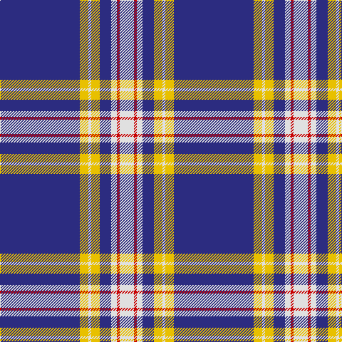

**Bands:** [BYWYBWRW](/stripes/bywybwrw/) · **Stripes:** [DB LY W LY DB W R W](/stripes/stripes8/) DB LY W LY DB W R W

This was sourced from house-of-tartan.  It is a [8 band tartan](/bands/bands8/).

Original link http://www.house-of-tartan.scotland.net/house/TartanViewjs.asp?colr=Def&tnam=2180

## Thread count
DB/112 Y12 LN4 Y12 DB16 LN8 R4 LN/20

## Palette
Each colour and its ΔE from the base-6 reference it is a variant of.

| Colour | Shade | Base | ΔE (OKLab) |
|---|---|---|---|
| DB | <code style="background-color:#2C2C80;">#2C2C80</code> `#2C2C80` | B <code style="background-color:#2A418A;">#2A418A</code> | 0.06 |
| LN | <code style="background-color:#E0E0E0;">#E0E0E0</code> `#E0E0E0` | W <code style="background-color:#F7F7F7;">#F7F7F7</code> | 0.07 |
| R | <code style="background-color:#C80000;">#C80000</code> `#C80000` | R <code style="background-color:#CC0000;">#CC0000</code> | 0.01 |
| Y | <code style="background-color:#E8C000;">#E8C000</code> `#E8C000` | Y <code style="background-color:#F2BF00;">#F2BF00</code> | 0.02 |

# Sample pattern

## Nearest tartans

The nearest existing variants by ΔTartan distance.

1. [Baker (Name)](/setts/s8/db28lo3w1lo3db4w2dp1w5~x4/) — ΔT 0.54
1. [Baker](/setts/s8/db28o3w1o3db4w2dp1w5~x4/) — ΔT 0.55
1. [Baker](/setts/s8/db28o3w1o3db4w2p1w5~x4/) — ΔT 0.78
1. [Baker Family Tartan Tartan Number: 613. Earliest known date: pre 2003 STS notes 'Sample in trade specimens file.' See products available Copyright © Blair Urquhart, Comrie, 2015](/setts/s8/db28dr3w1dr3db4w2dp1w5~x4/) — ΔT 0.87
1. [Gonzaga University’s True Blue and White](/setts/s7/w6db2w3db2g2db20r1~x2/) — ΔT 0.89
1. [University of North Carolina at Greensboro, The](/setts/s9/db96ly11db8ly11db16ly6w4ly16w8/) — ΔT 1.02
1. [Antigonish](/setts/s8/t4db1t4db24w6db4w1db2~x4/) — ΔT 1.23
1. [George, Stuart (Personal)](/setts/s9/db62w2db4w5db6ly2r8ly3w4~x2/) — ΔT 1.36
1. [X Marks the Scot](/setts/s10/w6db32o3db3o1db3o2db4db1ly2~x2/) — ΔT 1.39
1. [Morris Welsh Name Tartan Tartan Number: 5749. Earliest known date: 2002 The tartan for this Welsh surname and its variations, Meyrick, Meurig, is actually woven in Wales at the Cambrian Woollen Mill, weaving on the same site since 1830. This tartan differs from many traditional patterns in that the warp and weft differ, giving the finished worsted wool cloth more of a predominant stripe, vertically noticeable in the finished Kilt, or Cilt in Wales. See products available Copyright © Blair Urquhart, Comrie, 2015](/setts/s8/w6ly3db3ly2db3ly4db48ly4/) — ΔT 1.46

## Neighbour map

Every grey dot is one of 14299 variants placed by the first two principal components of the ΔTartan feature space (44% of its variance). Red is this tartan; blue dots are its nearest — click one to open its page.

<svg viewBox="0 0 640 380" role="img" style="max-width:100%;height:auto;border:1px solid #e0e0e0;border-radius:4px;display:block" xmlns="http://www.w3.org/2000/svg"><image href="/nn/cloud.v1.png" width="640" height="380"/><a href="/setts/s8/db28lo3w1lo3db4w2dp1w5~x4/"><circle cx="413.6" cy="115.4" r="4" fill="#3465a4"><title>Baker (Name)</title></circle></a><a href="/setts/s8/db28o3w1o3db4w2dp1w5~x4/"><circle cx="414.7" cy="115.6" r="4" fill="#3465a4"><title>Baker</title></circle></a><a href="/setts/s8/db28o3w1o3db4w2p1w5~x4/"><circle cx="435.7" cy="125.1" r="4" fill="#3465a4"><title>Baker</title></circle></a><a href="/setts/s8/db28dr3w1dr3db4w2dp1w5~x4/"><circle cx="428.3" cy="122.3" r="4" fill="#3465a4"><title>Baker Family Tartan Tartan Number: 613. Earliest known date: pre 2003 STS notes 'Sample in trade specimens file.' See products available Copyright © Blair Urquhart, Comrie, 2015</title></circle></a><a href="/setts/s7/w6db2w3db2g2db20r1~x2/"><circle cx="377.0" cy="138.7" r="4" fill="#3465a4"><title>Gonzaga University’s True Blue and White</title></circle></a><a href="/setts/s9/db96ly11db8ly11db16ly6w4ly16w8/"><circle cx="425.5" cy="129.7" r="4" fill="#3465a4"><title>University of North Carolina at Greensboro, The</title></circle></a><a href="/setts/s8/t4db1t4db24w6db4w1db2~x4/"><circle cx="416.7" cy="150.8" r="4" fill="#3465a4"><title>Antigonish</title></circle></a><a href="/setts/s9/db62w2db4w5db6ly2r8ly3w4~x2/"><circle cx="482.6" cy="100.9" r="4" fill="#3465a4"><title>George, Stuart (Personal)</title></circle></a><a href="/setts/s10/w6db32o3db3o1db3o2db4db1ly2~x2/"><circle cx="414.6" cy="91.6" r="4" fill="#3465a4"><title>X Marks the Scot</title></circle></a><a href="/setts/s8/w6ly3db3ly2db3ly4db48ly4/"><circle cx="480.5" cy="132.1" r="4" fill="#3465a4"><title>Morris Welsh Name Tartan Tartan Number: 5749. Earliest known date: 2002 The tartan for this Welsh surname and its variations, Meyrick, Meurig, is actually woven in Wales at the Cambrian Woollen Mill, weaving on the same site since 1830. This tartan differs from many traditional patterns in that the warp and weft differ, giving the finished worsted wool cloth more of a predominant stripe, vertically noticeable in the finished Kilt, or Cilt in Wales. See products available Copyright © Blair Urquhart, Comrie, 2015</title></circle></a><circle cx="412.8" cy="112.5" r="5" fill="#c00000"/></svg>

ID: /setts/s8/db28ly3w1ly3db4w2r1w5~x4/
