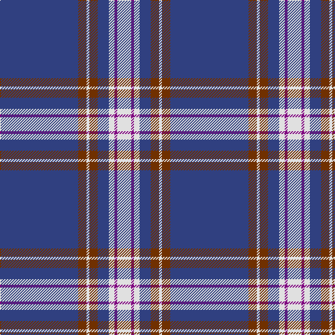

In pattern [BRWRBWBW](/stripes/brwrbwbw/).

This was sourced from weddslist.  It is a [8 stripe tartan](/stripes/stripes8/).

Original link http://www.weddslist.com/cgi-bin/tartans/pg.pl?source=sts

## Thread count
B/112 T12 LN4 T12 B16 LN8 P4 LN/20

## Palette
Each colour and the base-6 reference it is a variant of.

| Colour | Shade | Base |
|---|---|---|
| B | <code style="background-color:#304080;">#304080</code> `oklch(39.4% 0.109 270.2)` <small>#304080</small> | B <code style="background-color:#2A418A;">#2A418A</code> |
| LN | <code style="background-color:#E0E0E0;">#E0E0E0</code> `oklch(90.7% 0.000 89.9)` <small>#E0E0E0</small> | W <code style="background-color:#F7F7F7;">#F7F7F7</code> |
| P | <code style="background-color:#800080;">#800080</code> `oklch(42.1% 0.193 328.4)` <small>#800080</small> | B <code style="background-color:#2A418A;">#2A418A</code> |
| T | <code style="background-color:#703000;">#703000</code> `oklch(39.1% 0.105 49.1)` <small>#703000</small> | R <code style="background-color:#CC0000;">#CC0000</code> |

# Sample pattern

## Nearest tartans

The nearest existing variants by ΔTartan distance, with this tartan at the top so the swatches line up against it.

ΔTartan

Tartan

Sett

—

<a href="/ttd/edit/#slug=db28o3w1o3db4w2p1w5~x4">Baker</a> <a class="nn-out" href="/setts/s8/db28o3w1o3db4w2p1w5~x4/" title="open its dictionary page">↗</a>

0.75

<a href="/ttd/edit/#slug=db28dr3w1dr3db4w2dp1w5~x4">Baker Family Tartan Tartan Number: 613. Earliest known date: pre 2003 STS notes 'Sample in trade specimens file.' See products available Copyright © Blair Urquhart, Comrie, 2015</a> <a class="nn-out" href="/setts/s8/db28dr3w1dr3db4w2dp1w5~x4/" title="open its dictionary page">↗</a>

0.78

<a href="/ttd/edit/#slug=db28ly3w1ly3db4w2r1w5~x4">Baker Dress Family Tartan Tartan Number: 2180. Earliest known date: 1999 STS notes 'Sample in trade specimens file.' See products available Copyright © Blair Urquhart, Comrie, 2015</a> <a class="nn-out" href="/setts/s8/db28ly3w1ly3db4w2r1w5~x4/" title="open its dictionary page">↗</a>

0.85

<a href="/ttd/edit/#slug=db28o3w1o3db4w2dp1w5~x4">Baker</a> <a class="nn-out" href="/setts/s8/db28o3w1o3db4w2dp1w5~x4/" title="open its dictionary page">↗</a>

0.86

<a href="/ttd/edit/#slug=db28lo3w1lo3db4w2dp1w5~x4">Baker (Name)</a> <a class="nn-out" href="/setts/s8/db28lo3w1lo3db4w2dp1w5~x4/" title="open its dictionary page">↗</a>

1.23

<a href="/ttd/edit/#slug=w6db32o3db3o1db3o2db4db1ly2~x2">X Marks the Scot</a> <a class="nn-out" href="/setts/s10/w6db32o3db3o1db3o2db4db1ly2~x2/" title="open its dictionary page">↗</a>

1.28

<a href="/ttd/edit/#slug=db32ly4db12db2db4db2o16db67ly6">Calum's Cabin</a> <a class="nn-out" href="/setts/s9/db32ly4db12db2db4db2o16db67ly6/" title="open its dictionary page">↗</a>

1.30

<a href="/ttd/edit/#slug=db42r2y16r2db6r2y8lo3~x2">Prince George's Police Pipe Band</a> <a class="nn-out" href="/setts/s8/db42r2y16r2db6r2y8lo3~x2/" title="open its dictionary page">↗</a>

1.32

<a href="/ttd/edit/#slug=db96ly11db8ly11db16ly6w4ly16w8">University of North Carolina at Greensboro, The</a> <a class="nn-out" href="/setts/s9/db96ly11db8ly11db16ly6w4ly16w8/" title="open its dictionary page">↗</a>

1.33

<a href="/ttd/edit/#slug=t4db1t4db24w6db4w1db2~x4">Antigonish</a> <a class="nn-out" href="/setts/s8/t4db1t4db24w6db4w1db2~x4/" title="open its dictionary page">↗</a>

1.36

<a href="/ttd/edit/#slug=w6db2w3db2g2db20r1~x2">Gonzaga University’s True Blue and White</a> <a class="nn-out" href="/setts/s7/w6db2w3db2g2db20r1~x2/" title="open its dictionary page">↗</a>

## Neighbour map

Every grey dot is one of 14299 variants placed by the first two principal components of the ΔTartan feature space (44% of its variance). Red is this tartan; blue dots are its nearest — click one to open its page.

<svg viewBox="0 0 640 380" role="img" style="max-width:100%;height:auto;border:1px solid #e0e0e0;border-radius:4px;display:block" xmlns="http://www.w3.org/2000/svg"><image href="/nn/cloud.v1.png" width="640" height="380"/><a href="/setts/s8/db28dr3w1dr3db4w2dp1w5~x4/"><circle cx="428.3" cy="122.3" r="4" fill="#3465a4"><title>Baker Family Tartan Tartan Number: 613. Earliest known date: pre 2003 STS notes 'Sample in trade specimens file.' See products available Copyright © Blair Urquhart, Comrie, 2015</title></circle></a><a href="/setts/s8/db28ly3w1ly3db4w2r1w5~x4/"><circle cx="412.8" cy="112.5" r="4" fill="#3465a4"><title>Baker Dress Family Tartan Tartan Number: 2180. Earliest known date: 1999 STS notes 'Sample in trade specimens file.' See products available Copyright © Blair Urquhart, Comrie, 2015</title></circle></a><a href="/setts/s8/db28o3w1o3db4w2dp1w5~x4/"><circle cx="414.7" cy="115.6" r="4" fill="#3465a4"><title>Baker</title></circle></a><a href="/setts/s8/db28lo3w1lo3db4w2dp1w5~x4/"><circle cx="413.6" cy="115.4" r="4" fill="#3465a4"><title>Baker (Name)</title></circle></a><a href="/setts/s10/w6db32o3db3o1db3o2db4db1ly2~x2/"><circle cx="414.6" cy="91.6" r="4" fill="#3465a4"><title>X Marks the Scot</title></circle></a><a href="/setts/s9/db32ly4db12db2db4db2o16db67ly6/"><circle cx="467.7" cy="140.5" r="4" fill="#3465a4"><title>Calum's Cabin</title></circle></a><a href="/setts/s8/db42r2y16r2db6r2y8lo3~x2/"><circle cx="365.8" cy="146.2" r="4" fill="#3465a4"><title>Prince George's Police Pipe Band</title></circle></a><a href="/setts/s9/db96ly11db8ly11db16ly6w4ly16w8/"><circle cx="425.5" cy="129.7" r="4" fill="#3465a4"><title>University of North Carolina at Greensboro, The</title></circle></a><a href="/setts/s8/t4db1t4db24w6db4w1db2~x4/"><circle cx="416.7" cy="150.8" r="4" fill="#3465a4"><title>Antigonish</title></circle></a><a href="/setts/s7/w6db2w3db2g2db20r1~x2/"><circle cx="377.0" cy="138.7" r="4" fill="#3465a4"><title>Gonzaga University’s True Blue and White</title></circle></a><circle cx="435.7" cy="125.1" r="5" fill="#c00000"/></svg>

ID: /setts/s8/db28o3w1o3db4w2p1w5~x4/
