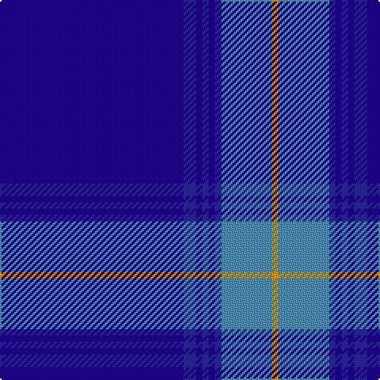

In pattern [BBBBBBBY](/stripes/bbbbbbby/).

This was sourced from register-of-tartans.  It is a [8 stripe tartan](/stripes/stripes8/).

Original link https://www.tartanregister.gov.uk/tartanDetails.aspx?ref=2836

## Also known as

This cloth is also recorded under:

- Marist School, The

## Attestations

This cloth appears in 2 source records; the oldest owns this page.

- 01/01/1996 — Marist School, The (register-of-tartans, [record](https://www.tartanregister.gov.uk/tartanDetails.aspx?ref=2836))
- 1996 — Marist (Corporate) (tartans-authority, [record](http://www.tartansauthority.com/tartan-ferret/display/2376/))

## Register references

External register numbers recorded for this tartan.

- Scottish Register of Tartans: [2836](https://www.tartanregister.gov.uk/tartanDetails.aspx?ref=2836)
- Scottish Tartans Authority (ITI): 2376
- Scottish Tartans World Register: 2376

## Thread count
DBa/116 DB8 DBa4 DB4 DBa4 DB4 B32 DY/4

## Palette
Each colour and the base-6 reference it is a variant of.

| Colour | Shade | Base |
|---|---|---|
| B | <code style="background-color:#5C8CA8;">#5C8CA8</code> `oklch(61.7% 0.067 235.0)` <small>#5C8CA8</small> | B <code style="background-color:#2A418A;">#2A418A</code> |
| DB | <code style="background-color:#2C2C80;">#2C2C80</code> `oklch(35.0% 0.138 276.6)` <small>#2C2C80</small> | B <code style="background-color:#2A418A;">#2A418A</code> |
| DBa | <code style="background-color:#1C0070;">#1C0070</code> `oklch(26.3% 0.162 277.1)` <small>#1C0070</small> | B <code style="background-color:#2A418A;">#2A418A</code> |
| DY | <code style="background-color:#D09800;">#D09800</code> `oklch(71.4% 0.147 82.1)` <small>#D09800</small> | Y <code style="background-color:#F2BF00;">#F2BF00</code> |

# Sample pattern

## Nearest tartans

The nearest existing variants by ΔTartan distance.

1. [French Freemasons' Pride (Fashion)](/setts/s6/db128r8t41n4t4n4/) — ΔT 0.83
1. [S.C.O.T.S.](/setts/s6/db55db18w3db2r2db6~x2/) — ΔT 1.30
1. [Affara (Personal)](/setts/s7/db80k5g12k2ly2g2k10~x2/) — ΔT 1.35
1. [Tyneside Blue, North Tyneside Pipe Band](/setts/s7/db62k22w3k2w2k3r1~x2/) — ΔT 1.37
1. [Royal Agricultural Winter Fair](/setts/s8/db32lb1db1lo2db1r1db4dg16~x4/) — ΔT 1.40
1. [French Freemasons' Pride](/setts/s6/db128r8g41n4g4n4/) — ΔT 1.40
1. [Marist School, The](/setts/s8/dt29b2dt1b1dt1b1db8ly1~x4/) — ΔT 1.42
1. [Glen Innes (District)](/setts/s8/db142dt12db24w7db5w5db5r10/) — ΔT 1.44
1. [United French Freemasons (Corporate](/setts/s6/db144r9t44db4t4db4/) — ΔT 1.47
1. [RAAF](/setts/s9/db66w2db10w2db10w2db12r3t24~x2/) — ΔT 1.47

## Neighbour map

Every grey dot is one of 14299 variants placed by the first two principal components of the ΔTartan feature space (44% of its variance). Red is this tartan; blue dots are its nearest — click one to open its page.

<svg viewBox="0 0 640 380" role="img" style="max-width:100%;height:auto;border:1px solid #e0e0e0;border-radius:4px;display:block" xmlns="http://www.w3.org/2000/svg"><image href="/nn/cloud.v1.png" width="640" height="380"/><a href="/setts/s6/db128r8t41n4t4n4/"><circle cx="481.0" cy="158.9" r="4" fill="#3465a4"><title>French Freemasons' Pride (Fashion)</title></circle></a><a href="/setts/s6/db55db18w3db2r2db6~x2/"><circle cx="468.7" cy="179.1" r="4" fill="#3465a4"><title>S.C.O.T.S.</title></circle></a><a href="/setts/s7/db80k5g12k2ly2g2k10~x2/"><circle cx="535.8" cy="149.1" r="4" fill="#3465a4"><title>Affara (Personal)</title></circle></a><a href="/setts/s7/db62k22w3k2w2k3r1~x2/"><circle cx="476.9" cy="126.6" r="4" fill="#3465a4"><title>Tyneside Blue, North Tyneside Pipe Band</title></circle></a><a href="/setts/s8/db32lb1db1lo2db1r1db4dg16~x4/"><circle cx="449.9" cy="140.0" r="4" fill="#3465a4"><title>Royal Agricultural Winter Fair</title></circle></a><a href="/setts/s6/db128r8g41n4g4n4/"><circle cx="455.7" cy="150.7" r="4" fill="#3465a4"><title>French Freemasons' Pride</title></circle></a><a href="/setts/s8/dt29b2dt1b1dt1b1db8ly1~x4/"><circle cx="530.4" cy="161.3" r="4" fill="#3465a4"><title>Marist School, The</title></circle></a><a href="/setts/s8/db142dt12db24w7db5w5db5r10/"><circle cx="472.5" cy="133.1" r="4" fill="#3465a4"><title>Glen Innes (District)</title></circle></a><a href="/setts/s6/db144r9t44db4t4db4/"><circle cx="558.0" cy="176.5" r="4" fill="#3465a4"><title>United French Freemasons (Corporate</title></circle></a><a href="/setts/s9/db66w2db10w2db10w2db12r3t24~x2/"><circle cx="494.9" cy="133.7" r="4" fill="#3465a4"><title>RAAF</title></circle></a><circle cx="502.5" cy="144.1" r="5" fill="#c00000"/></svg>

ID: /setts/s8/db29db2db1db1db1db1t8lo1~x4/
