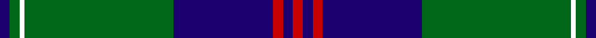
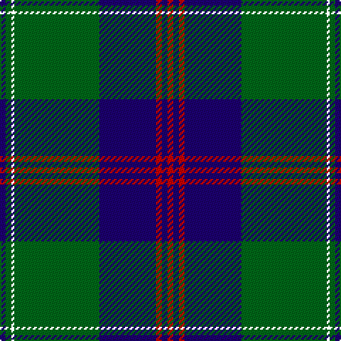

In pattern [BGKGBRBR](/stripes/bgkgbrbr/).

This was sourced from house-of-tartan.  It is a [8 stripe tartan](/stripes/stripes8/).

Original link http://www.house-of-tartan.scotland.net/house/TartanViewjs.asp?colr=Def&tnam=5119

## Thread count
DB/4 G4 YT2 G60 DB40 R4 DB4 R/4

## Palette
Each colour and its ΔE from the base-6 reference it is a variant of.

| Colour | Shade | Base | ΔE (OKLab) |
|---|---|---|---|
| DB | <code style="background-color:#1C0070;">#1C0070</code> `#1C0070` | B <code style="background-color:#2A418A;">#2A418A</code> | 0.14 |
| G | <code style="background-color:#006818;">#006818</code> `#006818` | G <code style="background-color:#006100;">#006100</code> | 0.02 |
| R | <code style="background-color:#C80000;">#C80000</code> `#C80000` | R <code style="background-color:#CC0000;">#CC0000</code> | 0.01 |

# Sample pattern

## Nearest tartans

The nearest existing variants by ΔTartan distance.

1. [Gretna Green](/setts/s8/db2g2ly1g30db20r2db2r2~x2/) — ΔT 0.12
1. [Johnston](/setts/s8/ly3dg2k1dg30db24k2db2k2/) — ΔT 0.86
1. [Williams, Jodi (Personal)](/setts/s7/o2db20r2g3r4g35r1~x2/) — ΔT 0.89
1. [Black Thistle](/setts/s9/b10k6g42k2g1k2r1k24r2~x2/) — ΔT 0.93
1. [Johnston](/setts/s8/ly3dg2k1dg30db24k2db2k2~x2/) — ΔT 1.05
1. [Oliphant (Clan)](/setts/s6/db4k4db24g32w1g2~x4/) — ΔT 1.18
1. [Sinclair-Brown](/setts/s8/db64k11r2k4r2k4g32y4~x2/) — ΔT 1.20
1. [Oliver, hunting](/setts/s9/db40g3db2g12k2g2ly2g2k3~x2/) — ΔT 1.21
1. [Johnston / Johnstone](/setts/s8/ly3g2k1g30db24k2db2k2~x2/) — ΔT 1.21
1. [MacRobart](/setts/s6/db72k21g16t3g17t3~x2/) — ΔT 1.23

## Neighbour map

Every grey dot is one of 14299 variants placed by the first two principal components of the ΔTartan feature space (44% of its variance). Red is this tartan; blue dots are its nearest — click one to open its page.

<svg viewBox="0 0 640 380" role="img" style="max-width:100%;height:auto;border:1px solid #e0e0e0;border-radius:4px;display:block" xmlns="http://www.w3.org/2000/svg"><image href="/nn/cloud.v1.png" width="640" height="380"/><a href="/setts/s8/db2g2ly1g30db20r2db2r2~x2/"><circle cx="367.6" cy="141.2" r="4" fill="#3465a4"><title>Gretna Green</title></circle></a><a href="/setts/s8/ly3dg2k1dg30db24k2db2k2/"><circle cx="334.4" cy="145.7" r="4" fill="#3465a4"><title>Johnston</title></circle></a><a href="/setts/s7/o2db20r2g3r4g35r1~x2/"><circle cx="376.6" cy="144.8" r="4" fill="#3465a4"><title>Williams, Jodi (Personal)</title></circle></a><a href="/setts/s9/b10k6g42k2g1k2r1k24r2~x2/"><circle cx="336.5" cy="118.8" r="4" fill="#3465a4"><title>Black Thistle</title></circle></a><a href="/setts/s8/ly3dg2k1dg30db24k2db2k2~x2/"><circle cx="354.7" cy="156.0" r="4" fill="#3465a4"><title>Johnston</title></circle></a><a href="/setts/s6/db4k4db24g32w1g2~x4/"><circle cx="374.7" cy="178.2" r="4" fill="#3465a4"><title>Oliphant (Clan)</title></circle></a><a href="/setts/s8/db64k11r2k4r2k4g32y4~x2/"><circle cx="313.0" cy="115.7" r="4" fill="#3465a4"><title>Sinclair-Brown</title></circle></a><a href="/setts/s9/db40g3db2g12k2g2ly2g2k3~x2/"><circle cx="398.0" cy="139.4" r="4" fill="#3465a4"><title>Oliver, hunting</title></circle></a><a href="/setts/s8/ly3g2k1g30db24k2db2k2~x2/"><circle cx="324.4" cy="135.4" r="4" fill="#3465a4"><title>Johnston / Johnstone</title></circle></a><a href="/setts/s6/db72k21g16t3g17t3~x2/"><circle cx="327.8" cy="172.8" r="4" fill="#3465a4"><title>MacRobart</title></circle></a><circle cx="369.1" cy="142.5" r="5" fill="#c00000"/></svg>

ID: /setts/s8/db2g2k1g30db20r2db2r2~x2/
