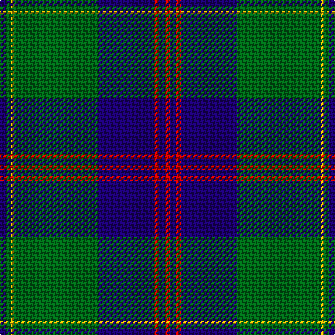

This page is one **sett** — a single exact thread-count. It belongs to the [tartan](/tartans/db2g2ly1g30db20r2db2r2/)
(the same proportion at any scale), whose colour order is pattern [BGYGBRBR](/stripes/bgygbrbr/).

Sourced from register-of-tartans.  It is a [8 stripe tartan](/stripes/stripes8/).

Original link https://www.tartanregister.gov.uk/tartanDetails.aspx?ref=1540

2 attestations — the source records this cloth was collapsed from (oldest owns this page)

<ul>
<li>01/01/1996 — Gretna Green (register-of-tartans, <a href="https://www.tartanregister.gov.uk/tartanDetails.aspx?ref=1540">record</a>)</li>
<li>1996 — Gretna Green (Fashion) (tartans-authority, <a href="http://www.tartansauthority.com/tartan-ferret/display/5119/">record</a>)</li>
</ul>

## Register references

External register numbers recorded for this tartan.

- Scottish Register of Tartans: [1540](https://www.tartanregister.gov.uk/tartanDetails.aspx?ref=1540)
- Scottish Tartans Authority (ITI): 5119

## Thread count
DB/4 G4 Y2 G60 DB40 R4 DB4 R/4

## Palette

Palette: <strong>Tartan Register</strong>
<table><thead><tr><th>Colour</th><th>Threads</th><th>Shade</th><th>Base</th><th>OKLCh</th></tr></thead><tbody><tr><td>DB/</td><td style="text-align:right;font-variant-numeric:tabular-nums">4</td><td><code style="background-color:#1C0070;">#1C0070</code> <small style="color:#888">#1C0070</small></td><td>B <code style="background-color:#2A418A;">#2A418A</code></td><td><small style="color:#888">oklch(26.3% 0.162 277.1)</small></td></tr><tr><td>G</td><td style="text-align:right;font-variant-numeric:tabular-nums">4</td><td><code style="background-color:#006818;">#006818</code> <small style="color:#888">#006818</small></td><td>G <code style="background-color:#006100;">#006100</code></td><td><small style="color:#888">oklch(45.0% 0.142 145.0)</small></td></tr><tr><td>Y</td><td style="text-align:right;font-variant-numeric:tabular-nums">2</td><td><code style="background-color:#D8B000;">#D8B000</code> <small style="color:#888">#D8B000</small></td><td>Y <code style="background-color:#F2BF00;">#F2BF00</code></td><td><small style="color:#888">oklch(77.1% 0.158 92.3)</small></td></tr><tr><td>G</td><td style="text-align:right;font-variant-numeric:tabular-nums">60</td><td><code style="background-color:#006818;">#006818</code> <small style="color:#888">#006818</small></td><td>G <code style="background-color:#006100;">#006100</code></td><td><small style="color:#888">oklch(45.0% 0.142 145.0)</small></td></tr><tr><td>DB</td><td style="text-align:right;font-variant-numeric:tabular-nums">40</td><td><code style="background-color:#1C0070;">#1C0070</code> <small style="color:#888">#1C0070</small></td><td>B <code style="background-color:#2A418A;">#2A418A</code></td><td><small style="color:#888">oklch(26.3% 0.162 277.1)</small></td></tr><tr><td>R</td><td style="text-align:right;font-variant-numeric:tabular-nums">4</td><td><code style="background-color:#C80000;">#C80000</code> <small style="color:#888">#C80000</small></td><td>R <code style="background-color:#CC0000;">#CC0000</code></td><td><small style="color:#888">oklch(52.3% 0.215 29.2)</small></td></tr><tr><td>DB</td><td style="text-align:right;font-variant-numeric:tabular-nums">4</td><td><code style="background-color:#1C0070;">#1C0070</code> <small style="color:#888">#1C0070</small></td><td>B <code style="background-color:#2A418A;">#2A418A</code></td><td><small style="color:#888">oklch(26.3% 0.162 277.1)</small></td></tr><tr><td>R/</td><td style="text-align:right;font-variant-numeric:tabular-nums">4</td><td><code style="background-color:#C80000;">#C80000</code> <small style="color:#888">#C80000</small></td><td>R <code style="background-color:#CC0000;">#CC0000</code></td><td><small style="color:#888">oklch(52.3% 0.215 29.2)</small></td></tr></tbody></table>

# Sample pattern

## Nearest tartans

The nearest existing variants by ΔTartan distance, with this tartan at the top so the swatches line up against it.

ΔTartan

Tartan

Sett

—

<a href="/ttd/edit/#slug=db2g2ly1g30db20r2db2r2~x2">Gretna Green</a> <a class="nn-out" href="/setts/s8/db2g2ly1g30db20r2db2r2~x2/" title="open its dictionary page">↗</a>

0.12

<a href="/ttd/edit/#slug=db2g2k1g30db20r2db2r2~x2">Gretna Green Fashion Tartan Tartan Number: 5119. Earliest known date: 01/01/1996 Designed in 1996 by Lochcarron for Tartan &amp; Tweeds of Gretna Green. Gretna Green became famous for runaway marriages when 'irregular' marriages were banned by law in England in 1753. Couples were able to run to Scotland and become legally married by proclamation in front of two witnesses. This form of marriage was recognised worldwide. From the middle of the 18th century these marriages were in such demand that the blacksmith, conveniently situated on the crossroads at Gretna Green, became known as the 'anvil priest', giving birth to the anvil as the symbol of Gretna Green. Many couples are still married at the original smithy while many others, although married elsewhere, visit Gretna Green to take the traditional Scottish oath. The Gretna Green tartan reflects the twin influences of this history and that of the powerful border clan Johnstone, so influential in this area of Dumfriesshire, on which this tartan is based. Sample in Scottish Tartans Authority's Johnston Collection. See products available Copyright © Blair Urquhart, Comrie, 2015</a> <a class="nn-out" href="/setts/s8/db2g2k1g30db20r2db2r2~x2/" title="open its dictionary page">↗</a>

0.85

<a href="/ttd/edit/#slug=o2db20r2g3r4g35r1~x2">Williams, Jodi (Personal)</a> <a class="nn-out" href="/setts/s7/o2db20r2g3r4g35r1~x2/" title="open its dictionary page">↗</a>

0.89

<a href="/ttd/edit/#slug=b10k6g42k2g1k2r1k24r2~x2">Black Thistle</a> <a class="nn-out" href="/setts/s9/b10k6g42k2g1k2r1k24r2~x2/" title="open its dictionary page">↗</a>

0.93

<a href="/ttd/edit/#slug=ly3dg2k1dg30db24k2db2k2">Johnston</a> <a class="nn-out" href="/setts/s8/ly3dg2k1dg30db24k2db2k2/" title="open its dictionary page">↗</a>

1.12

<a href="/ttd/edit/#slug=ly3g2k1g30db24k2db2k2~x2">Johnston / Johnstone</a> <a class="nn-out" href="/setts/s8/ly3g2k1g30db24k2db2k2~x2/" title="open its dictionary page">↗</a>

1.15

<a href="/ttd/edit/#slug=ly3dg2k1dg30db24k2db2k2~x2">Johnston</a> <a class="nn-out" href="/setts/s8/ly3dg2k1dg30db24k2db2k2~x2/" title="open its dictionary page">↗</a>

1.19

<a href="/ttd/edit/#slug=db4k4db24g32w1g2~x4">Oliphant (Clan)</a> <a class="nn-out" href="/setts/s6/db4k4db24g32w1g2~x4/" title="open its dictionary page">↗</a>

1.20

<a href="/ttd/edit/#slug=db64k11r2k4r2k4g32y4~x2">Sinclair-Brown</a> <a class="nn-out" href="/setts/s8/db64k11r2k4r2k4g32y4~x2/" title="open its dictionary page">↗</a>

1.20

<a href="/ttd/edit/#slug=db40g3db2g12k2g2ly2g2k3~x2">Oliver, hunting</a> <a class="nn-out" href="/setts/s9/db40g3db2g12k2g2ly2g2k3~x2/" title="open its dictionary page">↗</a>

1.25

<a href="/ttd/edit/#slug=g2k1db6k11g26k1g1lo2~x2">Mackie (2016)</a> <a class="nn-out" href="/setts/s8/g2k1db6k11g26k1g1lo2~x2/" title="open its dictionary page">↗</a>

## Neighbour map

Every grey dot is one of 14299 variants placed by the first two principal components of the ΔTartan feature space (44% of its variance). Red is this tartan; blue dots are its nearest — click one to open its page.

<svg viewBox="0 0 640 380" role="img" style="max-width:100%;height:auto;border:1px solid #e0e0e0;border-radius:4px;display:block" xmlns="http://www.w3.org/2000/svg"><image href="/nn/cloud.v1.png" width="640" height="380"/><a href="/setts/s8/db2g2k1g30db20r2db2r2~x2/"><circle cx="369.1" cy="142.5" r="4" fill="#3465a4"><title>Gretna Green Fashion Tartan Tartan Number: 5119. Earliest known date: 01/01/1996 Designed in 1996 by Lochcarron for Tartan &amp; Tweeds of Gretna Green. Gretna Green became famous for runaway marriages when 'irregular' marriages were banned by law in England in 1753. Couples were able to run to Scotland and become legally married by proclamation in front of two witnesses. This form of marriage was recognised worldwide. From the middle of the 18th century these marriages were in such demand that the blacksmith, conveniently situated on the crossroads at Gretna Green, became known as the 'anvil priest', giving birth to the anvil as the symbol of Gretna Green. Many couples are still married at the original smithy while many others, although married elsewhere, visit Gretna Green to take the traditional Scottish oath. The Gretna Green tartan reflects the twin influences of this history and that of the powerful border clan Johnstone, so influential in this area of Dumfriesshire, on which this tartan is based. Sample in Scottish Tartans Authority's Johnston Collection. See products available Copyright © Blair Urquhart, Comrie, 2015</title></circle></a><a href="/setts/s7/o2db20r2g3r4g35r1~x2/"><circle cx="376.6" cy="144.8" r="4" fill="#3465a4"><title>Williams, Jodi (Personal)</title></circle></a><a href="/setts/s9/b10k6g42k2g1k2r1k24r2~x2/"><circle cx="336.5" cy="118.8" r="4" fill="#3465a4"><title>Black Thistle</title></circle></a><a href="/setts/s8/ly3dg2k1dg30db24k2db2k2/"><circle cx="334.4" cy="145.7" r="4" fill="#3465a4"><title>Johnston</title></circle></a><a href="/setts/s8/ly3g2k1g30db24k2db2k2~x2/"><circle cx="324.4" cy="135.4" r="4" fill="#3465a4"><title>Johnston / Johnstone</title></circle></a><a href="/setts/s8/ly3dg2k1dg30db24k2db2k2~x2/"><circle cx="354.7" cy="156.0" r="4" fill="#3465a4"><title>Johnston</title></circle></a><a href="/setts/s6/db4k4db24g32w1g2~x4/"><circle cx="374.7" cy="178.2" r="4" fill="#3465a4"><title>Oliphant (Clan)</title></circle></a><a href="/setts/s8/db64k11r2k4r2k4g32y4~x2/"><circle cx="313.0" cy="115.7" r="4" fill="#3465a4"><title>Sinclair-Brown</title></circle></a><a href="/setts/s9/db40g3db2g12k2g2ly2g2k3~x2/"><circle cx="398.0" cy="139.4" r="4" fill="#3465a4"><title>Oliver, hunting</title></circle></a><a href="/setts/s8/g2k1db6k11g26k1g1lo2~x2/"><circle cx="380.7" cy="157.4" r="4" fill="#3465a4"><title>Mackie (2016)</title></circle></a><circle cx="367.6" cy="141.2" r="5" fill="#c00000"/></svg>

ID: /setts/s8/db2g2ly1g30db20r2db2r2~x2/
