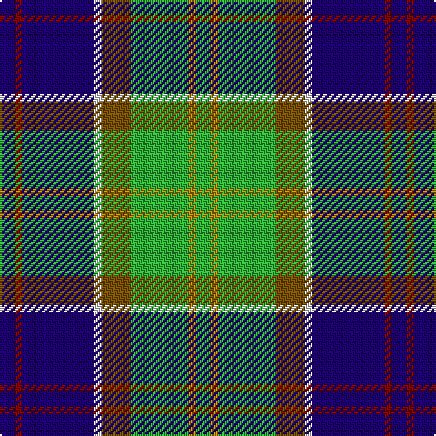

In pattern [BRBWGGYG](/stripes/brbwggyg/).

This was sourced from tartans-authority.  It is a [8 stripe tartan](/stripes/stripes8/).

Original link http://www.tartansauthority.com/tartan-ferret/display/436/

## Thread count
DB/8 DR4 DB40 LN4 T16 G32 DY4 G/8

## Palette
Each colour and the base-6 reference it is a variant of.

| Colour | Shade | Base |
|---|---|---|
| DB | <code style="background-color:#1C0070;">#1C0070</code> `oklch(26.3% 0.162 277.1)` <small>#1C0070</small> | B <code style="background-color:#2A418A;">#2A418A</code> |
| DR | <code style="background-color:#880000;">#880000</code> `oklch(39.4% 0.162 29.2)` <small>#880000</small> | R <code style="background-color:#CC0000;">#CC0000</code> |
| DY | <code style="background-color:#BC8C00;">#BC8C00</code> `oklch(66.8% 0.137 84.1)` <small>#BC8C00</small> | Y <code style="background-color:#F2BF00;">#F2BF00</code> |
| G | <code style="background-color:#30AC38;">#30AC38</code> `oklch(65.4% 0.189 143.9)` <small>#30AC38</small> | G <code style="background-color:#006100;">#006100</code> |
| LN | <code style="background-color:#E0E0E0;">#E0E0E0</code> `oklch(90.7% 0.000 89.9)` <small>#E0E0E0</small> | W <code style="background-color:#F7F7F7;">#F7F7F7</code> |
| T | <code style="background-color:#785000;">#785000</code> `oklch(46.4% 0.098 75.7)` <small>#785000</small> | G <code style="background-color:#006100;">#006100</code> |

# Sample pattern

## Nearest tartans

The nearest existing variants by ΔTartan distance, with this tartan at the top so the swatches line up against it.

ΔTartan

Tartan

Sett

—

<a href="/ttd/edit/#slug=db2r1db10w1y4g8lo1g2~x4">Ayrshire (District)</a> <a class="nn-out" href="/setts/s8/db2r1db10w1y4g8lo1g2~x4/" title="open its dictionary page">↗</a>

0.82

<a href="/ttd/edit/#slug=r2k1lo2g3lo4g3db12k1lb2~x4">Federated Women's Institutes of</a> <a class="nn-out" href="/setts/s9/r2k1lo2g3lo4g3db12k1lb2~x4/" title="open its dictionary page">↗</a>

0.87

<a href="/ttd/edit/#slug=k6r3g30ly10db30w3~x2">Turnbull of Thornton (Personal)</a> <a class="nn-out" href="/setts/s6/k6r3g30ly10db30w3~x2/" title="open its dictionary page">↗</a>

0.88

<a href="/ttd/edit/#slug=k10ly3k2b20k10g15k2r3w3~x2">McCuaig (2010) (Name)</a> <a class="nn-out" href="/setts/s9/k10ly3k2b20k10g15k2r3w3~x2/" title="open its dictionary page">↗</a>

0.88

<a href="/ttd/edit/#slug=db2r1db10w1y4g8g1g2~x4">Ayrshire</a> <a class="nn-out" href="/setts/s8/db2r1db10w1y4g8g1g2~x4/" title="open its dictionary page">↗</a>

0.89

<a href="/ttd/edit/#slug=dt36y20dg6w12k6r3~x2">Sirens &amp; Swords</a> <a class="nn-out" href="/setts/s6/dt36y20dg6w12k6r3~x2/" title="open its dictionary page">↗</a>

0.94

<a href="/ttd/edit/#slug=o5dt30w3dg15ly8r4~x2">Carleton College Rugby</a> <a class="nn-out" href="/setts/s6/o5dt30w3dg15ly8r4~x2/" title="open its dictionary page">↗</a>

0.99

<a href="/ttd/edit/#slug=r4g14k3lp3g12db36w4~x2">Vipont</a> <a class="nn-out" href="/setts/s7/r4g14k3lp3g12db36w4~x2/" title="open its dictionary page">↗</a>

1.00

<a href="/ttd/edit/#slug=db6r4db24lb3k6g18lo4g2lo2g4~x2">Greene</a> <a class="nn-out" href="/setts/s10/db6r4db24lb3k6g18lo4g2lo2g4~x2/" title="open its dictionary page">↗</a>

1.01

<a href="/ttd/edit/#slug=k6w3k2db30r9k4g20ly3~x2">Minnesota (District)</a> <a class="nn-out" href="/setts/s8/k6w3k2db30r9k4g20ly3~x2/" title="open its dictionary page">↗</a>

1.03

<a href="/ttd/edit/#slug=w4k2t18g18k18w3k18r3~x2">Hislop (Name)</a> <a class="nn-out" href="/setts/s8/w4k2t18g18k18w3k18r3~x2/" title="open its dictionary page">↗</a>

## Neighbour map

Every grey dot is one of 14299 variants placed by the first two principal components of the ΔTartan feature space (44% of its variance). Red is this tartan; blue dots are its nearest — click one to open its page.

<svg viewBox="0 0 640 380" role="img" style="max-width:100%;height:auto;border:1px solid #e0e0e0;border-radius:4px;display:block" xmlns="http://www.w3.org/2000/svg"><image href="/nn/cloud.v1.png" width="640" height="380"/><a href="/setts/s9/r2k1lo2g3lo4g3db12k1lb2~x4/"><circle cx="142.0" cy="137.0" r="4" fill="#3465a4"><title>Federated Women's Institutes of</title></circle></a><a href="/setts/s6/k6r3g30ly10db30w3~x2/"><circle cx="143.9" cy="173.0" r="4" fill="#3465a4"><title>Turnbull of Thornton (Personal)</title></circle></a><a href="/setts/s9/k10ly3k2b20k10g15k2r3w3~x2/"><circle cx="115.4" cy="159.5" r="4" fill="#3465a4"><title>McCuaig (2010) (Name)</title></circle></a><a href="/setts/s8/db2r1db10w1y4g8g1g2~x4/"><circle cx="177.6" cy="169.8" r="4" fill="#3465a4"><title>Ayrshire</title></circle></a><a href="/setts/s6/dt36y20dg6w12k6r3~x2/"><circle cx="154.2" cy="162.6" r="4" fill="#3465a4"><title>Sirens &amp; Swords</title></circle></a><a href="/setts/s6/o5dt30w3dg15ly8r4~x2/"><circle cx="172.0" cy="167.9" r="4" fill="#3465a4"><title>Carleton College Rugby</title></circle></a><a href="/setts/s7/r4g14k3lp3g12db36w4~x2/"><circle cx="221.1" cy="154.1" r="4" fill="#3465a4"><title>Vipont</title></circle></a><a href="/setts/s10/db6r4db24lb3k6g18lo4g2lo2g4~x2/"><circle cx="154.4" cy="138.3" r="4" fill="#3465a4"><title>Greene</title></circle></a><a href="/setts/s8/k6w3k2db30r9k4g20ly3~x2/"><circle cx="154.7" cy="132.9" r="4" fill="#3465a4"><title>Minnesota (District)</title></circle></a><a href="/setts/s8/w4k2t18g18k18w3k18r3~x2/"><circle cx="145.8" cy="175.4" r="4" fill="#3465a4"><title>Hislop (Name)</title></circle></a><circle cx="152.8" cy="153.2" r="5" fill="#c00000"/></svg>

ID: /setts/s8/db2r1db10w1y4g8lo1g2~x4/
