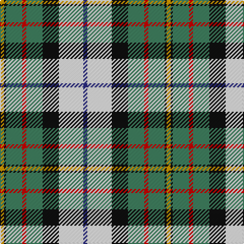

In pattern [BWKGRGKY](/stripes/bwkgrgky/).

This was sourced from register-of-tartans.  It is a [8 stripe tartan](/stripes/stripes8/).

Original link https://www.tartanregister.gov.uk/tartanDetails.aspx?ref=2599

## Attestations

This cloth appears in 2 source records; the oldest owns this page.

- 01/01/1981 — MacLaren Dress (register-of-tartans, [record](https://www.tartanregister.gov.uk/tartanDetails.aspx?ref=2599))
- 1981 — MacLaren Dress (Clan) (tartans-authority, [record](http://www.tartansauthority.com/tartan-ferret/display/649/))

## Register references

External register numbers recorded for this tartan.

- Scottish Register of Tartans: [2599](https://www.tartanregister.gov.uk/tartanDetails.aspx?ref=2599)
- Scottish Tartans Authority (ITI): 649
- Scottish Tartans World Register: 649

## Thread count
DY/4 K2 G16 R4 G16 K16 W24 DB/4

## Palette
Each colour and its ΔE from the base-6 reference it is a variant of.

| Colour | Shade | Base | ΔE (OKLab) |
|---|---|---|---|
| DB | <code style="background-color:#2C2C80;">#2C2C80</code> `#2C2C80` | B <code style="background-color:#2A418A;">#2A418A</code> | 0.06 |
| DY | <code style="background-color:#D09800;">#D09800</code> `#D09800` | Y <code style="background-color:#F2BF00;">#F2BF00</code> | 0.12 |
| G | <code style="background-color:#408060;">#408060</code> `#408060` | G <code style="background-color:#006100;">#006100</code> | 0.14 |
| K | <code style="background-color:#101010;">#101010</code> `#101010` | K <code style="background-color:#000000;">#000000</code> | 0.17 |
| R | <code style="background-color:#C80000;">#C80000</code> `#C80000` | R <code style="background-color:#CC0000;">#CC0000</code> | 0.01 |
| W | <code style="background-color:#F8F8F8;">#F8F8F8</code> `#F8F8F8` | W <code style="background-color:#F7F7F7;">#F7F7F7</code> | 0.00 |

# Sample pattern

## Nearest tartans

The nearest existing variants by ΔTartan distance.

1. [MacLaren dress](/setts/s8/db7w30k13g9r6g16k2ly7~x2/) — ΔT 0.81
1. [Coulter Dress (Personal)](/setts/s8/r6w20g12o3g8t20k2t3~x2/) — ΔT 0.98
1. [Crofters (Personal)](/setts/s7/db20r2g9w6ly4k2g8~x2/) — ΔT 0.99
1. [Gillies, Blue dress](/setts/s10/r7k2t16ly5t10k13w28g2w4g2~x2/) — ΔT 1.00
1. [MacRobart Dress (Personal)](/setts/s7/db8w33k15dg17t3dg17t3~x2/) — ΔT 1.01
1. [Gillies, dress Green](/setts/s10/ly6k2g15r6g8k12w25t2w3t2~x2/) — ΔT 1.04
1. [Gillies Dress Blue #1 (Dance)](/setts/s10/r7k2t16ly5t10k13w28dg2w4dg4~x2/) — ΔT 1.06
1. [Carmen Lau (Hong Kong) (Personal)](/setts/s7/ly8r3b2db1w6g12db2~x2/) — ΔT 1.09
1. [Barbour -Modern](/setts/s7/lb4ly2lb21k11w2n21r2~x2/) — ΔT 1.09
1. [Gillies, dress Blue](/setts/s10/ly6k2t15r5t9k13w25db2w3db2~x2/) — ΔT 1.09

## Neighbour map

Every grey dot is one of 14299 variants placed by the first two principal components of the ΔTartan feature space (44% of its variance). Red is this tartan; blue dots are its nearest — click one to open its page.

<svg viewBox="0 0 640 380" role="img" style="max-width:100%;height:auto;border:1px solid #e0e0e0;border-radius:4px;display:block" xmlns="http://www.w3.org/2000/svg"><image href="/nn/cloud.v1.png" width="640" height="380"/><a href="/setts/s8/db7w30k13g9r6g16k2ly7~x2/"><circle cx="75.9" cy="132.5" r="4" fill="#3465a4"><title>MacLaren dress</title></circle></a><a href="/setts/s8/r6w20g12o3g8t20k2t3~x2/"><circle cx="82.4" cy="153.0" r="4" fill="#3465a4"><title>Coulter Dress (Personal)</title></circle></a><a href="/setts/s7/db20r2g9w6ly4k2g8~x2/"><circle cx="130.5" cy="163.7" r="4" fill="#3465a4"><title>Crofters (Personal)</title></circle></a><a href="/setts/s10/r7k2t16ly5t10k13w28g2w4g2~x2/"><circle cx="101.4" cy="109.6" r="4" fill="#3465a4"><title>Gillies, Blue dress</title></circle></a><a href="/setts/s7/db8w33k15dg17t3dg17t3~x2/"><circle cx="114.9" cy="174.8" r="4" fill="#3465a4"><title>MacRobart Dress (Personal)</title></circle></a><a href="/setts/s10/ly6k2g15r6g8k12w25t2w3t2~x2/"><circle cx="84.5" cy="116.5" r="4" fill="#3465a4"><title>Gillies, dress Green</title></circle></a><a href="/setts/s10/r7k2t16ly5t10k13w28dg2w4dg4~x2/"><circle cx="93.6" cy="110.4" r="4" fill="#3465a4"><title>Gillies Dress Blue #1 (Dance)</title></circle></a><a href="/setts/s7/ly8r3b2db1w6g12db2~x2/"><circle cx="89.6" cy="144.4" r="4" fill="#3465a4"><title>Carmen Lau (Hong Kong) (Personal)</title></circle></a><a href="/setts/s7/lb4ly2lb21k11w2n21r2~x2/"><circle cx="148.7" cy="143.3" r="4" fill="#3465a4"><title>Barbour -Modern</title></circle></a><a href="/setts/s10/ly6k2t15r5t9k13w25db2w3db2~x2/"><circle cx="87.5" cy="114.8" r="4" fill="#3465a4"><title>Gillies, dress Blue</title></circle></a><circle cx="98.0" cy="144.7" r="5" fill="#c00000"/></svg>

ID: /setts/s8/db2w12k8g8r2g8k1lo2~x2/
