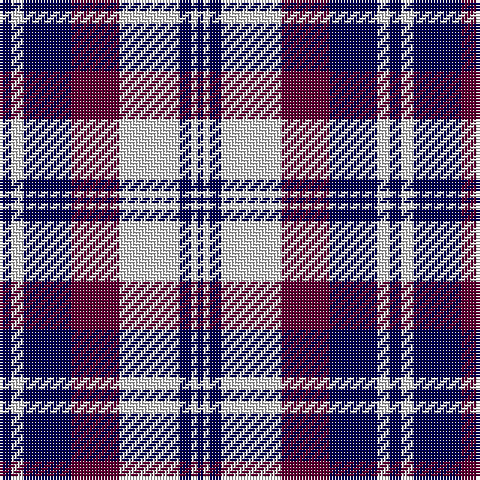

This page is one **sett** — a single exact thread-count. It belongs to the [tartan](/tartans/db2ln2db8dr8ln10db2ln1db1/)
(the same proportion at any scale), whose colour order is pattern [BWBBWBWB](/stripes/bwbbwbwb/).

Sourced from weddslist.  It is a [8 stripe tartan](/stripes/stripes8/).

Original link http://www.weddslist.com/cgi-bin/tartans/pg.pl?source=sts

## Thread count
DB/4 LN4 DB16 DR16 LN20 DB4 LN2 DB/2

## Palette
Each colour and the base-6 reference it is a variant of.

| Colour | Shade | Base |
|---|---|---|
| DB | <code style="background-color:#000050;">#000050</code> `oklch(19.5% 0.135 264.1)` <small>#000050</small> | B <code style="background-color:#2A418A;">#2A418A</code> |
| DR | <code style="background-color:#600030;">#600030</code> `oklch(31.7% 0.129 359.5)` <small>#600030</small> | B <code style="background-color:#2A418A;">#2A418A</code> |
| LN | <code style="background-color:#E0E0E0;">#E0E0E0</code> `oklch(90.7% 0.000 89.9)` <small>#E0E0E0</small> | W <code style="background-color:#F7F7F7;">#F7F7F7</code> |

# Sample pattern

## Nearest tartans

The nearest existing variants by ΔTartan distance, with this tartan at the top so the swatches line up against it.

ΔTartan

Tartan

Sett

—

<a href="/ttd/edit/#slug=db2w2db8dr8w10db2w1db1~x2">Laval (Tartan de..), dress</a> <a class="nn-out" href="/setts/s8/db2w2db8dr8w10db2w1db1~x2/" title="open its dictionary page">↗</a>

1.00

<a href="/ttd/edit/#slug=db12w4db1w4r8w2r1~x4">Sunderland</a> <a class="nn-out" href="/setts/s7/db12w4db1w4r8w2r1~x4/" title="open its dictionary page">↗</a>

1.08

<a href="/ttd/edit/#slug=k4w2k2w2k2w4k2w2k4db12w1~x4">Napier</a> <a class="nn-out" href="/setts/s11/k4w2k2w2k2w4k2w2k4db12w1~x4/" title="open its dictionary page">↗</a>

1.14

<a href="/ttd/edit/#slug=r3db15w13o6db2o2r2~x2">Thom(p)son, Navy</a> <a class="nn-out" href="/setts/s7/r3db15w13o6db2o2r2~x2/" title="open its dictionary page">↗</a>

1.16

<a href="/ttd/edit/#slug=k14w2k3w2dr10w32dr10k10w2k3~x2">Fraser, Arisaid</a> <a class="nn-out" href="/setts/s10/k14w2k3w2dr10w32dr10k10w2k3~x2/" title="open its dictionary page">↗</a>

1.16

<a href="/ttd/edit/#slug=db11k1db1k1db1k8w8k1w8k8db8k1db1~x4">Blue Watch (Fashion)</a> <a class="nn-out" href="/setts/s13/db11k1db1k1db1k8w8k1w8k8db8k1db1~x4/" title="open its dictionary page">↗</a>

1.22

<a href="/ttd/edit/#slug=db2lb2db7dr8lb10db2lb2db2~x2">Laval Dress, Tartan de</a> <a class="nn-out" href="/setts/s8/db2lb2db7dr8lb10db2lb2db2~x2/" title="open its dictionary page">↗</a>

1.23

<a href="/ttd/edit/#slug=db12lr4db4lr4db4lr10db4lr3db8r24lr2~x2">Wcwm 9285 4906-2</a> <a class="nn-out" href="/setts/s11/db12lr4db4lr4db4lr10db4lr3db8r24lr2~x2/" title="open its dictionary page">↗</a>

1.23

<a href="/ttd/edit/#slug=k2b2w11b5k5w2k1b2~x2">Conquergood</a> <a class="nn-out" href="/setts/s8/k2b2w11b5k5w2k1b2~x2/" title="open its dictionary page">↗</a>

1.28

<a href="/ttd/edit/#slug=k4w2k2w2k2w4k2w2k4db12w1~x2">Napier</a> <a class="nn-out" href="/setts/s11/k4w2k2w2k2w4k2w2k4db12w1~x2/" title="open its dictionary page">↗</a>

1.29

<a href="/ttd/edit/#slug=db11k4w5k1r3k1w5k4db11r1~x4">Hydro-Electric</a> <a class="nn-out" href="/setts/s10/db11k4w5k1r3k1w5k4db11r1~x4/" title="open its dictionary page">↗</a>

## Neighbour map

Every grey dot is one of 14299 variants placed by the first two principal components of the ΔTartan feature space (44% of its variance). Red is this tartan; blue dots are its nearest — click one to open its page.

<svg viewBox="0 0 640 380" role="img" style="max-width:100%;height:auto;border:1px solid #e0e0e0;border-radius:4px;display:block" xmlns="http://www.w3.org/2000/svg"><image href="/nn/cloud.v1.png" width="640" height="380"/><a href="/setts/s7/db12w4db1w4r8w2r1~x4/"><circle cx="212.3" cy="187.2" r="4" fill="#3465a4"><title>Sunderland</title></circle></a><a href="/setts/s11/k4w2k2w2k2w4k2w2k4db12w1~x4/"><circle cx="188.8" cy="174.3" r="4" fill="#3465a4"><title>Napier</title></circle></a><a href="/setts/s7/r3db15w13o6db2o2r2~x2/"><circle cx="151.7" cy="188.8" r="4" fill="#3465a4"><title>Thom(p)son, Navy</title></circle></a><a href="/setts/s10/k14w2k3w2dr10w32dr10k10w2k3~x2/"><circle cx="228.8" cy="147.4" r="4" fill="#3465a4"><title>Fraser, Arisaid</title></circle></a><a href="/setts/s13/db11k1db1k1db1k8w8k1w8k8db8k1db1~x4/"><circle cx="183.3" cy="170.7" r="4" fill="#3465a4"><title>Blue Watch (Fashion)</title></circle></a><a href="/setts/s8/db2lb2db7dr8lb10db2lb2db2~x2/"><circle cx="172.4" cy="227.0" r="4" fill="#3465a4"><title>Laval Dress, Tartan de</title></circle></a><a href="/setts/s11/db12lr4db4lr4db4lr10db4lr3db8r24lr2~x2/"><circle cx="216.7" cy="179.4" r="4" fill="#3465a4"><title>Wcwm 9285 4906-2</title></circle></a><a href="/setts/s8/k2b2w11b5k5w2k1b2~x2/"><circle cx="201.5" cy="182.7" r="4" fill="#3465a4"><title>Conquergood</title></circle></a><a href="/setts/s11/k4w2k2w2k2w4k2w2k4db12w1~x2/"><circle cx="182.5" cy="173.3" r="4" fill="#3465a4"><title>Napier</title></circle></a><a href="/setts/s10/db11k4w5k1r3k1w5k4db11r1~x4/"><circle cx="194.0" cy="170.6" r="4" fill="#3465a4"><title>Hydro-Electric</title></circle></a><circle cx="186.8" cy="189.6" r="5" fill="#c00000"/></svg>

ID: /setts/s8/db2w2db8dr8w10db2w1db1~x2/
