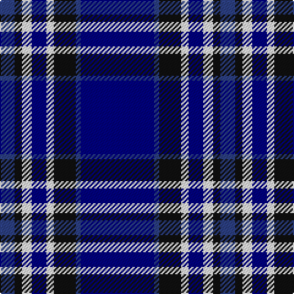

**Bands:** [BBKWBWKB](/stripes/bbkwbwkb/) · **Stripes:** [DB DB K W DB W K DB](/stripes/stripes8/) DB DB K W DB W K DB

This was sourced from register-of-tartans.  It is a [8 band tartan](/bands/bands8/).

Original link https://www.tartanregister.gov.uk/tartanDetails.aspx?ref=11431

## Register references

External register numbers recorded for this tartan.

- Scottish Register of Tartans: [11431](https://www.tartanregister.gov.uk/tartanDetails.aspx?ref=11431)

## Thread count
B/12 K6 W8 DB12 W6 K18 B4 DB/60

## Palette
Each colour and its ΔE from the base-6 reference it is a variant of.

| Colour | Shade | Base | ΔE (OKLab) |
|---|---|---|---|
| B | <code style="background-color:#2C4084;">#2C4084</code> `#2C4084` | B <code style="background-color:#2A418A;">#2A418A</code> | 0.01 |
| DB | <code style="background-color:#000080;">#000080</code> `#000080` | B <code style="background-color:#2A418A;">#2A418A</code> | 0.14 |
| K | <code style="background-color:#101010;">#101010</code> `#101010` | K <code style="background-color:#000000;">#000000</code> | 0.17 |
| W | <code style="background-color:#FFFFFF;">#FFFFFF</code> `#FFFFFF` | W <code style="background-color:#F7F7F7;">#F7F7F7</code> | 0.02 |

# Sample pattern

## Nearest tartans

The nearest existing variants by ΔTartan distance.

1. [DeCloud-McMasters (Personal)](/setts/s8/r3db2w2db26k22w3db3w3~x2/) — ΔT 1.07
1. [Kinding](/setts/s7/k10db30g3db3g3db3r6~x2/) — ΔT 1.14
1. [Indigo Blue Works](/setts/s11/db9k1db4k1db18b5k1b1k1b5db4~x2/) — ΔT 1.26
1. [Rhys Welsh Name Tartan Tartan Number: 5753. Earliest known date: 2002 The tartan for this Welsh surname and its variations, Rees, Preece, Reese, is actually woven in Wales at the Cambrian Woollen Mill, weaving on the same site since 1830. This tartan differs from many traditional patterns in that the warp and weft differ, giving the finished worsted wool cloth more of a predominant stripe, vertically noticeable in the finished Kilt, or Cilt in Wales. See products available Copyright © Blair Urquhart, Comrie, 2015](/setts/s10/db6lo3db3lo15db7db7db5db17db46w4/) — ΔT 1.29
1. [Hannah (Personal)](/setts/s6/ly2k9w3k9db35w2~x2/) — ΔT 1.30
1. [Chestico](/setts/s7/db20o1db1o1dg8k1w3~x2/) — ΔT 1.36
1. [Wolverine Corporate Tartan Tartan Number: 10748. Earliest known date: 03/12/2012 Created by the designer to celebrate an exclusive group of work colleagues known affectionately as the 'Wolverines'. Many within this close group share a proud Scottish heritage and wished to acknowledge this strong affiliation by commissioning a tartan. Yes. The Wolverine tartan has been created for the exclusive use of the 'Wolverines'. No commercial use of this tartan is permitted without expressed permission from the designer, and any party wishing to use or reproduce this tartan should first seek permission by email from the designer. See products available Copyright © Blair Urquhart, Comrie, 2015](/setts/s6/ly8k3b40k12k3ly3~x2/) — ΔT 1.37
1. [Historic Scotland](/setts/s9/db4w1db1w3db24y9k1y9k3~x2/) — ΔT 1.38
1. [Int. Police Association (Official)](/setts/s7/db7r3db26t2db2t26ly4~x2/) — ΔT 1.39
1. [Hannah (Personal)](/setts/s6/ly2k9w3k9b35w2~x2/) — ΔT 1.40

## Neighbour map

Every grey dot is one of 14313 variants placed by the first two principal components of the ΔTartan feature space (44% of its variance). Red is this tartan; blue dots are its nearest — click one to open its page.

<svg viewBox="0 0 640 380" role="img" style="max-width:100%;height:auto;border:1px solid #e0e0e0;border-radius:4px;display:block" xmlns="http://www.w3.org/2000/svg"><image href="/nn/cloud.v1.png" width="640" height="380"/><a href="/setts/s8/r3db2w2db26k22w3db3w3~x2/"><circle cx="256.6" cy="161.3" r="4" fill="#3465a4"><title>DeCloud-McMasters (Personal)</title></circle></a><a href="/setts/s7/k10db30g3db3g3db3r6~x2/"><circle cx="327.0" cy="190.6" r="4" fill="#3465a4"><title>Kinding</title></circle></a><a href="/setts/s11/db9k1db4k1db18b5k1b1k1b5db4~x2/"><circle cx="358.2" cy="163.1" r="4" fill="#3465a4"><title>Indigo Blue Works</title></circle></a><a href="/setts/s10/db6lo3db3lo15db7db7db5db17db46w4/"><circle cx="297.6" cy="168.8" r="4" fill="#3465a4"><title>Rhys Welsh Name Tartan Tartan Number: 5753. Earliest known date: 2002 The tartan for this Welsh surname and its variations, Rees, Preece, Reese, is actually woven in Wales at the Cambrian Woollen Mill, weaving on the same site since 1830. This tartan differs from many traditional patterns in that the warp and weft differ, giving the finished worsted wool cloth more of a predominant stripe, vertically noticeable in the finished Kilt, or Cilt in Wales. See products available Copyright © Blair Urquhart, Comrie, 2015</title></circle></a><a href="/setts/s6/ly2k9w3k9db35w2~x2/"><circle cx="349.9" cy="171.7" r="4" fill="#3465a4"><title>Hannah (Personal)</title></circle></a><a href="/setts/s7/db20o1db1o1dg8k1w3~x2/"><circle cx="331.9" cy="138.5" r="4" fill="#3465a4"><title>Chestico</title></circle></a><a href="/setts/s6/ly8k3b40k12k3ly3~x2/"><circle cx="314.5" cy="180.7" r="4" fill="#3465a4"><title>Wolverine Corporate Tartan Tartan Number: 10748. Earliest known date: 03/12/2012 Created by the designer to celebrate an exclusive group of work colleagues known affectionately as the 'Wolverines'. Many within this close group share a proud Scottish heritage and wished to acknowledge this strong affiliation by commissioning a tartan. Yes. The Wolverine tartan has been created for the exclusive use of the 'Wolverines'. No commercial use of this tartan is permitted without expressed permission from the designer, and any party wishing to use or reproduce this tartan should first seek permission by email from the designer. See products available Copyright © Blair Urquhart, Comrie, 2015</title></circle></a><a href="/setts/s9/db4w1db1w3db24y9k1y9k3~x2/"><circle cx="301.7" cy="137.7" r="4" fill="#3465a4"><title>Historic Scotland</title></circle></a><a href="/setts/s7/db7r3db26t2db2t26ly4~x2/"><circle cx="288.6" cy="179.8" r="4" fill="#3465a4"><title>Int. Police Association (Official)</title></circle></a><a href="/setts/s6/ly2k9w3k9b35w2~x2/"><circle cx="321.4" cy="162.9" r="4" fill="#3465a4"><title>Hannah (Personal)</title></circle></a><circle cx="301.2" cy="169.2" r="5" fill="#c00000"/></svg>

ID: /setts/s8/db30db2k9w3db6w4k3db6~x2/
