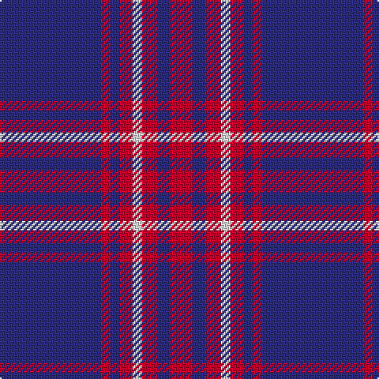

**Bands:** [BRBRWRBR](/stripes/brbrwrbr/) · **Stripes:** [DB R DB R W R DB R](/stripes/stripes8/) DB R DB R W R DB R

This was sourced from tartans-authority.  It is a [8 band tartan](/bands/bands8/).

Original link http://www.tartansauthority.com/tartan-ferret/display/3944/

## Attestations

This cloth appears in 2 source records; the oldest owns this page.

- Late 1980's — Edinburgh TIC (Corporate) (tartans-authority, [record](http://www.tartansauthority.com/tartan-ferret/display/3944/))
- undated — Edinburgh TIC (register-of-tartans, [record](https://www.tartanregister.gov.uk/tartanDetails.aspx?ref=4980))

## Register references

External register numbers recorded for this tartan.

- Scottish Register of Tartans: [4980](https://www.tartanregister.gov.uk/tartanDetails.aspx?ref=4980)
- Scottish Tartans Authority (ITI): 3944

## Variants

Other setts woven to the same stripe pattern.

- [Edinburgh Marketing](/setts/s8/db6r1db1r2w1r2db1r3~x4/)
- [Edinburgh Marketing](/setts/s8/db38r6db6r9w5r12db8r16/)

## Thread count
DB/64 R6 DB6 R8 LN6 R10 DB8 R/14

## Palette
Each colour and its ΔE from the base-6 reference it is a variant of.

| Colour | Shade | Base | ΔE (OKLab) |
|---|---|---|---|
| DB | <code style="background-color:#2C2C80;">#2C2C80</code> `#2C2C80` | B <code style="background-color:#2A418A;">#2A418A</code> | 0.06 |
| LN | <code style="background-color:#E0E0E0;">#E0E0E0</code> `#E0E0E0` | W <code style="background-color:#F7F7F7;">#F7F7F7</code> | 0.07 |
| R | <code style="background-color:#C8002C;">#C8002C</code> `#C8002C` | R <code style="background-color:#CC0000;">#CC0000</code> | 0.03 |

# Sample pattern

## Nearest tartans

The nearest existing variants by ΔTartan distance.

1. [BC Corps of Commissionaires, The](/setts/s7/db12lb1r3lb1r3lb1db6~x4/) — ΔT 1.09
1. [Orlando Fire Department (Corporate)](/setts/s9/db12ly1r16db1r1db14r3db14ly1~x4/) — ΔT 1.13
1. [MacQueen variant](/setts/s6/db2r7db2r7db22ly2~x2/) — ΔT 1.16
1. [South Australian Pipes & Drums (Corp](/setts/s6/db60ly6db11r25db11ly6~x2/) — ΔT 1.17
1. [Newton Primary School](/setts/s9/db26r3db3w2db3r3db6r6ly2~x4/) — ΔT 1.21
1. [South Australian Pipes & Drums](/setts/s10/db60ly6db11r25db11ly6db11r25db11ly6~x2/) — ΔT 1.31
1. [Coronation (1936) #2](/setts/s7/db11w1r12db6r1db6w1~x4/) — ΔT 1.37
1. [Americana - 1978 (Fashion)](/setts/s8/db33w7db5r2db5w2r13db3~x2/) — ΔT 1.39
1. [BC Corps of Commissionaires](/setts/s7/db12w1r3w1r3w1db6~x4/) — ΔT 1.48
1. [Coronation](/setts/s7/db11w1r12db6r1db6w1~x2/) — ΔT 1.49

## Neighbour map

Every grey dot is one of 14313 variants placed by the first two principal components of the ΔTartan feature space (44% of its variance). Red is this tartan; blue dots are its nearest — click one to open its page.

<svg viewBox="0 0 640 380" role="img" style="max-width:100%;height:auto;border:1px solid #e0e0e0;border-radius:4px;display:block" xmlns="http://www.w3.org/2000/svg"><image href="/nn/cloud.v1.png" width="640" height="380"/><a href="/setts/s7/db12lb1r3lb1r3lb1db6~x4/"><circle cx="406.7" cy="208.6" r="4" fill="#3465a4"><title>BC Corps of Commissionaires, The</title></circle></a><a href="/setts/s9/db12ly1r16db1r1db14r3db14ly1~x4/"><circle cx="420.4" cy="191.1" r="4" fill="#3465a4"><title>Orlando Fire Department (Corporate)</title></circle></a><a href="/setts/s6/db2r7db2r7db22ly2~x2/"><circle cx="394.7" cy="207.0" r="4" fill="#3465a4"><title>MacQueen variant</title></circle></a><a href="/setts/s6/db60ly6db11r25db11ly6~x2/"><circle cx="410.6" cy="215.1" r="4" fill="#3465a4"><title>South Australian Pipes &amp; Drums (Corp</title></circle></a><a href="/setts/s9/db26r3db3w2db3r3db6r6ly2~x4/"><circle cx="427.3" cy="161.6" r="4" fill="#3465a4"><title>Newton Primary School</title></circle></a><a href="/setts/s10/db60ly6db11r25db11ly6db11r25db11ly6~x2/"><circle cx="343.8" cy="190.3" r="4" fill="#3465a4"><title>South Australian Pipes &amp; Drums</title></circle></a><a href="/setts/s7/db11w1r12db6r1db6w1~x4/"><circle cx="361.7" cy="209.2" r="4" fill="#3465a4"><title>Coronation (1936) #2</title></circle></a><a href="/setts/s8/db33w7db5r2db5w2r13db3~x2/"><circle cx="395.1" cy="167.5" r="4" fill="#3465a4"><title>Americana - 1978 (Fashion)</title></circle></a><a href="/setts/s7/db12w1r3w1r3w1db6~x4/"><circle cx="395.8" cy="206.5" r="4" fill="#3465a4"><title>BC Corps of Commissionaires</title></circle></a><a href="/setts/s7/db11w1r12db6r1db6w1~x2/"><circle cx="378.6" cy="218.3" r="4" fill="#3465a4"><title>Coronation</title></circle></a><circle cx="412.5" cy="185.9" r="5" fill="#c00000"/></svg>

ID: /setts/s8/db32r3db3r4w3r5db4r7~x2/
