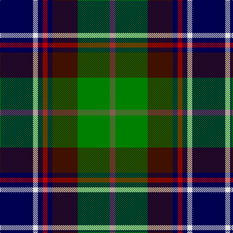

This page is one **sett** — a single exact thread-count. It belongs to the [tartan](/tartans/db34ln5db5r5db5dr26g33lt6/)
(the same proportion at any scale), whose colour order is pattern [BWBRBBGR](/stripes/bwbrbbgr/).

Sourced from weddslist.  It is a [8 stripe tartan](/stripes/stripes8/).

Original link http://www.weddslist.com/cgi-bin/tartans/pg.pl?source=sts

## Thread count
DB/68 LN10 DB10 R10 DB10 DR52 G66 LT/12

## Palette
Each colour and the base-6 reference it is a variant of.

| Colour | Shade | Base |
|---|---|---|
| DB | <code style="background-color:#000050;">#000050</code> `oklch(19.5% 0.135 264.1)` <small>#000050</small> | B <code style="background-color:#2A418A;">#2A418A</code> |
| DR | <code style="background-color:#401000;">#401000</code> `oklch(25.3% 0.079 39.9)` <small>#401000</small> | B <code style="background-color:#2A418A;">#2A418A</code> |
| G | <code style="background-color:#008000;">#008000</code> `oklch(52.0% 0.177 142.5)` <small>#008000</small> | G <code style="background-color:#006100;">#006100</code> |
| LN | <code style="background-color:#E0E0E0;">#E0E0E0</code> `oklch(90.7% 0.000 89.9)` <small>#E0E0E0</small> | W <code style="background-color:#F7F7F7;">#F7F7F7</code> |
| LT | <code style="background-color:#806050;">#806050</code> `oklch(51.7% 0.049 47.8)` <small>#806050</small> | R <code style="background-color:#CC0000;">#CC0000</code> |
| R | <code style="background-color:#C00000;">#C00000</code> `oklch(50.7% 0.208 29.2)` <small>#C00000</small> | R <code style="background-color:#CC0000;">#CC0000</code> |

# Sample pattern

## Nearest tartans

The nearest existing variants by ΔTartan distance, with this tartan at the top so the swatches line up against it.

ΔTartan

Tartan

Sett

—

<a href="/ttd/edit/#slug=db34w5db5r5db5dr26g33o6~x2">Blairmore</a> <a class="nn-out" href="/setts/s8/db34w5db5r5db5dr26g33o6~x2/" title="open its dictionary page">↗</a>

0.68

<a href="/ttd/edit/#slug=dr2lb1g7r1k7g1db7r1g2~x8">MacCraig</a> <a class="nn-out" href="/setts/s9/dr2lb1g7r1k7g1db7r1g2~x8/" title="open its dictionary page">↗</a>

0.73

<a href="/ttd/edit/#slug=g16lb3g3k10db12r2k3~x2">MacLean, Donald Personal Tartan Tartan Number: 3440. Earliest known date: pre 2002 From Pendleton Woolen Mills of Oregon, owners of the only copy of Clans Originaux. EBW 8.11.02. This is the same as MacTaggart #408 and #409!!! See products available Copyright © Blair Urquhart, Comrie, 2015</a> <a class="nn-out" href="/setts/s7/g16lb3g3k10db12r2k3~x2/" title="open its dictionary page">↗</a>

0.75

<a href="/ttd/edit/#slug=dp2g4k8lo1k1db4lb1db1lb2~x8">Scottish Cultural Society (Corporate</a> <a class="nn-out" href="/setts/s9/dp2g4k8lo1k1db4lb1db1lb2~x8/" title="open its dictionary page">↗</a>

0.80

<a href="/ttd/edit/#slug=k6dg14t2r3t2k16ly2b16dg16r3~x2">Unidentified #37</a> <a class="nn-out" href="/setts/s10/k6dg14t2r3t2k16ly2b16dg16r3~x2/" title="open its dictionary page">↗</a>

0.87

<a href="/ttd/edit/#slug=w10k52db52dg24ly10dg5r5">Harvey of Cornwall (Personal)</a> <a class="nn-out" href="/setts/s7/w10k52db52dg24ly10dg5r5/" title="open its dictionary page">↗</a>

0.88

<a href="/ttd/edit/#slug=k10ly3k2b20k10g15k2r3w3~x2">McCuaig (2010) (Name)</a> <a class="nn-out" href="/setts/s9/k10ly3k2b20k10g15k2r3w3~x2/" title="open its dictionary page">↗</a>

0.91

<a href="/ttd/edit/#slug=db3r2db18k6dg18ly2g3~x2">McComb</a> <a class="nn-out" href="/setts/s7/db3r2db18k6dg18ly2g3~x2/" title="open its dictionary page">↗</a>

0.91

<a href="/ttd/edit/#slug=w2db20r3k10g20lo2~x2">Morris of Eddergoll (Personal)</a> <a class="nn-out" href="/setts/s6/w2db20r3k10g20lo2~x2/" title="open its dictionary page">↗</a>

0.95

<a href="/ttd/edit/#slug=r4g16w2k15db15k2db2ly2~x2">Cowan, of Inveresk</a> <a class="nn-out" href="/setts/s8/r4g16w2k15db15k2db2ly2~x2/" title="open its dictionary page">↗</a>

0.97

<a href="/ttd/edit/#slug=r4dg16w2k15db15k2db2ly2~x2">Cowan of Inveresk (Personal)</a> <a class="nn-out" href="/setts/s8/r4dg16w2k15db15k2db2ly2~x2/" title="open its dictionary page">↗</a>

## Neighbour map

Every grey dot is one of 14299 variants placed by the first two principal components of the ΔTartan feature space (44% of its variance). Red is this tartan; blue dots are its nearest — click one to open its page.

<svg viewBox="0 0 640 380" role="img" style="max-width:100%;height:auto;border:1px solid #e0e0e0;border-radius:4px;display:block" xmlns="http://www.w3.org/2000/svg"><image href="/nn/cloud.v1.png" width="640" height="380"/><a href="/setts/s9/dr2lb1g7r1k7g1db7r1g2~x8/"><circle cx="102.8" cy="177.0" r="4" fill="#3465a4"><title>MacCraig</title></circle></a><a href="/setts/s7/g16lb3g3k10db12r2k3~x2/"><circle cx="129.8" cy="196.3" r="4" fill="#3465a4"><title>MacLean, Donald Personal Tartan Tartan Number: 3440. Earliest known date: pre 2002 From Pendleton Woolen Mills of Oregon, owners of the only copy of Clans Originaux. EBW 8.11.02. This is the same as MacTaggart #408 and #409!!! See products available Copyright © Blair Urquhart, Comrie, 2015</title></circle></a><a href="/setts/s9/dp2g4k8lo1k1db4lb1db1lb2~x8/"><circle cx="108.7" cy="165.8" r="4" fill="#3465a4"><title>Scottish Cultural Society (Corporate</title></circle></a><a href="/setts/s10/k6dg14t2r3t2k16ly2b16dg16r3~x2/"><circle cx="113.4" cy="169.5" r="4" fill="#3465a4"><title>Unidentified #37</title></circle></a><a href="/setts/s7/w10k52db52dg24ly10dg5r5/"><circle cx="123.6" cy="167.4" r="4" fill="#3465a4"><title>Harvey of Cornwall (Personal)</title></circle></a><a href="/setts/s9/k10ly3k2b20k10g15k2r3w3~x2/"><circle cx="115.4" cy="159.5" r="4" fill="#3465a4"><title>McCuaig (2010) (Name)</title></circle></a><a href="/setts/s7/db3r2db18k6dg18ly2g3~x2/"><circle cx="177.3" cy="181.7" r="4" fill="#3465a4"><title>McComb</title></circle></a><a href="/setts/s6/w2db20r3k10g20lo2~x2/"><circle cx="138.9" cy="181.3" r="4" fill="#3465a4"><title>Morris of Eddergoll (Personal)</title></circle></a><a href="/setts/s8/r4g16w2k15db15k2db2ly2~x2/"><circle cx="79.4" cy="162.8" r="4" fill="#3465a4"><title>Cowan, of Inveresk</title></circle></a><a href="/setts/s8/r4dg16w2k15db15k2db2ly2~x2/"><circle cx="88.3" cy="167.4" r="4" fill="#3465a4"><title>Cowan of Inveresk (Personal)</title></circle></a><circle cx="119.3" cy="179.1" r="5" fill="#c00000"/></svg>

ID: /setts/s8/db34w5db5r5db5dr26g33o6~x2/
