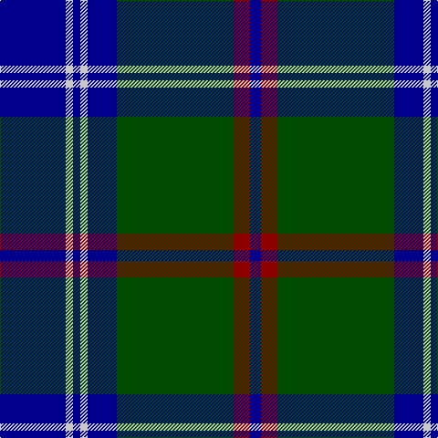

In pattern [BRGBWBWB](/stripes/brgbwbwb/).

This was sourced from register-of-tartans.  It is a [8 stripe tartan](/stripes/stripes8/).

Original link https://www.tartanregister.gov.uk/tartanDetails.aspx?ref=719

## Attestations

This cloth appears in 2 source records; the oldest owns this page.

- 01/01/1998 — Colvin (register-of-tartans, [record](https://www.tartanregister.gov.uk/tartanDetails.aspx?ref=719))
- pre 1998 — Colvin (Name) (tartans-authority, [record](http://www.tartansauthority.com/tartan-ferret/display/4196/))

## Register references

External register numbers recorded for this tartan.

- Scottish Register of Tartans: [719](https://www.tartanregister.gov.uk/tartanDetails.aspx?ref=719)
- Scottish Tartans Authority (ITI): 4196

## Thread count
DB/72 N8 DB8 N8 DB32 G128 DR18 DB/12

## Palette
Each colour and its ΔE from the base-6 reference it is a variant of.

| Colour | Shade | Base | ΔE (OKLab) |
|---|---|---|---|
| DB | <code style="background-color:#00008C;">#00008C</code> `#00008C` | B <code style="background-color:#2A418A;">#2A418A</code> | 0.13 |
| DR | <code style="background-color:#8C0000;">#8C0000</code> `#8C0000` | R <code style="background-color:#CC0000;">#CC0000</code> | 0.14 |
| G | <code style="background-color:#004C00;">#004C00</code> `#004C00` | G <code style="background-color:#006100;">#006100</code> | 0.07 |
| N | <code style="background-color:#C8C8C8;">#C8C8C8</code> `#C8C8C8` | W <code style="background-color:#F7F7F7;">#F7F7F7</code> | 0.14 |

# Sample pattern

## Nearest tartans

The nearest existing variants by ΔTartan distance.

1. [Greenways Marketing Intl (Corporate)](/setts/s7/db24g3db3g3lo2g18r2~x2/) — ΔT 0.80
1. [Gracie](/setts/s8/g47r3g6db35lo3~x2/) — ΔT 0.82
1. [Home (Clan)](/setts/s8/k36r3k3r3k9b36g3b2~x2/) — ΔT 0.97
1. [Gammell](/setts/s8/db32dr3db3dr3db3dr10g24m3~x2/) — ΔT 1.09
1. [Rowan (Name)](/setts/s10/db1k1db8k2lo1g12lo1db8k1db1~x4/) — ΔT 1.10
1. [Kinross (Fashion)](/setts/s8/dg20db2g6db2dg4db27lo2db8~x2/) — ΔT 1.12
1. [Wishart Htg (Clan)](/setts/s7/k7db4dg31db3ly2db27lb4~x2/) — ΔT 1.14
1. [Sorbie](/setts/s10/k1b17k17b1r1b1k17b17k1w1~x4/) — ΔT 1.15
1. [Sorbie (Name)](/setts/s6/r1b1k17b17k1w1~x4/) — ΔT 1.16
1. [Highlands School, (North Carolina)](/setts/s8/y12db2y2db30db3db2db13w4~x2/) — ΔT 1.16

## Neighbour map

Every grey dot is one of 14299 variants placed by the first two principal components of the ΔTartan feature space (44% of its variance). Red is this tartan; blue dots are its nearest — click one to open its page.

<svg viewBox="0 0 640 380" role="img" style="max-width:100%;height:auto;border:1px solid #e0e0e0;border-radius:4px;display:block" xmlns="http://www.w3.org/2000/svg"><image href="/nn/cloud.v1.png" width="640" height="380"/><a href="/setts/s7/db24g3db3g3lo2g18r2~x2/"><circle cx="312.4" cy="196.9" r="4" fill="#3465a4"><title>Greenways Marketing Intl (Corporate)</title></circle></a><a href="/setts/s8/g47r3g6db35lo3~x2/"><circle cx="326.3" cy="189.7" r="4" fill="#3465a4"><title>Gracie</title></circle></a><a href="/setts/s8/k36r3k3r3k9b36g3b2~x2/"><circle cx="318.7" cy="160.7" r="4" fill="#3465a4"><title>Home (Clan)</title></circle></a><a href="/setts/s8/db32dr3db3dr3db3dr10g24m3~x2/"><circle cx="262.4" cy="193.6" r="4" fill="#3465a4"><title>Gammell</title></circle></a><a href="/setts/s10/db1k1db8k2lo1g12lo1db8k1db1~x4/"><circle cx="300.4" cy="185.4" r="4" fill="#3465a4"><title>Rowan (Name)</title></circle></a><a href="/setts/s8/dg20db2g6db2dg4db27lo2db8~x2/"><circle cx="334.1" cy="197.7" r="4" fill="#3465a4"><title>Kinross (Fashion)</title></circle></a><a href="/setts/s7/k7db4dg31db3ly2db27lb4~x2/"><circle cx="246.9" cy="169.1" r="4" fill="#3465a4"><title>Wishart Htg (Clan)</title></circle></a><a href="/setts/s10/k1b17k17b1r1b1k17b17k1w1~x4/"><circle cx="315.6" cy="163.9" r="4" fill="#3465a4"><title>Sorbie</title></circle></a><a href="/setts/s6/r1b1k17b17k1w1~x4/"><circle cx="316.0" cy="172.5" r="4" fill="#3465a4"><title>Sorbie (Name)</title></circle></a><a href="/setts/s8/y12db2y2db30db3db2db13w4~x2/"><circle cx="280.3" cy="170.6" r="4" fill="#3465a4"><title>Highlands School, (North Carolina)</title></circle></a><circle cx="290.6" cy="177.4" r="5" fill="#c00000"/></svg>

ID: /setts/s8/db36lb4db4lb4db16dg64r9db6~x2/
