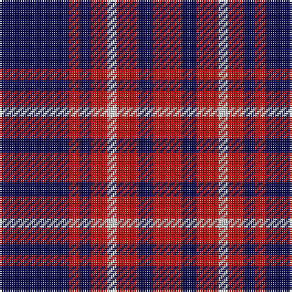

This page is one **sett** — a single exact thread-count. It belongs to the [tartan](/tartans/db38r6db6r9w5r12db8r16/)
(the same proportion at any scale), whose colour order is pattern [BRBRWRBR](/stripes/brbrwrbr/).

Sourced from weddslist.  It is a [8 stripe tartan](/stripes/stripes8/).

Original link http://www.weddslist.com/cgi-bin/tartans/pg.pl?source=sts

2 attestations — the source records this cloth was collapsed from (oldest owns this page)

<ul>
<li>undated — Edinburgh Marketing (weddslist, <a href="http://www.weddslist.com/cgi-bin/tartans/pg.pl?source=sts">record</a>)</li>
<li>undated — Edinburgh Marketing Corporate Tartan Tartan Number: 2106. Earliest known date: 1991 The tartan was based on the Drummond tartan after the famous Lord Provost of Edinburgh, Lord Drummond, who is regarded as the father of the New Town and the "bridge" between the Old town of Edinburgh and the New Town. The colours are the corporate colours of Edinburgh Marketing, Navy, Red and White. The tartan was designed by Messrs. Kinloch Anderson of Leith, Edinburgh. See products available Copyright © Blair Urquhart, Comrie, 2015 (house-of-tartan, <a href="http://www.house-of-tartan.scotland.net/house/TartanViewjs.asp?colr=Def&tnam=2106">record</a>)</li>
</ul>

## Thread count
DB/38 R6 DB6 R9 LN5 R12 DB8 R/16

## Palette

Palette: <strong>Tartan Dictionary</strong> <small style="color:#888">(1 of 3 colours)</small>
<table><thead><tr><th>Colour</th><th>Threads</th><th>Shade</th><th>Base</th><th>OKLCh</th></tr></thead><tbody><tr><td>DB/</td><td style="text-align:right;font-variant-numeric:tabular-nums">38</td><td><code style="background-color:#000050;">#000050</code> <small style="color:#888">#000050</small></td><td>B <code style="background-color:#2A418A;">#2A418A</code></td><td><small style="color:#888">oklch(19.5% 0.135 264.1)</small></td></tr><tr><td>R</td><td style="text-align:right;font-variant-numeric:tabular-nums">6</td><td><code style="background-color:#C00000;">#C00000</code> <small style="color:#888">#C00000</small></td><td>R <code style="background-color:#CC0000;">#CC0000</code></td><td><small style="color:#888">oklch(50.7% 0.208 29.2)</small></td></tr><tr><td>DB</td><td style="text-align:right;font-variant-numeric:tabular-nums">6</td><td><code style="background-color:#000050;">#000050</code> <small style="color:#888">#000050</small></td><td>B <code style="background-color:#2A418A;">#2A418A</code></td><td><small style="color:#888">oklch(19.5% 0.135 264.1)</small></td></tr><tr><td>R</td><td style="text-align:right;font-variant-numeric:tabular-nums">9</td><td><code style="background-color:#C00000;">#C00000</code> <small style="color:#888">#C00000</small></td><td>R <code style="background-color:#CC0000;">#CC0000</code></td><td><small style="color:#888">oklch(50.7% 0.208 29.2)</small></td></tr><tr><td>LN</td><td style="text-align:right;font-variant-numeric:tabular-nums">5</td><td><code style="background-color:#E0E0E0;">#E0E0E0</code> <small style="color:#888">#E0E0E0</small></td><td>W <code style="background-color:#F7F7F7;">#F7F7F7</code></td><td><small style="color:#888">oklch(90.7% 0.000 89.9)</small></td></tr><tr><td>R</td><td style="text-align:right;font-variant-numeric:tabular-nums">12</td><td><code style="background-color:#C00000;">#C00000</code> <small style="color:#888">#C00000</small></td><td>R <code style="background-color:#CC0000;">#CC0000</code></td><td><small style="color:#888">oklch(50.7% 0.208 29.2)</small></td></tr><tr><td>DB</td><td style="text-align:right;font-variant-numeric:tabular-nums">8</td><td><code style="background-color:#000050;">#000050</code> <small style="color:#888">#000050</small></td><td>B <code style="background-color:#2A418A;">#2A418A</code></td><td><small style="color:#888">oklch(19.5% 0.135 264.1)</small></td></tr><tr><td>R/</td><td style="text-align:right;font-variant-numeric:tabular-nums">16</td><td><code style="background-color:#C00000;">#C00000</code> <small style="color:#888">#C00000</small></td><td>R <code style="background-color:#CC0000;">#CC0000</code></td><td><small style="color:#888">oklch(50.7% 0.208 29.2)</small></td></tr></tbody></table>

# Sample pattern

## Nearest tartans

The nearest existing variants by ΔTartan distance, with this tartan at the top so the swatches line up against it.

ΔTartan

Tartan

Sett

—

<a href="/ttd/edit/#slug=db38r6db6r9w5r12db8r16">Edinburgh Marketing</a> <a class="nn-out" href="/setts/s8/db38r6db6r9w5r12db8r16/" title="open its dictionary page">↗</a>

0.69

<a href="/ttd/edit/#slug=k4m4k19m9k9m19k2m2w3~x2">McLeod-Bain (Personal)</a> <a class="nn-out" href="/setts/s9/k4m4k19m9k9m19k2m2w3~x2/" title="open its dictionary page">↗</a>

0.93

<a href="/ttd/edit/#slug=r6w3r17k3r3k25r3~x2">Bon Accord</a> <a class="nn-out" href="/setts/s7/r6w3r17k3r3k25r3~x2/" title="open its dictionary page">↗</a>

0.98

<a href="/ttd/edit/#slug=db6r1db1r2w1r2db1r3~x4">Edinburgh Marketing</a> <a class="nn-out" href="/setts/s8/db6r1db1r2w1r2db1r3~x4/" title="open its dictionary page">↗</a>

1.10

<a href="/ttd/edit/#slug=r19k3r19k32g3k8~x2">Tartan TV</a> <a class="nn-out" href="/setts/s6/r19k3r19k32g3k8~x2/" title="open its dictionary page">↗</a>

1.12

<a href="/ttd/edit/#slug=db6r1db6r9lb1~x2">Hamilton</a> <a class="nn-out" href="/setts/s5/db6r1db6r9lb1~x2/" title="open its dictionary page">↗</a>

1.25

<a href="/ttd/edit/#slug=g22dp22g3dp11w3dp4w3~x2">O'Long (Personal)</a> <a class="nn-out" href="/setts/s7/g22dp22g3dp11w3dp4w3~x2/" title="open its dictionary page">↗</a>

1.25

<a href="/ttd/edit/#slug=db6r1db6r9lr1~x2">Hamilton</a> <a class="nn-out" href="/setts/s5/db6r1db6r9lr1~x2/" title="open its dictionary page">↗</a>

1.32

<a href="/setts/s10/db60ly6db11r25db11ly6~x2/">South Australian Pipes &amp; Drums</a>

1.41

<a href="/ttd/edit/#slug=db11w1r12db6r1db6w1~x4">Coronation (1936) #2</a> <a class="nn-out" href="/setts/s7/db11w1r12db6r1db6w1~x4/" title="open its dictionary page">↗</a>

1.42

<a href="/ttd/edit/#slug=db3r24db3r3db25w3~x2">Matthews (Personal)</a> <a class="nn-out" href="/setts/s6/db3r24db3r3db25w3~x2/" title="open its dictionary page">↗</a>

## Neighbour map

Every grey dot is one of 14299 variants placed by the first two principal components of the ΔTartan feature space (44% of its variance). Red is this tartan; blue dots are its nearest — click one to open its page.

<svg viewBox="0 0 640 380" role="img" style="max-width:100%;height:auto;border:1px solid #e0e0e0;border-radius:4px;display:block" xmlns="http://www.w3.org/2000/svg"><image href="/nn/cloud.v1.png" width="640" height="380"/><a href="/setts/s9/k4m4k19m9k9m19k2m2w3~x2/"><circle cx="285.2" cy="196.7" r="4" fill="#3465a4"><title>McLeod-Bain (Personal)</title></circle></a><a href="/setts/s7/r6w3r17k3r3k25r3~x2/"><circle cx="296.0" cy="201.5" r="4" fill="#3465a4"><title>Bon Accord</title></circle></a><a href="/setts/s8/db6r1db1r2w1r2db1r3~x4/"><circle cx="260.9" cy="220.1" r="4" fill="#3465a4"><title>Edinburgh Marketing</title></circle></a><a href="/setts/s6/r19k3r19k32g3k8~x2/"><circle cx="311.4" cy="223.1" r="4" fill="#3465a4"><title>Tartan TV</title></circle></a><a href="/setts/s5/db6r1db6r9lb1~x2/"><circle cx="299.4" cy="239.8" r="4" fill="#3465a4"><title>Hamilton</title></circle></a><a href="/setts/s7/g22dp22g3dp11w3dp4w3~x2/"><circle cx="305.3" cy="222.8" r="4" fill="#3465a4"><title>O'Long (Personal)</title></circle></a><a href="/setts/s5/db6r1db6r9lr1~x2/"><circle cx="313.1" cy="249.9" r="4" fill="#3465a4"><title>Hamilton</title></circle></a><a href="/setts/s10/db60ly6db11r25db11ly6~x2/"><circle cx="343.5" cy="190.1" r="4" fill="#3465a4"><title>South Australian Pipes &amp; Drums</title></circle></a><a href="/setts/s7/db11w1r12db6r1db6w1~x4/"><circle cx="361.5" cy="208.9" r="4" fill="#3465a4"><title>Coronation (1936) #2</title></circle></a><a href="/setts/s6/db3r24db3r3db25w3~x2/"><circle cx="332.0" cy="211.1" r="4" fill="#3465a4"><title>Matthews (Personal)</title></circle></a><circle cx="292.6" cy="213.9" r="5" fill="#c00000"/></svg>

ID: /setts/s8/db38r6db6r9w5r12db8r16/
