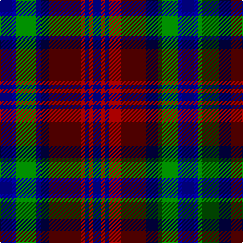

This page is one **sett** — a single exact thread-count. It belongs to the [tartan](/tartans/db3db1g5db3r9db1r1db2/)
(the same proportion at any scale), whose colour order is pattern [BBGBRBRB](/stripes/bbgbrbrb/).

Sourced from register-of-tartans.  It is a [8 stripe tartan](/stripes/stripes8/).

Original link https://www.tartanregister.gov.uk/tartanDetails.aspx?ref=4262

## Register references

External register numbers recorded for this tartan.

- Scottish Register of Tartans: [4262](https://www.tartanregister.gov.uk/tartanDetails.aspx?ref=4262)
- Scottish Tartans Authority (ITI): 4621

## Thread count
DBa/12 DB4 G20 DBa12 DR36 DBa4 DR4 DBa/8

## Palette

Palette: <strong>Tartan Register</strong> <small style="color:#888">(8 of 9 colours)</small>
<table><thead><tr><th>Colour</th><th>Threads</th><th>Shade</th><th>Base</th><th>OKLCh</th></tr></thead><tbody><tr><td>DBa/</td><td style="text-align:right;font-variant-numeric:tabular-nums">12</td><td><code style="background-color:#000064;">#000064</code> <small style="color:#888">#000064</small></td><td>B <code style="background-color:#2A418A;">#2A418A</code></td><td><small style="color:#888">oklch(22.7% 0.158 264.1)</small></td></tr><tr><td>DB</td><td style="text-align:right;font-variant-numeric:tabular-nums">4</td><td><code style="background-color:#00008C;">#00008C</code> <small style="color:#888">#00008C</small></td><td>B <code style="background-color:#2A418A;">#2A418A</code></td><td><small style="color:#888">oklch(28.9% 0.200 264.1)</small></td></tr><tr><td>G</td><td style="text-align:right;font-variant-numeric:tabular-nums">20</td><td><code style="background-color:#007800;">#007800</code> <small style="color:#888">#007800</small></td><td>G <code style="background-color:#006100;">#006100</code></td><td><small style="color:#888">oklch(49.6% 0.169 142.5)</small></td></tr><tr><td>DBa</td><td style="text-align:right;font-variant-numeric:tabular-nums">12</td><td><code style="background-color:#000064;">#000064</code> <small style="color:#888">#000064</small></td><td>B <code style="background-color:#2A418A;">#2A418A</code></td><td><small style="color:#888">oklch(22.7% 0.158 264.1)</small></td></tr><tr><td>DR</td><td style="text-align:right;font-variant-numeric:tabular-nums">36</td><td><code style="background-color:#8C0000;">#8C0000</code> <small style="color:#888">#8C0000</small></td><td>R <code style="background-color:#CC0000;">#CC0000</code></td><td><small style="color:#888">oklch(40.2% 0.165 29.2)</small></td></tr><tr><td>DBa</td><td style="text-align:right;font-variant-numeric:tabular-nums">4</td><td><code style="background-color:#000064;">#000064</code> <small style="color:#888">#000064</small></td><td>B <code style="background-color:#2A418A;">#2A418A</code></td><td><small style="color:#888">oklch(22.7% 0.158 264.1)</small></td></tr><tr><td>DR</td><td style="text-align:right;font-variant-numeric:tabular-nums">4</td><td><code style="background-color:#8C0000;">#8C0000</code> <small style="color:#888">#8C0000</small></td><td>R <code style="background-color:#CC0000;">#CC0000</code></td><td><small style="color:#888">oklch(40.2% 0.165 29.2)</small></td></tr><tr><td>DBa/</td><td style="text-align:right;font-variant-numeric:tabular-nums">8</td><td><code style="background-color:#000064;">#000064</code> <small style="color:#888">#000064</small></td><td>B <code style="background-color:#2A418A;">#2A418A</code></td><td><small style="color:#888">oklch(22.7% 0.158 264.1)</small></td></tr></tbody></table>

# Sample pattern

## Nearest tartans

The nearest existing variants by ΔTartan distance, with this tartan at the top so the swatches line up against it.

ΔTartan

Tartan

Sett

—

<a href="/ttd/edit/#slug=db3db1g5db3r9db1r1db2~x4">Unidentified #61</a> <a class="nn-out" href="/setts/s8/db3db1g5db3r9db1r1db2~x4/" title="open its dictionary page">↗</a>

0.88

<a href="/ttd/edit/#slug=r3k12g4db12r1k2r1~x4">Sandberg</a> <a class="nn-out" href="/setts/s7/r3k12g4db12r1k2r1~x4/" title="open its dictionary page">↗</a>

0.97

<a href="/setts/s10/g19t2g4k13dp12k3~x2/">Wilson's No.150</a>

0.98

<a href="/ttd/edit/#slug=db28k3db6k3db6k20dy28k3w6~x2">Forbes #5</a> <a class="nn-out" href="/setts/s9/db28k3db6k3db6k20dy28k3w6~x2/" title="open its dictionary page">↗</a>

0.98

<a href="/ttd/edit/#slug=dp3k1dp8k6dg8k1w2~x2">Baillie (Highland Society)</a> <a class="nn-out" href="/setts/s7/dp3k1dp8k6dg8k1w2~x2/" title="open its dictionary page">↗</a>

1.01

<a href="/setts/s10/g19w2g4k13dp12k3~x2/">Wilson's No.158</a>

1.01

<a href="/ttd/edit/#slug=dt10r2dt10r10dg2r2dg2r2dg10r1w2~x4">North Berwick (Dance)</a> <a class="nn-out" href="/setts/s11/dt10r2dt10r10dg2r2dg2r2dg10r1w2~x4/" title="open its dictionary page">↗</a>

1.02

<a href="/setts/s10/g19ly2g4k13dp12k3~x2/">Wilson's No.160</a>

1.03

<a href="/ttd/edit/#slug=n32w4n4k24dp29k4">Grammar School at Leeds (School)</a> <a class="nn-out" href="/setts/s6/n32w4n4k24dp29k4/" title="open its dictionary page">↗</a>

1.03

<a href="/ttd/edit/#slug=w2r3dg9r3db2r3db3w1~x6">Utah (US State)</a> <a class="nn-out" href="/setts/s8/w2r3dg9r3db2r3db3w1~x6/" title="open its dictionary page">↗</a>

1.05

<a href="/ttd/edit/#slug=k36r3db3r3k8db24r18g3r3~x2">Grady (Personal)</a> <a class="nn-out" href="/setts/s9/k36r3db3r3k8db24r18g3r3~x2/" title="open its dictionary page">↗</a>

## Neighbour map

Every grey dot is one of 14299 variants placed by the first two principal components of the ΔTartan feature space (44% of its variance). Red is this tartan; blue dots are its nearest — click one to open its page.

<svg viewBox="0 0 640 380" role="img" style="max-width:100%;height:auto;border:1px solid #e0e0e0;border-radius:4px;display:block" xmlns="http://www.w3.org/2000/svg"><image href="/nn/cloud.v1.png" width="640" height="380"/><a href="/setts/s7/r3k12g4db12r1k2r1~x4/"><circle cx="243.7" cy="206.3" r="4" fill="#3465a4"><title>Sandberg</title></circle></a><a href="/setts/s10/g19t2g4k13dp12k3~x2/"><circle cx="179.5" cy="213.7" r="4" fill="#3465a4"><title>Wilson's No.150</title></circle></a><a href="/setts/s9/db28k3db6k3db6k20dy28k3w6~x2/"><circle cx="219.0" cy="207.5" r="4" fill="#3465a4"><title>Forbes #5</title></circle></a><a href="/setts/s7/dp3k1dp8k6dg8k1w2~x2/"><circle cx="177.2" cy="225.7" r="4" fill="#3465a4"><title>Baillie (Highland Society)</title></circle></a><a href="/setts/s10/g19w2g4k13dp12k3~x2/"><circle cx="163.4" cy="204.5" r="4" fill="#3465a4"><title>Wilson's No.158</title></circle></a><a href="/setts/s11/dt10r2dt10r10dg2r2dg2r2dg10r1w2~x4/"><circle cx="200.5" cy="186.6" r="4" fill="#3465a4"><title>North Berwick (Dance)</title></circle></a><a href="/setts/s10/g19ly2g4k13dp12k3~x2/"><circle cx="167.2" cy="206.2" r="4" fill="#3465a4"><title>Wilson's No.160</title></circle></a><a href="/setts/s6/n32w4n4k24dp29k4/"><circle cx="207.5" cy="228.9" r="4" fill="#3465a4"><title>Grammar School at Leeds (School)</title></circle></a><a href="/setts/s8/w2r3dg9r3db2r3db3w1~x6/"><circle cx="158.7" cy="206.3" r="4" fill="#3465a4"><title>Utah (US State)</title></circle></a><a href="/setts/s9/k36r3db3r3k8db24r18g3r3~x2/"><circle cx="259.7" cy="177.7" r="4" fill="#3465a4"><title>Grady (Personal)</title></circle></a><circle cx="217.9" cy="207.9" r="5" fill="#c00000"/></svg>

ID: /setts/s8/db3db1g5db3r9db1r1db2~x4/
