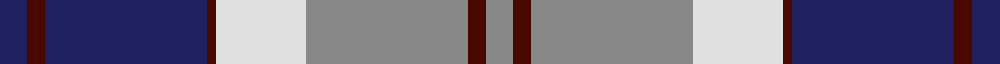
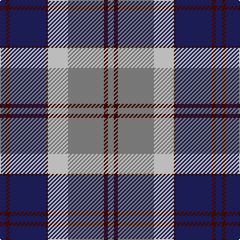

In pattern [BBBBWRBR](/stripes/bbbbwrbr/).

This was sourced from register-of-tartans.  It is a [8 stripe tartan](/stripes/stripes8/).

Original link https://www.tartanregister.gov.uk/tartanDetails.aspx?ref=205

## Register references

External register numbers recorded for this tartan.

- Scottish Register of Tartans: [205](https://www.tartanregister.gov.uk/tartanDetails.aspx?ref=205)
- Scottish Tartans Authority (ITI): 595
- Scottish Tartans World Register: 595

## Thread count
DB/6 DR4 DB36 DR2 LN20 N36 DR4 N/6

## Palette
Each colour and the base-6 reference it is a variant of.

| Colour | Shade | Base |
|---|---|---|
| DB | <code style="background-color:#202060;">#202060</code> `oklch(28.9% 0.111 276.9)` <small>#202060</small> | B <code style="background-color:#2A418A;">#2A418A</code> |
| DR | <code style="background-color:#480800;">#480800</code> `oklch(26.1% 0.096 33.1)` <small>#480800</small> | B <code style="background-color:#2A418A;">#2A418A</code> |
| LN | <code style="background-color:#E0E0E0;">#E0E0E0</code> `oklch(90.7% 0.000 89.9)` <small>#E0E0E0</small> | W <code style="background-color:#F7F7F7;">#F7F7F7</code> |
| N | <code style="background-color:#888888;">#888888</code> `oklch(62.7% 0.000 89.9)` <small>#888888</small> | R <code style="background-color:#CC0000;">#CC0000</code> |

# Sample pattern

## Nearest tartans

The nearest existing variants by ΔTartan distance.

1. [Bannockbane, Modern Silver](/setts/s8/db3o2db18o1w10y18o2y3~x2/) — ΔT 0.94
1. [Bannockbane Navy](/setts/s8/db3m2db30m1w18o30m2o3~x2/) — ΔT 0.95
1. [Lord Arran (Corporate)](/setts/s9/r3dy1w12dy2db2dy2db14w2db2~x2/) — ΔT 1.03
1. [Knights Templar St Andrews Corporate Tartan Tartan Number: 559. Earliest known date: 1989 An Order of Chivalry serving God and Scotland.' Correct name is 'Scottish Knights Templar of Militi Scotia, St Andrews.' One of three similar designs which were designed by Capt T.S. Davidson* in 1978. All were ratified and approved by the Grand Conclave of the Militi Scotia S.M.O.T.J* in Perth - 28 Mar 1998. Stuart Davidson started the Scottish Tartan Society in 1966. There are slight differences between each one which dictates which 'branch' of the order is entitled to wear it. * Supreme Military Order of the Temple of Jeruslalem See products available Copyright © Blair Urquhart, Comrie, 2015](/setts/s12/w4r1db18k6w5k4w4k4w3k2r1db2~x2/) — ΔT 1.11
1. [Confederate (Military)](/setts/s7/r12b18k1r4k1g6k2~x2/) — ΔT 1.11
1. [Keela (Corporate)](/setts/s7/dt7w3dt2w6dt16t26r4~x2/) — ΔT 1.12
1. [Yale College of Wrexham (Corporate)](/setts/s8/r9w5t57k5t9r29k18w9/) — ΔT 1.12
1. [Confederate](/setts/s7/r12b18k1r4k1dg6k2~x2/) — ΔT 1.14
1. [Central Newcastle School](/setts/s7/lp10dp9o59dp9k59dp9lp5/) — ΔT 1.16
1. [Bannockbane Blue #1](/setts/s8/k4lo2k13lo1w8b13lo2b4~x2/) — ΔT 1.16

## Neighbour map

Every grey dot is one of 14299 variants placed by the first two principal components of the ΔTartan feature space (44% of its variance). Red is this tartan; blue dots are its nearest — click one to open its page.

<svg viewBox="0 0 640 380" role="img" style="max-width:100%;height:auto;border:1px solid #e0e0e0;border-radius:4px;display:block" xmlns="http://www.w3.org/2000/svg"><image href="/nn/cloud.v1.png" width="640" height="380"/><a href="/setts/s8/db3o2db18o1w10y18o2y3~x2/"><circle cx="224.1" cy="163.2" r="4" fill="#3465a4"><title>Bannockbane, Modern Silver</title></circle></a><a href="/setts/s8/db3m2db30m1w18o30m2o3~x2/"><circle cx="228.8" cy="119.7" r="4" fill="#3465a4"><title>Bannockbane Navy</title></circle></a><a href="/setts/s9/r3dy1w12dy2db2dy2db14w2db2~x2/"><circle cx="225.2" cy="143.2" r="4" fill="#3465a4"><title>Lord Arran (Corporate)</title></circle></a><a href="/setts/s12/w4r1db18k6w5k4w4k4w3k2r1db2~x2/"><circle cx="182.2" cy="130.3" r="4" fill="#3465a4"><title>Knights Templar St Andrews Corporate Tartan Tartan Number: 559. Earliest known date: 1989 An Order of Chivalry serving God and Scotland.' Correct name is 'Scottish Knights Templar of Militi Scotia, St Andrews.' One of three similar designs which were designed by Capt T.S. Davidson* in 1978. All were ratified and approved by the Grand Conclave of the Militi Scotia S.M.O.T.J* in Perth - 28 Mar 1998. Stuart Davidson started the Scottish Tartan Society in 1966. There are slight differences between each one which dictates which 'branch' of the order is entitled to wear it. * Supreme Military Order of the Temple of Jeruslalem See products available Copyright © Blair Urquhart, Comrie, 2015</title></circle></a><a href="/setts/s7/r12b18k1r4k1g6k2~x2/"><circle cx="238.1" cy="162.6" r="4" fill="#3465a4"><title>Confederate (Military)</title></circle></a><a href="/setts/s7/dt7w3dt2w6dt16t26r4~x2/"><circle cx="213.5" cy="181.9" r="4" fill="#3465a4"><title>Keela (Corporate)</title></circle></a><a href="/setts/s8/r9w5t57k5t9r29k18w9/"><circle cx="226.0" cy="167.0" r="4" fill="#3465a4"><title>Yale College of Wrexham (Corporate)</title></circle></a><a href="/setts/s7/r12b18k1r4k1dg6k2~x2/"><circle cx="238.6" cy="162.9" r="4" fill="#3465a4"><title>Confederate</title></circle></a><a href="/setts/s7/lp10dp9o59dp9k59dp9lp5/"><circle cx="204.5" cy="174.1" r="4" fill="#3465a4"><title>Central Newcastle School</title></circle></a><a href="/setts/s8/k4lo2k13lo1w8b13lo2b4~x2/"><circle cx="149.3" cy="172.1" r="4" fill="#3465a4"><title>Bannockbane Blue #1</title></circle></a><circle cx="202.0" cy="152.3" r="5" fill="#c00000"/></svg>

ID: /setts/s8/db3dr2db18dr1w10o18dr2o3~x2/
