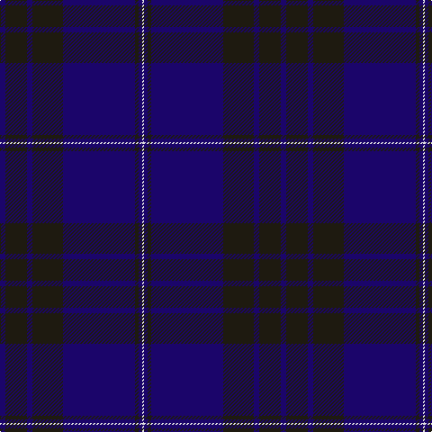

**Bands:** [BKBKBKBW](/stripes/bkbkbkbw/) · **Stripes:** [DB K DB K DB K DB W](/stripes/stripes8/) DB K DB K DB K DB W

This was sourced from house-of-tartan.  It is a [8 band tartan](/bands/bands8/).

Original link http://www.house-of-tartan.scotland.net/house/TartanViewjs.asp?colr=Def&tnam=7001

## Thread count
DB/6 K24 DB6 K34 DB80 K4 DB4 LN/2

## Palette
Each colour and its ΔE from the base-6 reference it is a variant of.

| Colour | Shade | Base | ΔE (OKLab) |
|---|---|---|---|
| DB | <code style="background-color:#1B056A;">#1B056A</code> `#1B056A` | B <code style="background-color:#2A418A;">#2A418A</code> | 0.15 |
| K | <code style="background-color:#1E1A10;">#1E1A10</code> `#1E1A10` | K <code style="background-color:#000000;">#000000</code> | 0.22 |
| LN | <code style="background-color:#E0E0E0;">#E0E0E0</code> `#E0E0E0` | W <code style="background-color:#F7F7F7;">#F7F7F7</code> | 0.07 |

# Sample pattern

## Nearest tartans

The nearest existing variants by ΔTartan distance.

1. [Blue Spirit](/setts/s8/db3k13db3k22db49k2db2lb1~x2/) — ΔT 0.57
1. [Dalziel Rugby Club (Corporate)](/setts/s7/db56k4w1db6k20w2k20~x2/) — ΔT 1.11
1. [Orman (Midlothian) (Personal)](/setts/s9/k10db3k3db32dg1db1dg1db2n2~x2/) — ΔT 1.60
1. [Scotland's Own (Fashion)](/setts/s12/db4y1db30k15dp4db2k2db2k10db4dp2db2~x2/) — ΔT 1.66
1. [Potts (Personal)](/setts/s6/k1y3db3do28db36y1~x2/) — ΔT 1.69
1. [Earl Blue Marl](/setts/s6/db80k28dp9k3m5k12~x2/) — ΔT 1.73
1. [U.S. Navy/Edzell (Military)](/setts/s6/dt45db7w3db27r1db7~x2/) — ΔT 1.76
1. [Little of Morton Rigg Red (Personal)](/setts/s8/k3t1k32db6k4db16k3r2~x2/) — ΔT 1.79
1. [Munster Ancestry (Fashion)](/setts/s8/n4db48n21db14dy3db6n1ly3~x2/) — ΔT 1.84
1. [Casterton (Corporate)](/setts/s6/db7k2db33k33r2k7~x2/) — ΔT 1.86

## Neighbour map

Every grey dot is one of 14313 variants placed by the first two principal components of the ΔTartan feature space (44% of its variance). Red is this tartan; blue dots are its nearest — click one to open its page.

<svg viewBox="0 0 640 380" role="img" style="max-width:100%;height:auto;border:1px solid #e0e0e0;border-radius:4px;display:block" xmlns="http://www.w3.org/2000/svg"><image href="/nn/cloud.v1.png" width="640" height="380"/><a href="/setts/s8/db3k13db3k22db49k2db2lb1~x2/"><circle cx="557.5" cy="200.6" r="4" fill="#3465a4"><title>Blue Spirit</title></circle></a><a href="/setts/s7/db56k4w1db6k20w2k20~x2/"><circle cx="499.7" cy="195.3" r="4" fill="#3465a4"><title>Dalziel Rugby Club (Corporate)</title></circle></a><a href="/setts/s9/k10db3k3db32dg1db1dg1db2n2~x2/"><circle cx="582.8" cy="191.1" r="4" fill="#3465a4"><title>Orman (Midlothian) (Personal)</title></circle></a><a href="/setts/s12/db4y1db30k15dp4db2k2db2k10db4dp2db2~x2/"><circle cx="447.0" cy="167.3" r="4" fill="#3465a4"><title>Scotland's Own (Fashion)</title></circle></a><a href="/setts/s6/k1y3db3do28db36y1~x2/"><circle cx="472.8" cy="197.3" r="4" fill="#3465a4"><title>Potts (Personal)</title></circle></a><a href="/setts/s6/db80k28dp9k3m5k12~x2/"><circle cx="453.2" cy="200.6" r="4" fill="#3465a4"><title>Earl Blue Marl</title></circle></a><a href="/setts/s6/dt45db7w3db27r1db7~x2/"><circle cx="450.4" cy="200.3" r="4" fill="#3465a4"><title>U.S. Navy/Edzell (Military)</title></circle></a><a href="/setts/s8/k3t1k32db6k4db16k3r2~x2/"><circle cx="539.4" cy="215.5" r="4" fill="#3465a4"><title>Little of Morton Rigg Red (Personal)</title></circle></a><a href="/setts/s8/n4db48n21db14dy3db6n1ly3~x2/"><circle cx="532.7" cy="168.8" r="4" fill="#3465a4"><title>Munster Ancestry (Fashion)</title></circle></a><a href="/setts/s6/db7k2db33k33r2k7~x2/"><circle cx="451.9" cy="266.5" r="4" fill="#3465a4"><title>Casterton (Corporate)</title></circle></a><circle cx="537.4" cy="205.7" r="5" fill="#c00000"/></svg>

ID: /setts/s8/db3k12db3k17db40k2db2w1~x2/
