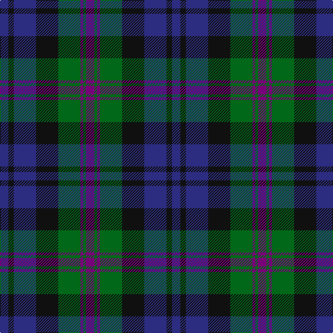

**Bands:** [BGBGKBKB](/stripes/bgbgkbkb/) · **Stripes:** [DP G DP G K DB K DB](/stripes/stripes8/) DP G DP G K DB K DB

This was sourced from register-of-tartans.  It is a [8 band tartan](/bands/bands8/).

Original link https://www.tartanregister.gov.uk/tartanDetails.aspx?ref=168

## Attestations

This cloth appears in 2 source records; the oldest owns this page.

- 01/01/1880 — Baird (Modern) (register-of-tartans, [record](https://www.tartanregister.gov.uk/tartanDetails.aspx?ref=168))
- 1880 — Baird (Clan) (tartans-authority, [record](http://www.tartansauthority.com/tartan-ferret/display/104/))

## Register references

External register numbers recorded for this tartan.

- Scottish Register of Tartans: [168](https://www.tartanregister.gov.uk/tartanDetails.aspx?ref=168)
- Scottish Tartans Authority (ITI): 104
- Scottish Tartans World Register: 104

## Variants

Other setts woven to the same stripe pattern.

- [Baird Clan Tartan Tartan Number: 104. Earliest known date: 1906 This tartan is first recorded in Johnston's work of 1906, and the sample from the Highland Society of London probably dates from the same period. In both these early references the triple stripes are rendered in red. Today, however, they are generally woven in purple. The name originates from 'bard' meaning poet. The Bairds owned estates in Aberdeenshire which were later purchased by the Gordons. See products available Copyright © Blair Urquhart, Comrie, 2015](/setts/s8/db3k2db8k8g8dp1g1dp3~x2/)

## Thread count
DB/12 K8 DB32 K32 G32 P4 G4 P/12

## Palette
Each colour and its ΔE from the base-6 reference it is a variant of.

| Colour | Shade | Base | ΔE (OKLab) |
|---|---|---|---|
| DB | <code style="background-color:#2C2C80;">#2C2C80</code> `#2C2C80` | B <code style="background-color:#2A418A;">#2A418A</code> | 0.06 |
| G | <code style="background-color:#006818;">#006818</code> `#006818` | G <code style="background-color:#006100;">#006100</code> | 0.02 |
| K | <code style="background-color:#101010;">#101010</code> `#101010` | K <code style="background-color:#000000;">#000000</code> | 0.17 |
| P | <code style="background-color:#780078;">#780078</code> `#780078` | B <code style="background-color:#2A418A;">#2A418A</code> | 0.17 |

# Sample pattern

## Nearest tartans

The nearest existing variants by ΔTartan distance.

1. [Baird Clan Tartan Tartan Number: 104. Earliest known date: 1906 This tartan is first recorded in Johnston's work of 1906, and the sample from the Highland Society of London probably dates from the same period. In both these early references the triple stripes are rendered in red. Today, however, they are generally woven in purple. The name originates from 'bard' meaning poet. The Bairds owned estates in Aberdeenshire which were later purchased by the Gordons. See products available Copyright © Blair Urquhart, Comrie, 2015](/setts/s8/db3k2db8k8g8dp1g1dp3~x2/) — ΔT 0.00
1. [Renfrew](/setts/s7/db6k2db18k18g18k3r2~x2/) — ΔT 0.75
1. [Alexander Hunting (Name)](/setts/s9/db12r2db4r4k15db4g4db2g12~x2/) — ΔT 0.77
1. [Reid and Taylor](/setts/s7/db2k1r1db9k9g10k2~x2/) — ΔT 0.91
1. [Inneryne (Personal)](/setts/s7/db4k3db16k14g14r3g3~x2/) — ΔT 0.91
1. [Forbes #3](/setts/s9/db8k2db2k2db2k8dg7k1w1~x2/) — ΔT 0.92
1. [Brabender](/setts/s8/g1db7k1db1k4r1g4k1~x6/) — ΔT 0.94
1. [MacKinlay (Clan)](/setts/s7/db4k2db10k10g10k2r3~x2/) — ΔT 0.96
1. [Unnamed 19th Century Plaid](/setts/s7/g8t1g1k6dp6k1dp3~x4/) — ΔT 0.96
1. [Glenalmond College](/setts/s12/db12k2db2k2db2k12dg12r3dg12k12db12r3~x2/) — ΔT 0.99

## Neighbour map

Every grey dot is one of 14313 variants placed by the first two principal components of the ΔTartan feature space (44% of its variance). Red is this tartan; blue dots are its nearest — click one to open its page.

<svg viewBox="0 0 640 380" role="img" style="max-width:100%;height:auto;border:1px solid #e0e0e0;border-radius:4px;display:block" xmlns="http://www.w3.org/2000/svg"><image href="/nn/cloud.v1.png" width="640" height="380"/><a href="/setts/s8/db3k2db8k8g8dp1g1dp3~x2/"><circle cx="181.0" cy="241.9" r="4" fill="#3465a4"><title>Baird Clan Tartan Tartan Number: 104. Earliest known date: 1906 This tartan is first recorded in Johnston's work of 1906, and the sample from the Highland Society of London probably dates from the same period. In both these early references the triple stripes are rendered in red. Today, however, they are generally woven in purple. The name originates from 'bard' meaning poet. The Bairds owned estates in Aberdeenshire which were later purchased by the Gordons. See products available Copyright © Blair Urquhart, Comrie, 2015</title></circle></a><a href="/setts/s7/db6k2db18k18g18k3r2~x2/"><circle cx="219.1" cy="238.8" r="4" fill="#3465a4"><title>Renfrew</title></circle></a><a href="/setts/s9/db12r2db4r4k15db4g4db2g12~x2/"><circle cx="184.7" cy="229.6" r="4" fill="#3465a4"><title>Alexander Hunting (Name)</title></circle></a><a href="/setts/s7/db2k1r1db9k9g10k2~x2/"><circle cx="221.2" cy="231.7" r="4" fill="#3465a4"><title>Reid and Taylor</title></circle></a><a href="/setts/s7/db4k3db16k14g14r3g3~x2/"><circle cx="179.4" cy="259.6" r="4" fill="#3465a4"><title>Inneryne (Personal)</title></circle></a><a href="/setts/s9/db8k2db2k2db2k8dg7k1w1~x2/"><circle cx="226.3" cy="233.2" r="4" fill="#3465a4"><title>Forbes #3</title></circle></a><a href="/setts/s8/g1db7k1db1k4r1g4k1~x6/"><circle cx="223.3" cy="233.0" r="4" fill="#3465a4"><title>Brabender</title></circle></a><a href="/setts/s7/db4k2db10k10g10k2r3~x2/"><circle cx="171.5" cy="274.7" r="4" fill="#3465a4"><title>MacKinlay (Clan)</title></circle></a><a href="/setts/s7/g8t1g1k6dp6k1dp3~x4/"><circle cx="203.0" cy="241.8" r="4" fill="#3465a4"><title>Unnamed 19th Century Plaid</title></circle></a><a href="/setts/s12/db12k2db2k2db2k12dg12r3dg12k12db12r3~x2/"><circle cx="174.0" cy="240.2" r="4" fill="#3465a4"><title>Glenalmond College</title></circle></a><circle cx="181.0" cy="241.9" r="5" fill="#c00000"/></svg>

ID: /setts/s8/db3k2db8k8g8dp1g1dp3~x4/
