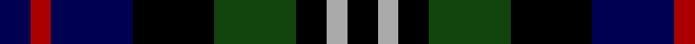
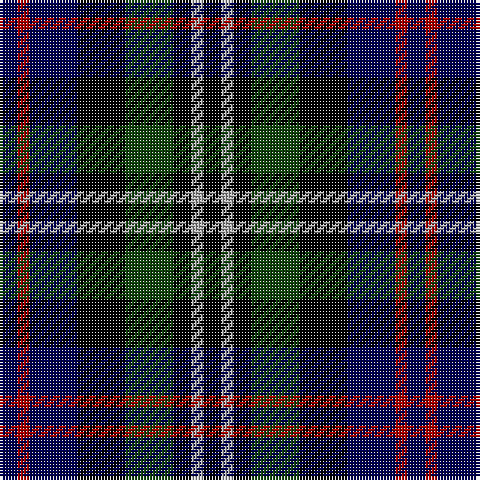

**Bands:** [BRBKGKYK](/stripes/brbkgkyk/) · **Stripes:** [DB R DB K DG K LR K](/stripes/stripes8/) DB R DB K DG K LR K

This was sourced from weddslist.  It is a [8 band tartan](/bands/bands8/).

Original link http://www.weddslist.com/cgi-bin/tartans/pg.pl?source=tinsel

## Register references

External register numbers recorded for this tartan.

- Scottish Register of Tartans: [1166](https://www.tartanregister.gov.uk/tartanDetails.aspx?ref=1166)
- Scottish Register of Tartans: [1510](https://www.tartanregister.gov.uk/tartanDetails.aspx?ref=1510)
- Scottish Register of Tartans: [1758](https://www.tartanregister.gov.uk/tartanDetails.aspx?ref=1758)
- Scottish Register of Tartans: [2307](https://www.tartanregister.gov.uk/tartanDetails.aspx?ref=2307)
- Scottish Register of Tartans: [2349](https://www.tartanregister.gov.uk/tartanDetails.aspx?ref=2349)
- Scottish Register of Tartans: [2540](https://www.tartanregister.gov.uk/tartanDetails.aspx?ref=2540)
- Scottish Register of Tartans: [2582](https://www.tartanregister.gov.uk/tartanDetails.aspx?ref=2582)
- Scottish Register of Tartans: [2585](https://www.tartanregister.gov.uk/tartanDetails.aspx?ref=2585)
- Scottish Register of Tartans: [2625](https://www.tartanregister.gov.uk/tartanDetails.aspx?ref=2625)
- Scottish Register of Tartans: [2730](https://www.tartanregister.gov.uk/tartanDetails.aspx?ref=2730)
- Scottish Register of Tartans: [2862](https://www.tartanregister.gov.uk/tartanDetails.aspx?ref=2862)
- Scottish Register of Tartans: [3072](https://www.tartanregister.gov.uk/tartanDetails.aspx?ref=3072)
- Scottish Register of Tartans: [3555](https://www.tartanregister.gov.uk/tartanDetails.aspx?ref=3555)
- Scottish Register of Tartans: [4925](https://www.tartanregister.gov.uk/tartanDetails.aspx?ref=4925)
- Scottish Register of Tartans: [696](https://www.tartanregister.gov.uk/tartanDetails.aspx?ref=696)
- Scottish Register of Tartans: [697](https://www.tartanregister.gov.uk/tartanDetails.aspx?ref=697)
- Scottish Register of Tartans: [982](https://www.tartanregister.gov.uk/tartanDetails.aspx?ref=982)
- Scottish Tartans Authority (ITI): 1277
- Scottish Tartans Authority (ITI): 1429
- Scottish Tartans Authority (ITI): 218
- Scottish Tartans Authority (ITI): 977
- Scottish Tartans World Register: 1042
- Scottish Tartans World Register: 127
- Scottish Tartans World Register: 1277
- Scottish Tartans World Register: 1399
- Scottish Tartans World Register: 1429
- Scottish Tartans World Register: 1593
- Scottish Tartans World Register: 218
- Scottish Tartans World Register: 2218
- Scottish Tartans World Register: 3061
- Scottish Tartans World Register: 441
- Scottish Tartans World Register: 737
- Scottish Tartans World Register: 858
- Scottish Tartans World Register: 864
- Scottish Tartans World Register: 873
- Scottish Tartans World Register: 897
- Scottish Tartans World Register: 977
- Scottish Tartans World Register: 978

## Variants

Other setts woven to the same stripe pattern.

- [Davidson Double](/setts/s8/db3r2db8k8dg8k3lr2k3/)

## Thread count
DB/6 DR4 DB16 K16 DG16 K6 N4 K/6

## Palette
Each colour and its ΔE from the base-6 reference it is a variant of.

| Colour | Shade | Base | ΔE (OKLab) |
|---|---|---|---|
| DB | <code style="background-color:#000052;">#000052</code> `#000052` | B <code style="background-color:#2A418A;">#2A418A</code> | 0.20 |
| DG | <code style="background-color:#11450D;">#11450D</code> `#11450D` | G <code style="background-color:#006100;">#006100</code> | 0.09 |
| DR | <code style="background-color:#AA0000;">#AA0000</code> `#AA0000` | R <code style="background-color:#CC0000;">#CC0000</code> | 0.07 |
| K | <code style="background-color:#000000;">#000000</code> `#000000` | K <code style="background-color:#000000;">#000000</code> | 0.00 |
| N | <code style="background-color:#AAAAAA;">#AAAAAA</code> `#AAAAAA` | Y <code style="background-color:#F2BF00;">#F2BF00</code> | 0.19 |

# Sample pattern

## Nearest tartans

The nearest existing variants by ΔTartan distance.

1. [Davidson Double](/setts/s8/db3r2db8k8dg8k3lr2k3/) — ΔT 0.00
1. [Davidson Double](/setts/s8/db3r2db8k8dg8k3lb2dg3/) — ΔT 0.90
1. [MacKean dress](/setts/s9/r1k2dg4k1dg1k2db3k1w1~x6/) — ΔT 0.97
1. [Brodie Hunting](/setts/s7/r2db8dg8k8ly1k8r2~x2/) — ΔT 1.25
1. [Brodie Hunting](/setts/s7/r2db8dg8k8ly1k8r2/) — ΔT 1.25
1. [Vosko](/setts/s9/db8k4lo2k3r2k3lo2k4g8~x4/) — ΔT 1.25
1. [Davidson, Double](/setts/s8/db3r2db8k8g8k3w2k3~x2/) — ΔT 1.28
1. [Hinnigan (Personal)](/setts/s8/o8g4db16g4k14o14db4b3~x2/) — ΔT 1.30
1. [Hunter](/setts/s10/dg8k1dg8k8r1db8lb1db8r1k8/) — ΔT 1.33
1. [Davidson of Tulloch](/setts/s5/lr1dg6k3db6r1~x2/) — ΔT 1.36

## Neighbour map

Every grey dot is one of 14313 variants placed by the first two principal components of the ΔTartan feature space (44% of its variance). Red is this tartan; blue dots are its nearest — click one to open its page.

<svg viewBox="0 0 640 380" role="img" style="max-width:100%;height:auto;border:1px solid #e0e0e0;border-radius:4px;display:block" xmlns="http://www.w3.org/2000/svg"><image href="/nn/cloud.v1.png" width="640" height="380"/><a href="/setts/s8/db3r2db8k8dg8k3lr2k3/"><circle cx="111.0" cy="253.0" r="4" fill="#3465a4"><title>Davidson Double</title></circle></a><a href="/setts/s8/db3r2db8k8dg8k3lb2dg3/"><circle cx="65.8" cy="244.9" r="4" fill="#3465a4"><title>Davidson Double</title></circle></a><a href="/setts/s9/r1k2dg4k1dg1k2db3k1w1~x6/"><circle cx="88.9" cy="233.8" r="4" fill="#3465a4"><title>MacKean dress</title></circle></a><a href="/setts/s7/r2db8dg8k8ly1k8r2~x2/"><circle cx="165.1" cy="231.0" r="4" fill="#3465a4"><title>Brodie Hunting</title></circle></a><a href="/setts/s7/r2db8dg8k8ly1k8r2/"><circle cx="165.1" cy="231.0" r="4" fill="#3465a4"><title>Brodie Hunting</title></circle></a><a href="/setts/s9/db8k4lo2k3r2k3lo2k4g8~x4/"><circle cx="104.4" cy="241.3" r="4" fill="#3465a4"><title>Vosko</title></circle></a><a href="/setts/s8/db3r2db8k8g8k3w2k3~x2/"><circle cx="104.1" cy="242.5" r="4" fill="#3465a4"><title>Davidson, Double</title></circle></a><a href="/setts/s8/o8g4db16g4k14o14db4b3~x2/"><circle cx="84.2" cy="224.1" r="4" fill="#3465a4"><title>Hinnigan (Personal)</title></circle></a><a href="/setts/s10/dg8k1dg8k8r1db8lb1db8r1k8/"><circle cx="132.8" cy="213.8" r="4" fill="#3465a4"><title>Hunter</title></circle></a><a href="/setts/s5/lr1dg6k3db6r1~x2/"><circle cx="139.9" cy="249.2" r="4" fill="#3465a4"><title>Davidson of Tulloch</title></circle></a><circle cx="111.0" cy="253.0" r="5" fill="#c00000"/></svg>

ID: /setts/s8/db3r2db8k8dg8k3lr2k3~x2/
