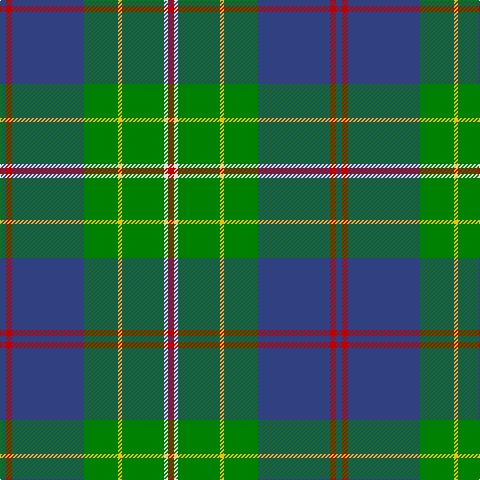

This page is one **sett** — a single exact thread-count. It belongs to the [tartan](/tartans/r3ln2g21y2g17b36r3b3/)
(the same proportion at any scale), whose colour order is pattern [BRBGYGWR](/stripes/brbgygwr/).

Sourced from weddslist.  It is a [8 stripe tartan](/stripes/stripes8/).

Original link http://www.weddslist.com/cgi-bin/tartans/pg.pl?source=sts

2 attestations — the source records this cloth was collapsed from (oldest owns this page)

<ul>
<li>undated — Singh (weddslist, <a href="http://www.weddslist.com/cgi-bin/tartans/pg.pl?source=sts">record</a>)</li>
<li>undated — Singh Name Tartan Tartan Number: 2600. Earliest known date: 1999 Created for the use of those with the name Singh. The proposer was Sirdar Iqubal Singh, Lord of Butley See products available Copyright © Blair Urquhart, Comrie, 2015 (house-of-tartan, <a href="http://www.house-of-tartan.scotland.net/house/TartanViewjs.asp?colr=Def&tnam=2600">record</a>)</li>
</ul>

## Thread count
R/6 LN4 G42 Y4 G34 B72 R6 B/6

## Palette
Each colour and the base-6 reference it is a variant of.

| Colour | Shade | Base |
|---|---|---|
| B | <code style="background-color:#304080;">#304080</code> `oklch(39.4% 0.109 270.2)` <small>#304080</small> | B <code style="background-color:#2A418A;">#2A418A</code> |
| G | <code style="background-color:#008000;">#008000</code> `oklch(52.0% 0.177 142.5)` <small>#008000</small> | G <code style="background-color:#006100;">#006100</code> |
| LN | <code style="background-color:#E0E0E0;">#E0E0E0</code> `oklch(90.7% 0.000 89.9)` <small>#E0E0E0</small> | W <code style="background-color:#F7F7F7;">#F7F7F7</code> |
| R | <code style="background-color:#C00000;">#C00000</code> `oklch(50.7% 0.208 29.2)` <small>#C00000</small> | R <code style="background-color:#CC0000;">#CC0000</code> |
| Y | <code style="background-color:#F0C000;">#F0C000</code> `oklch(82.7% 0.169 90.5)` <small>#F0C000</small> | Y <code style="background-color:#F2BF00;">#F2BF00</code> |

# Sample pattern

## Nearest tartans

The nearest existing variants by ΔTartan distance, with this tartan at the top so the swatches line up against it.

ΔTartan

Tartan

Sett

—

<a href="/ttd/edit/#slug=db3r3db36g17ly2g21w2r3~x2">Singh</a> <a class="nn-out" href="/setts/s8/db3r3db36g17ly2g21w2r3~x2/" title="open its dictionary page">↗</a>

0.71

<a href="/ttd/edit/#slug=r4k2g36k2b18ly3b18k2~x2">Fox Hunting</a> <a class="nn-out" href="/setts/s8/r4k2g36k2b18ly3b18k2~x2/" title="open its dictionary page">↗</a>

0.84

<a href="/ttd/edit/#slug=k3g36db28r2db2ly3~x2">Carmichael</a> <a class="nn-out" href="/setts/s6/k3g36db28r2db2ly3~x2/" title="open its dictionary page">↗</a>

0.98

<a href="/ttd/edit/#slug=ly4g3r2g36b30k3b3k3~x2">Chartered Accountants of Scotland</a> <a class="nn-out" href="/setts/s8/ly4g3r2g36b30k3b3k3~x2/" title="open its dictionary page">↗</a>

1.00

<a href="/ttd/edit/#slug=r1g16db2g10db22ly4r2ly1~x2">New Mexico</a> <a class="nn-out" href="/setts/s8/r1g16db2g10db22ly4r2ly1~x2/" title="open its dictionary page">↗</a>

1.00

<a href="/ttd/edit/#slug=r6db27t2g2t2g30w4~x2">MX-5 Owners' Club</a> <a class="nn-out" href="/setts/s7/r6db27t2g2t2g30w4~x2/" title="open its dictionary page">↗</a>

1.03

<a href="/ttd/edit/#slug=dg30db6r2db2ly2db15w2~x2">Hydesville Tower (Corporate)</a> <a class="nn-out" href="/setts/s7/dg30db6r2db2ly2db15w2~x2/" title="open its dictionary page">↗</a>

1.05

<a href="/ttd/edit/#slug=db5ly2db17g14w1g1w1g4ly2~x2">MacOrrell</a> <a class="nn-out" href="/setts/s9/db5ly2db17g14w1g1w1g4ly2~x2/" title="open its dictionary page">↗</a>

1.09

<a href="/ttd/edit/#slug=t24k2r2t2db12g28r4g5t3g3~x2">Downie (Name)</a> <a class="nn-out" href="/setts/s10/t24k2r2t2db12g28r4g5t3g3~x2/" title="open its dictionary page">↗</a>

1.11

<a href="/ttd/edit/#slug=g5db24g7k10g24ly2db2ly2r2~x2">Maitland Chief</a> <a class="nn-out" href="/setts/s9/g5db24g7k10g24ly2db2ly2r2~x2/" title="open its dictionary page">↗</a>

1.13

<a href="/ttd/edit/#slug=db3g13t1r3t1db10ly1~x2">Heckenberg Htg (Personal)</a> <a class="nn-out" href="/setts/s7/db3g13t1r3t1db10ly1~x2/" title="open its dictionary page">↗</a>

## Neighbour map

Every grey dot is one of 14299 variants placed by the first two principal components of the ΔTartan feature space (44% of its variance). Red is this tartan; blue dots are its nearest — click one to open its page.

<svg viewBox="0 0 640 380" role="img" style="max-width:100%;height:auto;border:1px solid #e0e0e0;border-radius:4px;display:block" xmlns="http://www.w3.org/2000/svg"><image href="/nn/cloud.v1.png" width="640" height="380"/><a href="/setts/s8/r4k2g36k2b18ly3b18k2~x2/"><circle cx="271.2" cy="163.3" r="4" fill="#3465a4"><title>Fox Hunting</title></circle></a><a href="/setts/s6/k3g36db28r2db2ly3~x2/"><circle cx="296.5" cy="163.5" r="4" fill="#3465a4"><title>Carmichael</title></circle></a><a href="/setts/s8/ly4g3r2g36b30k3b3k3~x2/"><circle cx="304.2" cy="159.4" r="4" fill="#3465a4"><title>Chartered Accountants of Scotland</title></circle></a><a href="/setts/s8/r1g16db2g10db22ly4r2ly1~x2/"><circle cx="289.7" cy="164.1" r="4" fill="#3465a4"><title>New Mexico</title></circle></a><a href="/setts/s7/r6db27t2g2t2g30w4~x2/"><circle cx="242.9" cy="158.5" r="4" fill="#3465a4"><title>MX-5 Owners' Club</title></circle></a><a href="/setts/s7/dg30db6r2db2ly2db15w2~x2/"><circle cx="307.2" cy="164.1" r="4" fill="#3465a4"><title>Hydesville Tower (Corporate)</title></circle></a><a href="/setts/s9/db5ly2db17g14w1g1w1g4ly2~x2/"><circle cx="282.4" cy="160.8" r="4" fill="#3465a4"><title>MacOrrell</title></circle></a><a href="/setts/s10/t24k2r2t2db12g28r4g5t3g3~x2/"><circle cx="243.8" cy="160.1" r="4" fill="#3465a4"><title>Downie (Name)</title></circle></a><a href="/setts/s9/g5db24g7k10g24ly2db2ly2r2~x2/"><circle cx="241.8" cy="173.1" r="4" fill="#3465a4"><title>Maitland Chief</title></circle></a><a href="/setts/s7/db3g13t1r3t1db10ly1~x2/"><circle cx="236.5" cy="178.7" r="4" fill="#3465a4"><title>Heckenberg Htg (Personal)</title></circle></a><circle cx="281.5" cy="156.5" r="5" fill="#c00000"/></svg>

ID: /setts/s8/db3r3db36g17ly2g21w2r3~x2/
