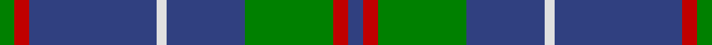
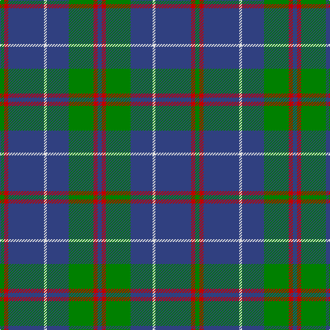

This page is one **sett** — a single exact thread-count. It belongs to the [tartan](/tartans/g3r3b26ln2b16g18r3b3/)
(the same proportion at any scale), whose colour order is pattern [BRGBWBRG](/stripes/brgbwbrg/).

Sourced from weddslist.  It is a [8 stripe tartan](/stripes/stripes8/).

Original link http://www.weddslist.com/cgi-bin/tartans/pg.pl?source=sts

2 attestations — the source records this cloth was collapsed from (oldest owns this page)

<ul>
<li>undated — MacHardy (weddslist, <a href="http://www.weddslist.com/cgi-bin/tartans/pg.pl?source=sts">record</a>)</li>
<li>undated — MacHardy Clan Tartan Tartan Number: 514. Earliest known date: 1906 The following is from an 1860 manuscript written by a Charles Andrew McHardy who was the Chief Constable of Dumbarton and an historian. The McHardy Tartan, for Kilting and Plaiding, according to coloured thread scale is as follows:-Warp, 6 red; 58 green; 58 blue; 4 white; 58 blue; 6 red; 6 green; 6 red; 58 blue; 4 white; 58 blue; 58 green; 6 red; 6 blue; 6 red; 58 green; 58 blue; 4 white; 58 blue; 6 red; 6 green; 6 red; 58 blue; 4 white; 58 blue; 58 green; 6 red; 6 blue; 6 red &c. The ordinary width of a web of tartan is about two feet two inches, and if made of double width the sets, as above, are to be repeated until the full width be obtained. The threads in the Woof must correspond with those in the Warp, and if this be attended to the sets and checks will be correct. The slightly smaller sett illustrated comes from Johnston book of 1906. See products available Copyright © Blair Urquhart, Comrie, 2015 (house-of-tartan, <a href="http://www.house-of-tartan.scotland.net/house/TartanViewjs.asp?colr=Def&tnam=514">record</a>)</li>
</ul>

## Thread count
G/6 R6 B52 LN4 B32 G36 R6 B/6

## Palette
Each colour and the base-6 reference it is a variant of.

| Colour | Shade | Base |
|---|---|---|
| B | <code style="background-color:#304080;">#304080</code> `oklch(39.4% 0.109 270.2)` <small>#304080</small> | B <code style="background-color:#2A418A;">#2A418A</code> |
| G | <code style="background-color:#008000;">#008000</code> `oklch(52.0% 0.177 142.5)` <small>#008000</small> | G <code style="background-color:#006100;">#006100</code> |
| LN | <code style="background-color:#E0E0E0;">#E0E0E0</code> `oklch(90.7% 0.000 89.9)` <small>#E0E0E0</small> | W <code style="background-color:#F7F7F7;">#F7F7F7</code> |
| R | <code style="background-color:#C00000;">#C00000</code> `oklch(50.7% 0.208 29.2)` <small>#C00000</small> | R <code style="background-color:#CC0000;">#CC0000</code> |

# Sample pattern

## Nearest tartans

The nearest existing variants by ΔTartan distance, with this tartan at the top so the swatches line up against it.

ΔTartan

Tartan

Sett

—

<a href="/ttd/edit/#slug=db3r3g18db16w2db26r3g3~x2">MacHardy</a> <a class="nn-out" href="/setts/s8/db3r3g18db16w2db26r3g3~x2/" title="open its dictionary page">↗</a>

0.73

<a href="/ttd/edit/#slug=db16w1db1w1db8g16r1db2~x2">Roxburgh</a> <a class="nn-out" href="/setts/s8/db16w1db1w1db8g16r1db2~x2/" title="open its dictionary page">↗</a>

0.94

<a href="/ttd/edit/#slug=db15g7ly3g7db40g7ly3g7db15r5~x2">Wheadon</a> <a class="nn-out" href="/setts/s10/db15g7ly3g7db40g7ly3g7db15r5~x2/" title="open its dictionary page">↗</a>

0.98

<a href="/ttd/edit/#slug=w4y15db8k4db28k2db4w2">Kelvinside Academy (School)</a> <a class="nn-out" href="/setts/s8/w4y15db8k4db28k2db4w2/" title="open its dictionary page">↗</a>

1.07

<a href="/ttd/edit/#slug=dt1r1dt10t1dt1t5dt1w1~x6">A2 (Personal)</a> <a class="nn-out" href="/setts/s8/dt1r1dt10t1dt1t5dt1w1~x6/" title="open its dictionary page">↗</a>

1.09

<a href="/ttd/edit/#slug=dg10r1dg1r2dg8db10dg1ly1~x4">Glen Esk</a> <a class="nn-out" href="/setts/s8/dg10r1dg1r2dg8db10dg1ly1~x4/" title="open its dictionary page">↗</a>

1.10

<a href="/ttd/edit/#slug=db6r3g26db26w4db26r5g5~x2">MacHardy, Blue</a> <a class="nn-out" href="/setts/s8/db6r3g26db26w4db26r5g5~x2/" title="open its dictionary page">↗</a>

1.10

<a href="/ttd/edit/#slug=r1db12y5db2y4lb1~x2">Connaught Green</a> <a class="nn-out" href="/setts/s6/r1db12y5db2y4lb1~x2/" title="open its dictionary page">↗</a>

1.12

<a href="/ttd/edit/#slug=db12ly1g16db1g1db14g3db14r2~x4">Orlando, City of (District)</a> <a class="nn-out" href="/setts/s9/db12ly1g16db1g1db14g3db14r2~x4/" title="open its dictionary page">↗</a>

1.13

<a href="/ttd/edit/#slug=db22ly2db1ly2db10y2g11y6~x2">Katsushika (Corporate)</a> <a class="nn-out" href="/setts/s8/db22ly2db1ly2db10y2g11y6~x2/" title="open its dictionary page">↗</a>

1.17

<a href="/ttd/edit/#slug=db22ly2db1ly2db10r2g11r6~x2">Katsushika Scottish Country Dancers</a> <a class="nn-out" href="/setts/s8/db22ly2db1ly2db10r2g11r6~x2/" title="open its dictionary page">↗</a>

## Neighbour map

Every grey dot is one of 14299 variants placed by the first two principal components of the ΔTartan feature space (44% of its variance). Red is this tartan; blue dots are its nearest — click one to open its page.

<svg viewBox="0 0 640 380" role="img" style="max-width:100%;height:auto;border:1px solid #e0e0e0;border-radius:4px;display:block" xmlns="http://www.w3.org/2000/svg"><image href="/nn/cloud.v1.png" width="640" height="380"/><a href="/setts/s8/db16w1db1w1db8g16r1db2~x2/"><circle cx="369.5" cy="180.6" r="4" fill="#3465a4"><title>Roxburgh</title></circle></a><a href="/setts/s10/db15g7ly3g7db40g7ly3g7db15r5~x2/"><circle cx="374.6" cy="186.0" r="4" fill="#3465a4"><title>Wheadon</title></circle></a><a href="/setts/s8/w4y15db8k4db28k2db4w2/"><circle cx="352.1" cy="186.6" r="4" fill="#3465a4"><title>Kelvinside Academy (School)</title></circle></a><a href="/setts/s8/dt1r1dt10t1dt1t5dt1w1~x6/"><circle cx="372.4" cy="193.7" r="4" fill="#3465a4"><title>A2 (Personal)</title></circle></a><a href="/setts/s8/dg10r1dg1r2dg8db10dg1ly1~x4/"><circle cx="324.8" cy="207.8" r="4" fill="#3465a4"><title>Glen Esk</title></circle></a><a href="/setts/s8/db6r3g26db26w4db26r5g5~x2/"><circle cx="303.6" cy="215.0" r="4" fill="#3465a4"><title>MacHardy, Blue</title></circle></a><a href="/setts/s6/r1db12y5db2y4lb1~x2/"><circle cx="353.7" cy="219.6" r="4" fill="#3465a4"><title>Connaught Green</title></circle></a><a href="/setts/s9/db12ly1g16db1g1db14g3db14r2~x4/"><circle cx="405.0" cy="202.9" r="4" fill="#3465a4"><title>Orlando, City of (District)</title></circle></a><a href="/setts/s8/db22ly2db1ly2db10y2g11y6~x2/"><circle cx="349.4" cy="173.1" r="4" fill="#3465a4"><title>Katsushika (Corporate)</title></circle></a><a href="/setts/s8/db22ly2db1ly2db10r2g11r6~x2/"><circle cx="346.9" cy="166.2" r="4" fill="#3465a4"><title>Katsushika Scottish Country Dancers</title></circle></a><circle cx="360.5" cy="198.1" r="5" fill="#c00000"/></svg>

ID: /setts/s8/db3r3g18db16w2db26r3g3~x2/
