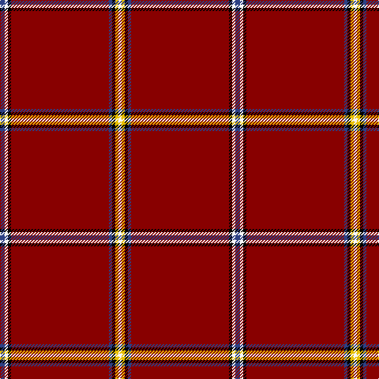

This page is one **sett** — a single exact thread-count. It belongs to the [tartan](/tartans/b3w2k2dr62b2k2y2w2/)
(the same proportion at any scale), whose colour order is pattern [BWKRBKYW](/stripes/bwkrbkyw/).

Sourced from register-of-tartans.  It is a [8 stripe tartan](/stripes/stripes8/).

Original link https://www.tartanregister.gov.uk/tartanDetails.aspx?ref=11652

## Register references

External register numbers recorded for this tartan.

- Scottish Register of Tartans: [11652](https://www.tartanregister.gov.uk/tartanDetails.aspx?ref=11652)

## Thread count
B/6 W4 K4 DR124 B4 K4 Y4 W/4

## Palette
Each colour and the base-6 reference it is a variant of.

| Colour | Shade | Base |
|---|---|---|
| B | <code style="background-color:#2C4084;">#2C4084</code> `oklch(39.4% 0.117 268.3)` <small>#2C4084</small> | B <code style="background-color:#2A418A;">#2A418A</code> |
| DR | <code style="background-color:#880000;">#880000</code> `oklch(39.4% 0.162 29.2)` <small>#880000</small> | R <code style="background-color:#CC0000;">#CC0000</code> |
| K | <code style="background-color:#000000;">#000000</code> `oklch(0.0% 0.000 0.0)` <small>#000000</small> | K <code style="background-color:#000000;">#000000</code> |
| W | <code style="background-color:#F8F8F8;">#F8F8F8</code> `oklch(97.9% 0.000 89.9)` <small>#F8F8F8</small> | W <code style="background-color:#F7F7F7;">#F7F7F7</code> |
| Y | <code style="background-color:#E8C000;">#E8C000</code> `oklch(81.9% 0.168 93.7)` <small>#E8C000</small> | Y <code style="background-color:#F2BF00;">#F2BF00</code> |

# Sample pattern

## Nearest tartans

The nearest existing variants by ΔTartan distance, with this tartan at the top so the swatches line up against it.

ΔTartan

Tartan

Sett

—

<a href="/ttd/edit/#slug=db3w2k2r62db2k2ly2w2~x2">Singer Sewing Machine Company</a> <a class="nn-out" href="/setts/s8/db3w2k2r62db2k2ly2w2~x2/" title="open its dictionary page">↗</a>

0.87

<a href="/ttd/edit/#slug=r90lr1k2lb10k5r2lr2lb2~x2">Lock in Northumberland (Name)</a> <a class="nn-out" href="/setts/s8/r90lr1k2lb10k5r2lr2lb2~x2/" title="open its dictionary page">↗</a>

1.26

<a href="/ttd/edit/#slug=r72db6ly2db11t2db2t2r9k2~x2">Junor (Personal)</a> <a class="nn-out" href="/setts/s9/r72db6ly2db11t2db2t2r9k2~x2/" title="open its dictionary page">↗</a>

1.33

<a href="/ttd/edit/#slug=r42k4w1k6ly1db1ly1r12~x2">Princess Elizabeth</a> <a class="nn-out" href="/setts/s8/r42k4w1k6ly1db1ly1r12~x2/" title="open its dictionary page">↗</a>

1.38

<a href="/ttd/edit/#slug=r72k6lb2k11ly2db2ly2r18~x2">Princess Elizabeth (Royal)</a> <a class="nn-out" href="/setts/s8/r72k6lb2k11ly2db2ly2r18~x2/" title="open its dictionary page">↗</a>

1.39

<a href="/ttd/edit/#slug=r80w2r5k10r6lr4r10k2lr6">Hampden-Sydney College</a> <a class="nn-out" href="/setts/s9/r80w2r5k10r6lr4r10k2lr6/" title="open its dictionary page">↗</a>

1.43

<a href="/ttd/edit/#slug=r48lr4db4k4r12db4r1ly4~x2">Brodie</a> <a class="nn-out" href="/setts/s8/r48lr4db4k4r12db4r1ly4~x2/" title="open its dictionary page">↗</a>

1.43

<a href="/ttd/edit/#slug=r48lr4db4k4r12db4r1ly4">Brodie</a> <a class="nn-out" href="/setts/s8/r48lr4db4k4r12db4r1ly4/" title="open its dictionary page">↗</a>

1.52

<a href="/ttd/edit/#slug=r36db3w1db6g1k1g1r9~x4">Inverness - 1829 (District)</a> <a class="nn-out" href="/setts/s8/r36db3w1db6g1k1g1r9~x4/" title="open its dictionary page">↗</a>

1.57

<a href="/ttd/edit/#slug=r36db3w1db6g1k1g1r9~x2">Inverness</a> <a class="nn-out" href="/setts/s8/r36db3w1db6g1k1g1r9~x2/" title="open its dictionary page">↗</a>

1.62

<a href="/ttd/edit/#slug=r72g6ly2g11b2g2b2r9k2~x2">Junor</a> <a class="nn-out" href="/setts/s9/r72g6ly2g11b2g2b2r9k2~x2/" title="open its dictionary page">↗</a>

## Neighbour map

Every grey dot is one of 14299 variants placed by the first two principal components of the ΔTartan feature space (44% of its variance). Red is this tartan; blue dots are its nearest — click one to open its page.

<svg viewBox="0 0 640 380" role="img" style="max-width:100%;height:auto;border:1px solid #e0e0e0;border-radius:4px;display:block" xmlns="http://www.w3.org/2000/svg"><image href="/nn/cloud.v1.png" width="640" height="380"/><a href="/setts/s8/r90lr1k2lb10k5r2lr2lb2~x2/"><circle cx="580.8" cy="65.9" r="4" fill="#3465a4"><title>Lock in Northumberland (Name)</title></circle></a><a href="/setts/s9/r72db6ly2db11t2db2t2r9k2~x2/"><circle cx="528.2" cy="70.6" r="4" fill="#3465a4"><title>Junor (Personal)</title></circle></a><a href="/setts/s8/r42k4w1k6ly1db1ly1r12~x2/"><circle cx="544.7" cy="72.2" r="4" fill="#3465a4"><title>Princess Elizabeth</title></circle></a><a href="/setts/s8/r72k6lb2k11ly2db2ly2r18~x2/"><circle cx="551.5" cy="84.7" r="4" fill="#3465a4"><title>Princess Elizabeth (Royal)</title></circle></a><a href="/setts/s9/r80w2r5k10r6lr4r10k2lr6/"><circle cx="603.2" cy="97.5" r="4" fill="#3465a4"><title>Hampden-Sydney College</title></circle></a><a href="/setts/s8/r48lr4db4k4r12db4r1ly4~x2/"><circle cx="517.7" cy="81.3" r="4" fill="#3465a4"><title>Brodie</title></circle></a><a href="/setts/s8/r48lr4db4k4r12db4r1ly4/"><circle cx="517.7" cy="81.3" r="4" fill="#3465a4"><title>Brodie</title></circle></a><a href="/setts/s8/r36db3w1db6g1k1g1r9~x4/"><circle cx="557.0" cy="91.9" r="4" fill="#3465a4"><title>Inverness - 1829 (District)</title></circle></a><a href="/setts/s8/r36db3w1db6g1k1g1r9~x2/"><circle cx="563.0" cy="96.6" r="4" fill="#3465a4"><title>Inverness</title></circle></a><a href="/setts/s9/r72g6ly2g11b2g2b2r9k2~x2/"><circle cx="532.4" cy="74.1" r="4" fill="#3465a4"><title>Junor</title></circle></a><circle cx="566.8" cy="77.6" r="5" fill="#c00000"/></svg>

ID: /setts/s8/db3w2k2r62db2k2ly2w2~x2/
