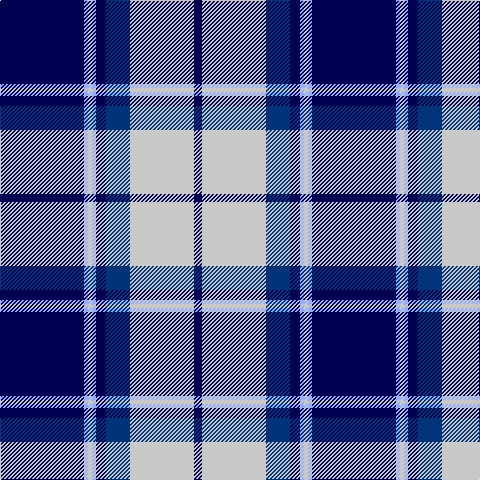

**Bands:** [BWBBWWWB](/stripes/bwbbwwwb/) · **Stripes:** [DB LB DB DB LB LB LB DB](/stripes/stripes8/) DB LB DB DB LB LB LB DB

This was sourced from register-of-tartans.  It is a [8 band tartan](/bands/bands8/).

Original link https://www.tartanregister.gov.uk/tartanDetails.aspx?ref=1092

## Also known as

This cloth is also recorded under:

- Longniddry Eildon Blue Dress Fancy

## Register references

External register numbers recorded for this tartan.

- Scottish Register of Tartans: [1092](https://www.tartanregister.gov.uk/tartanDetails.aspx?ref=1092)
- Scottish Tartans Authority (ITI): 4799

## Thread count
DB/84 LP4 N4 LP4 DB10 DBa24 N64 DB/8

## Palette
Each colour and its ΔE from the base-6 reference it is a variant of.

| Colour | Shade | Base | ΔE (OKLab) |
|---|---|---|---|
| DB | <code style="background-color:#000050;">#000050</code> `#000050` | B <code style="background-color:#2A418A;">#2A418A</code> | 0.21 |
| DBa | <code style="background-color:#003478;">#003478</code> `#003478` | B <code style="background-color:#2A418A;">#2A418A</code> | 0.06 |
| LP | <code style="background-color:#94ACFC;">#94ACFC</code> `#94ACFC` | W <code style="background-color:#F7F7F7;">#F7F7F7</code> | 0.25 |
| N | <code style="background-color:#C8C8C8;">#C8C8C8</code> `#C8C8C8` | W <code style="background-color:#F7F7F7;">#F7F7F7</code> | 0.14 |

# Sample pattern

## Nearest tartans

The nearest existing variants by ΔTartan distance.

1. [Longniddry Eildon Blue Dress Fancy Tartan Tartan Number: 5486. Earliest known date: pre 1992 Dancers tartan See products available Copyright © Blair Urquhart, Comrie, 2015](/setts/s8/db42lb2lb2lb2db5dt12lb32db4~x2/) — ΔT 0.75
1. [Historic Scotland](/setts/s9/db4w1db1w3db24y9k1y9k3~x2/) — ΔT 0.93
1. [Detroit Lions](/setts/s8/db30lb2k9w3db6w4k3lb6~x2/) — ΔT 0.94
1. [Highlands School (N. Carolina) Corporate Tartan Tartan Number: 2109. Earliest known date: 1990 Highlands in North Carolina is the home of the Scottish Tartans Society's Museum Extension. The school tartan was designed by Bob Martin who is a 'Fellow of the Society'. Blue and Gold are the school colours. See products available Copyright © Blair Urquhart, Comrie, 2015](/setts/s8/ly12db2ly2db30db3db2db13w4~x2/) — ΔT 1.08
1. [Harmony Eildon (Dance)](/setts/s8/db41t2w2t2db5t12w31db4~x2/) — ΔT 1.15
1. [DeCloud-McMasters (Personal)](/setts/s8/r3db2w2db26k22w3db3w3~x2/) — ΔT 1.16
1. [Longniddry Blue (Dance)](/setts/s8/dt42lb2lb2lb2dt5dt12lb32dt4~x2/) — ΔT 1.19
1. [Sinclair, Blue (Personal)](/setts/s7/db4r2db40k11g2w16r2~x2/) — ΔT 1.20
1. [Eildon/Longniddry Blue Dress Fashion Tartan Tartan Number: 4799. Earliest known date: 01/01/1980 A Dancers' Fancy from Dalgliesh. This appears under three different names - Longniddry #5486, Eildon #4799 and Harmony Eildon #87 (original Scottish Tartans Authority references). Needs resolving. Sample in Scottish Tartans Authority's Dalgety Collection. /Threadcount and colours aren't 100% original. Generated manually./ See products available Copyright © Blair Urquhart, Comrie, 2015](/setts/s8/db30t2w2t2db4t10w25db4~x2/) — ΔT 1.21
1. [Scottish Knights Templar, of M.T.S. St Andrew](/setts/s10/w4r1db20k6w5k4w3k2r1db2~x2/) — ΔT 1.22

## Neighbour map

Every grey dot is one of 14299 variants placed by the first two principal components of the ΔTartan feature space (44% of its variance). Red is this tartan; blue dots are its nearest — click one to open its page.

<svg viewBox="0 0 640 380" role="img" style="max-width:100%;height:auto;border:1px solid #e0e0e0;border-radius:4px;display:block" xmlns="http://www.w3.org/2000/svg"><image href="/nn/cloud.v1.png" width="640" height="380"/><a href="/setts/s8/db42lb2lb2lb2db5dt12lb32db4~x2/"><circle cx="289.4" cy="138.9" r="4" fill="#3465a4"><title>Longniddry Eildon Blue Dress Fancy Tartan Tartan Number: 5486. Earliest known date: pre 1992 Dancers tartan See products available Copyright © Blair Urquhart, Comrie, 2015</title></circle></a><a href="/setts/s9/db4w1db1w3db24y9k1y9k3~x2/"><circle cx="301.7" cy="137.6" r="4" fill="#3465a4"><title>Historic Scotland</title></circle></a><a href="/setts/s8/db30lb2k9w3db6w4k3lb6~x2/"><circle cx="291.5" cy="153.4" r="4" fill="#3465a4"><title>Detroit Lions</title></circle></a><a href="/setts/s8/ly12db2ly2db30db3db2db13w4~x2/"><circle cx="260.4" cy="155.7" r="4" fill="#3465a4"><title>Highlands School (N. Carolina) Corporate Tartan Tartan Number: 2109. Earliest known date: 1990 Highlands in North Carolina is the home of the Scottish Tartans Society's Museum Extension. The school tartan was designed by Bob Martin who is a 'Fellow of the Society'. Blue and Gold are the school colours. See products available Copyright © Blair Urquhart, Comrie, 2015</title></circle></a><a href="/setts/s8/db41t2w2t2db5t12w31db4~x2/"><circle cx="279.3" cy="133.8" r="4" fill="#3465a4"><title>Harmony Eildon (Dance)</title></circle></a><a href="/setts/s8/r3db2w2db26k22w3db3w3~x2/"><circle cx="256.7" cy="161.2" r="4" fill="#3465a4"><title>DeCloud-McMasters (Personal)</title></circle></a><a href="/setts/s8/dt42lb2lb2lb2dt5dt12lb32dt4~x2/"><circle cx="287.3" cy="139.3" r="4" fill="#3465a4"><title>Longniddry Blue (Dance)</title></circle></a><a href="/setts/s7/db4r2db40k11g2w16r2~x2/"><circle cx="291.0" cy="126.2" r="4" fill="#3465a4"><title>Sinclair, Blue (Personal)</title></circle></a><a href="/setts/s8/db30t2w2t2db4t10w25db4~x2/"><circle cx="244.1" cy="146.8" r="4" fill="#3465a4"><title>Eildon/Longniddry Blue Dress Fashion Tartan Tartan Number: 4799. Earliest known date: 01/01/1980 A Dancers' Fancy from Dalgliesh. This appears under three different names - Longniddry #5486, Eildon #4799 and Harmony Eildon #87 (original Scottish Tartans Authority references). Needs resolving. Sample in Scottish Tartans Authority's Dalgety Collection. /Threadcount and colours aren't 100% original. Generated manually./ See products available Copyright © Blair Urquhart, Comrie, 2015</title></circle></a><a href="/setts/s10/w4r1db20k6w5k4w3k2r1db2~x2/"><circle cx="232.9" cy="126.4" r="4" fill="#3465a4"><title>Scottish Knights Templar, of M.T.S. St Andrew</title></circle></a><circle cx="275.3" cy="137.0" r="5" fill="#c00000"/></svg>

ID: /setts/s8/db42lb2lb2lb2db5db12lb32db4~x2/
