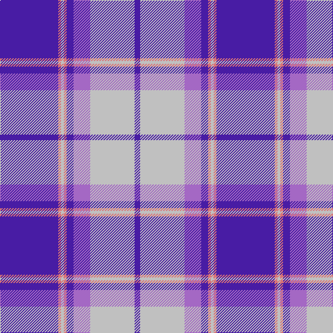

In pattern [BRWRBBWB](/stripes/brwrbbwb/).

This was sourced from register-of-tartans.  It is a [8 stripe tartan](/stripes/stripes8/).

Original link https://www.tartanregister.gov.uk/tartanDetails.aspx?ref=2210

## Also known as

This cloth is also recorded under:

- Longniddry, Lavender

## Attestations

This cloth appears in 2 source records; the oldest owns this page.

- 01/01/1992 — Longniddry Lavender (Dance) (register-of-tartans, [record](https://www.tartanregister.gov.uk/tartanDetails.aspx?ref=2210))
- pre 1992 — Longniddry, Lavender (Dance) (tartans-authority, [record](http://www.tartansauthority.com/tartan-ferret/display/6468/))

## Register references

External register numbers recorded for this tartan.

- Scottish Register of Tartans: [2210](https://www.tartanregister.gov.uk/tartanDetails.aspx?ref=2210)
- Scottish Tartans Authority (ITI): 6468

## Thread count
P/84 LR4 N4 LR4 P10 Pa24 N64 P/8

## Palette
Each colour and the base-6 reference it is a variant of.

| Colour | Shade | Base |
|---|---|---|
| LR | <code style="background-color:#D87478;">#D87478</code> `oklch(67.3% 0.125 18.5)` <small>#D87478</small> | R <code style="background-color:#CC0000;">#CC0000</code> |
| N | <code style="background-color:#C0C0C0;">#C0C0C0</code> `oklch(80.8% 0.000 89.9)` <small>#C0C0C0</small> | W <code style="background-color:#F7F7F7;">#F7F7F7</code> |
| P | <code style="background-color:#481CA4;">#481CA4</code> `oklch(38.9% 0.196 288.2)` <small>#481CA4</small> | B <code style="background-color:#2A418A;">#2A418A</code> |
| Pa | <code style="background-color:#A468C4;">#A468C4</code> `oklch(61.8% 0.147 312.9)` <small>#A468C4</small> | B <code style="background-color:#2A418A;">#2A418A</code> |

# Sample pattern

## Nearest tartans

The nearest existing variants by ΔTartan distance.

1. [Longniddry Dress District Tartan Tartan Number: 88. Earliest known date: pre 2003 A dancers tartan from D.C. Dalgleish weavers of Selkirk See products available Copyright © Blair Urquhart, Comrie, 2015](/setts/s8/dp42db2w2db2dp5t12w32dp4~x2/) — ΔT 1.12
1. [Presbyterian College Band (Corp)](/setts/s7/r28k2b36k2w4k2b7~x2/) — ΔT 1.13
1. [Longniddry Dress (Dance)](/setts/s8/dp42lb2w2lb2dp5t12w32dp4~x2/) — ΔT 1.17
1. [Longniddry, dress](/setts/s8/p42db2w2db2p5b12w32p4~x2/) — ΔT 1.24
1. [Harmony, Eildon](/setts/s8/db41t2w2t2db5b12w31db4~x2/) — ΔT 1.27
1. [Harmony Eildon (Dance)](/setts/s8/db41t2w2t2db5t12w31db4~x2/) — ΔT 1.28
1. [Illinois, St Andrews Society](/setts/s13/db4r3b23db16w5b3r2b3w5b11db2r1db4~x2/) — ΔT 1.47
1. [Longniddry Eildon Blue Dress Fancy Tartan Tartan Number: 5486. Earliest known date: pre 1992 Dancers tartan See products available Copyright © Blair Urquhart, Comrie, 2015](/setts/s8/db42lb2lb2lb2db5dt12lb32db4~x2/) — ΔT 1.48
1. [Thorburn #1 (Name)](/setts/s9/db12lb2db2t6db4lb3db4lb18r1~x4/) — ΔT 1.61
1. [British Energy Corporate Tartan Tartan Number: 2324. Earliest known date: 1996 Nothing See products available Copyright © Blair Urquhart, Comrie, 2015](/setts/s6/lb40k14dp22ly1dp1ly3~x2/) — ΔT 1.61

## Neighbour map

Every grey dot is one of 14299 variants placed by the first two principal components of the ΔTartan feature space (44% of its variance). Red is this tartan; blue dots are its nearest — click one to open its page.

<svg viewBox="0 0 640 380" role="img" style="max-width:100%;height:auto;border:1px solid #e0e0e0;border-radius:4px;display:block" xmlns="http://www.w3.org/2000/svg"><image href="/nn/cloud.v1.png" width="640" height="380"/><a href="/setts/s8/dp42db2w2db2dp5t12w32dp4~x2/"><circle cx="292.6" cy="122.4" r="4" fill="#3465a4"><title>Longniddry Dress District Tartan Tartan Number: 88. Earliest known date: pre 2003 A dancers tartan from D.C. Dalgleish weavers of Selkirk See products available Copyright © Blair Urquhart, Comrie, 2015</title></circle></a><a href="/setts/s7/r28k2b36k2w4k2b7~x2/"><circle cx="328.2" cy="151.0" r="4" fill="#3465a4"><title>Presbyterian College Band (Corp)</title></circle></a><a href="/setts/s8/dp42lb2w2lb2dp5t12w32dp4~x2/"><circle cx="292.9" cy="121.7" r="4" fill="#3465a4"><title>Longniddry Dress (Dance)</title></circle></a><a href="/setts/s8/p42db2w2db2p5b12w32p4~x2/"><circle cx="297.6" cy="121.8" r="4" fill="#3465a4"><title>Longniddry, dress</title></circle></a><a href="/setts/s8/db41t2w2t2db5b12w31db4~x2/"><circle cx="286.7" cy="135.3" r="4" fill="#3465a4"><title>Harmony, Eildon</title></circle></a><a href="/setts/s8/db41t2w2t2db5t12w31db4~x2/"><circle cx="279.3" cy="133.8" r="4" fill="#3465a4"><title>Harmony Eildon (Dance)</title></circle></a><a href="/setts/s13/db4r3b23db16w5b3r2b3w5b11db2r1db4~x2/"><circle cx="255.3" cy="121.0" r="4" fill="#3465a4"><title>Illinois, St Andrews Society</title></circle></a><a href="/setts/s8/db42lb2lb2lb2db5dt12lb32db4~x2/"><circle cx="289.4" cy="138.9" r="4" fill="#3465a4"><title>Longniddry Eildon Blue Dress Fancy Tartan Tartan Number: 5486. Earliest known date: pre 1992 Dancers tartan See products available Copyright © Blair Urquhart, Comrie, 2015</title></circle></a><a href="/setts/s9/db12lb2db2t6db4lb3db4lb18r1~x4/"><circle cx="249.9" cy="157.0" r="4" fill="#3465a4"><title>Thorburn #1 (Name)</title></circle></a><a href="/setts/s6/lb40k14dp22ly1dp1ly3~x2/"><circle cx="299.6" cy="122.2" r="4" fill="#3465a4"><title>British Energy Corporate Tartan Tartan Number: 2324. Earliest known date: 1996 Nothing See products available Copyright © Blair Urquhart, Comrie, 2015</title></circle></a><circle cx="305.3" cy="136.6" r="5" fill="#c00000"/></svg>

ID: /setts/s8/db42o2lb2o2db5p12lb32db4~x2/
