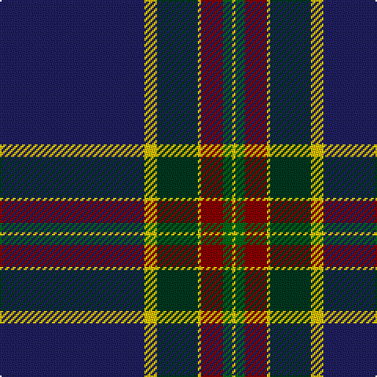

This page is one **sett** — a single exact thread-count. It belongs to the [tartan](/tartans/db46lyi1ly3dg13lyi1r7g3lyi1/)
(the same proportion at any scale), whose colour order is pattern [BYYGYRGY](/stripes/byygyrgy/).

Sourced from tartans-authority.  It is a [8 stripe tartan](/stripes/stripes8/).

Original link http://www.tartansauthority.com/tartan-ferret/display/11050/

## Register references

External register numbers recorded for this tartan.

- Scottish Register of Tartans: [11050](https://www.tartanregister.gov.uk/tartanDetails?ref=11050)
- Scottish Tartans Authority (ITI): 11050

## Thread count
DB/92 Y2 Ya6 DG26 Y2 DR14 G6 Y/2

## Palette

Palette: <strong>Tartan Register</strong>
<table><thead><tr><th>Colour</th><th>Threads</th><th>Shade</th><th>Base</th><th>OKLCh</th></tr></thead><tbody><tr><td>DB/</td><td style="text-align:right;font-variant-numeric:tabular-nums">92</td><td><code style="background-color:#202060;">#202060</code> <small style="color:#888">#202060</small></td><td>B <code style="background-color:#2A418A;">#2A418A</code></td><td><small style="color:#888">oklch(28.9% 0.111 276.9)</small></td></tr><tr><td>Y</td><td style="text-align:right;font-variant-numeric:tabular-nums">2</td><td><code style="background-color:#FCCC00;">#FCCC00</code> <small style="color:#888">#FCCC00</small></td><td>Y <code style="background-color:#F2BF00;">#F2BF00</code></td><td><small style="color:#888">oklch(86.2% 0.176 91.5)</small></td></tr><tr><td>Ya</td><td style="text-align:right;font-variant-numeric:tabular-nums">6</td><td><code style="background-color:#E8C000;">#E8C000</code> <small style="color:#888">#E8C000</small></td><td>Y <code style="background-color:#F2BF00;">#F2BF00</code></td><td><small style="color:#888">oklch(81.9% 0.168 93.7)</small></td></tr><tr><td>DG</td><td style="text-align:right;font-variant-numeric:tabular-nums">26</td><td><code style="background-color:#003820;">#003820</code> <small style="color:#888">#003820</small></td><td>G <code style="background-color:#006100;">#006100</code></td><td><small style="color:#888">oklch(30.0% 0.070 158.3)</small></td></tr><tr><td>Y</td><td style="text-align:right;font-variant-numeric:tabular-nums">2</td><td><code style="background-color:#FCCC00;">#FCCC00</code> <small style="color:#888">#FCCC00</small></td><td>Y <code style="background-color:#F2BF00;">#F2BF00</code></td><td><small style="color:#888">oklch(86.2% 0.176 91.5)</small></td></tr><tr><td>DR</td><td style="text-align:right;font-variant-numeric:tabular-nums">14</td><td><code style="background-color:#880000;">#880000</code> <small style="color:#888">#880000</small></td><td>R <code style="background-color:#CC0000;">#CC0000</code></td><td><small style="color:#888">oklch(39.4% 0.162 29.2)</small></td></tr><tr><td>G</td><td style="text-align:right;font-variant-numeric:tabular-nums">6</td><td><code style="background-color:#006818;">#006818</code> <small style="color:#888">#006818</small></td><td>G <code style="background-color:#006100;">#006100</code></td><td><small style="color:#888">oklch(45.0% 0.142 145.0)</small></td></tr><tr><td>Y/</td><td style="text-align:right;font-variant-numeric:tabular-nums">2</td><td><code style="background-color:#FCCC00;">#FCCC00</code> <small style="color:#888">#FCCC00</small></td><td>Y <code style="background-color:#F2BF00;">#F2BF00</code></td><td><small style="color:#888">oklch(86.2% 0.176 91.5)</small></td></tr></tbody></table>

# Sample pattern

## Nearest tartans

The nearest existing variants by ΔTartan distance, with this tartan at the top so the swatches line up against it.

ΔTartan

Tartan

Sett

—

<a href="/ttd/edit/#slug=db46lyi1ly3dg13lyi1r7g3lyi1~x2">Victorian Highland Pipe Band Assoc</a> <a class="nn-out" href="/setts/s8/db46lyi1ly3dg13lyi1r7g3lyi1~x2/" title="open its dictionary page">↗</a>

0.72

<a href="/ttd/edit/#slug=r2w1r5g5lo1g10db40ly2~x2">St. Andrew Quebec City (Corporate)</a> <a class="nn-out" href="/setts/s8/r2w1r5g5lo1g10db40ly2~x2/" title="open its dictionary page">↗</a>

0.86

<a href="/ttd/edit/#slug=dt46w1lo3dg13w1r7g3w1~x2">Victorian Highland Pipe Band Association (Australia)</a> <a class="nn-out" href="/setts/s8/dt46w1lo3dg13w1r7g3w1~x2/" title="open its dictionary page">↗</a>

0.97

<a href="/ttd/edit/#slug=k43ly3dg1w1db1ly3db25r2~x2">Royal Yacht Britannia</a> <a class="nn-out" href="/setts/s8/k43ly3dg1w1db1ly3db25r2~x2/" title="open its dictionary page">↗</a>

1.00

<a href="/ttd/edit/#slug=db76p6k6db24g17k4r10k4g17db4k2w6">Scottish Heritage Society (Corporate</a> <a class="nn-out" href="/setts/s12/db76p6k6db24g17k4r10k4g17db4k2w6/" title="open its dictionary page">↗</a>

1.01

<a href="/ttd/edit/#slug=db50dg25lo3o8r1w1r1~x2">Wells (2014)</a> <a class="nn-out" href="/setts/s7/db50dg25lo3o8r1w1r1~x2/" title="open its dictionary page">↗</a>

1.14

<a href="/ttd/edit/#slug=db60lo2db10k9lb2k2r2k2g28lo3~x2">Wcwm 9275-1510-1</a> <a class="nn-out" href="/setts/s10/db60lo2db10k9lb2k2r2k2g28lo3~x2/" title="open its dictionary page">↗</a>

1.18

<a href="/ttd/edit/#slug=g3db16k3dp2k45r1k2lo3~x2">Cumnock (District)</a> <a class="nn-out" href="/setts/s8/g3db16k3dp2k45r1k2lo3~x2/" title="open its dictionary page">↗</a>

1.23

<a href="/ttd/edit/#slug=lr2k1r5n3o12n4lr1k40b1~x2">Montgomerie, Colin</a> <a class="nn-out" href="/setts/s9/lr2k1r5n3o12n4lr1k40b1~x2/" title="open its dictionary page">↗</a>

1.23

<a href="/ttd/edit/#slug=db67w1lo6r5dg25db3k5~x2">Guide Dogs (Corporate)</a> <a class="nn-out" href="/setts/s7/db67w1lo6r5dg25db3k5~x2/" title="open its dictionary page">↗</a>

1.26

<a href="/ttd/edit/#slug=db5lb1db44m1g12k12m5k2lp2k3~x2">Heart of Scotland Fancy Tartan Tartan Number: 4230. Earliest known date: 1999 October 1999. Designed by Lochcarron of Scotland for 'Gavin' Kiltmaker. They use it for their hire kilts. Colour checked against sample. See products available Copyright © Blair Urquhart, Comrie, 2015</a> <a class="nn-out" href="/setts/s10/db5lb1db44m1g12k12m5k2lp2k3~x2/" title="open its dictionary page">↗</a>

## Neighbour map

Every grey dot is one of 14359 variants placed by the first two principal components of the ΔTartan feature space (44% of its variance). Red is this tartan; blue dots are its nearest — click one to open its page.

<svg viewBox="0 0 640 380" role="img" style="max-width:100%;height:auto;border:1px solid #e0e0e0;border-radius:4px;display:block" xmlns="http://www.w3.org/2000/svg"><image href="/nn/cloud.v1.png" width="640" height="380"/><a href="/setts/s8/r2w1r5g5lo1g10db40ly2~x2/"><circle cx="380.5" cy="89.1" r="4" fill="#3465a4"><title>St. Andrew Quebec City (Corporate)</title></circle></a><a href="/setts/s8/dt46w1lo3dg13w1r7g3w1~x2/"><circle cx="402.1" cy="95.7" r="4" fill="#3465a4"><title>Victorian Highland Pipe Band Association (Australia)</title></circle></a><a href="/setts/s8/k43ly3dg1w1db1ly3db25r2~x2/"><circle cx="353.8" cy="90.9" r="4" fill="#3465a4"><title>Royal Yacht Britannia</title></circle></a><a href="/setts/s12/db76p6k6db24g17k4r10k4g17db4k2w6/"><circle cx="351.8" cy="87.4" r="4" fill="#3465a4"><title>Scottish Heritage Society (Corporate</title></circle></a><a href="/setts/s7/db50dg25lo3o8r1w1r1~x2/"><circle cx="371.3" cy="104.0" r="4" fill="#3465a4"><title>Wells (2014)</title></circle></a><a href="/setts/s10/db60lo2db10k9lb2k2r2k2g28lo3~x2/"><circle cx="348.6" cy="97.9" r="4" fill="#3465a4"><title>Wcwm 9275-1510-1</title></circle></a><a href="/setts/s8/g3db16k3dp2k45r1k2lo3~x2/"><circle cx="438.3" cy="96.3" r="4" fill="#3465a4"><title>Cumnock (District)</title></circle></a><a href="/setts/s9/lr2k1r5n3o12n4lr1k40b1~x2/"><circle cx="356.0" cy="75.1" r="4" fill="#3465a4"><title>Montgomerie, Colin</title></circle></a><a href="/setts/s7/db67w1lo6r5dg25db3k5~x2/"><circle cx="430.4" cy="113.5" r="4" fill="#3465a4"><title>Guide Dogs (Corporate)</title></circle></a><a href="/setts/s10/db5lb1db44m1g12k12m5k2lp2k3~x2/"><circle cx="352.0" cy="88.5" r="4" fill="#3465a4"><title>Heart of Scotland Fancy Tartan Tartan Number: 4230. Earliest known date: 1999 October 1999. Designed by Lochcarron of Scotland for 'Gavin' Kiltmaker. They use it for their hire kilts. Colour checked against sample. See products available Copyright © Blair Urquhart, Comrie, 2015</title></circle></a><circle cx="390.7" cy="88.4" r="5" fill="#c00000"/></svg>

ID: /setts/s8/db46lyi1ly3dg13lyi1r7g3lyi1~x2/
