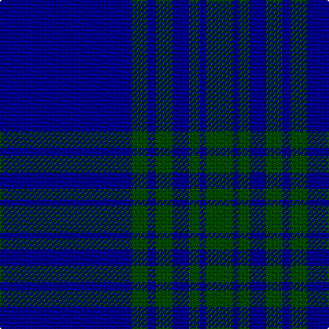

This page is one **sett** — a single exact thread-count. It belongs to the [tartan](/tartans/db48dg6db3dg6db6dg4db2dg10/)
(the same proportion at any scale), whose colour order is pattern [BGBGBGBG](/stripes/bgbgbgbg/).

Sourced from register-of-tartans.  It is a [8 stripe tartan](/stripes/stripes8/).

Original link https://www.tartanregister.gov.uk/tartanDetails.aspx?ref=2175

## Register references

External register numbers recorded for this tartan.

- Scottish Register of Tartans: [2175](https://www.tartanregister.gov.uk/tartanDetails.aspx?ref=2175)
- Scottish Tartans Authority (ITI): 4990

## Thread count
DB/96 G12 DB6 G12 DB12 G8 DB4 G/20

## Palette

Palette: <strong>Tartan Register</strong>
<table><thead><tr><th>Colour</th><th>Threads</th><th>Shade</th><th>Base</th><th>OKLCh</th></tr></thead><tbody><tr><td>DB/</td><td style="text-align:right;font-variant-numeric:tabular-nums">96</td><td><code style="background-color:#00008C;">#00008C</code> <small style="color:#888">#00008C</small></td><td>B <code style="background-color:#2A418A;">#2A418A</code></td><td><small style="color:#888">oklch(28.9% 0.200 264.1)</small></td></tr><tr><td>G</td><td style="text-align:right;font-variant-numeric:tabular-nums">12</td><td><code style="background-color:#004C00;">#004C00</code> <small style="color:#888">#004C00</small></td><td>G <code style="background-color:#006100;">#006100</code></td><td><small style="color:#888">oklch(36.1% 0.123 142.5)</small></td></tr><tr><td>DB</td><td style="text-align:right;font-variant-numeric:tabular-nums">6</td><td><code style="background-color:#00008C;">#00008C</code> <small style="color:#888">#00008C</small></td><td>B <code style="background-color:#2A418A;">#2A418A</code></td><td><small style="color:#888">oklch(28.9% 0.200 264.1)</small></td></tr><tr><td>G</td><td style="text-align:right;font-variant-numeric:tabular-nums">12</td><td><code style="background-color:#004C00;">#004C00</code> <small style="color:#888">#004C00</small></td><td>G <code style="background-color:#006100;">#006100</code></td><td><small style="color:#888">oklch(36.1% 0.123 142.5)</small></td></tr><tr><td>DB</td><td style="text-align:right;font-variant-numeric:tabular-nums">12</td><td><code style="background-color:#00008C;">#00008C</code> <small style="color:#888">#00008C</small></td><td>B <code style="background-color:#2A418A;">#2A418A</code></td><td><small style="color:#888">oklch(28.9% 0.200 264.1)</small></td></tr><tr><td>G</td><td style="text-align:right;font-variant-numeric:tabular-nums">8</td><td><code style="background-color:#004C00;">#004C00</code> <small style="color:#888">#004C00</small></td><td>G <code style="background-color:#006100;">#006100</code></td><td><small style="color:#888">oklch(36.1% 0.123 142.5)</small></td></tr><tr><td>DB</td><td style="text-align:right;font-variant-numeric:tabular-nums">4</td><td><code style="background-color:#00008C;">#00008C</code> <small style="color:#888">#00008C</small></td><td>B <code style="background-color:#2A418A;">#2A418A</code></td><td><small style="color:#888">oklch(28.9% 0.200 264.1)</small></td></tr><tr><td>G/</td><td style="text-align:right;font-variant-numeric:tabular-nums">20</td><td><code style="background-color:#004C00;">#004C00</code> <small style="color:#888">#004C00</small></td><td>G <code style="background-color:#006100;">#006100</code></td><td><small style="color:#888">oklch(36.1% 0.123 142.5)</small></td></tr></tbody></table>

# Sample pattern

## Nearest tartans

The nearest existing variants by ΔTartan distance, with this tartan at the top so the swatches line up against it.

ΔTartan

Tartan

Sett

—

<a href="/ttd/edit/#slug=db48dg6db3dg6db6dg4db2dg10~x2">Lochleven (Dance)</a> <a class="nn-out" href="/setts/s8/db48dg6db3dg6db6dg4db2dg10~x2/" title="open its dictionary page">↗</a>

1.54

<a href="/ttd/edit/#slug=db48k6db3k6db6k4db2k10~x2">Lochleven (Dance)</a> <a class="nn-out" href="/setts/s8/db48k6db3k6db6k4db2k10~x2/" title="open its dictionary page">↗</a>

1.71

<a href="/ttd/edit/#slug=db144r9t44db4t4db4">United French Freemasons (Corporate</a> <a class="nn-out" href="/setts/s6/db144r9t44db4t4db4/" title="open its dictionary page">↗</a>

1.90

<a href="/setts/s10/t4dt2t1dt23lb2t2~x2/">Covenant College (Corporate)</a>

2.13

<a href="/ttd/edit/#slug=db56lo2dg19lo1dg2lo1db2~x2">Lewis Welsh Name Tartan Tartan Number: 5758. Earliest known date: 22002 The tartan for this Welsh surname and its variations, Lewis, Lewys, Lou, Louis, Lew, Lewes, is actually woven in Wales at the Cambrian Woollen Mill, weaving on the same site since 1830. This tartan differs from many traditional patterns in that the warp and weft differ, giving the finished worsted wool cloth more of a predominant stripe, vertically noticeable in the finished Kilt, or Cilt in Wales. See products available Copyright © Blair Urquhart, Comrie, 2015</a> <a class="nn-out" href="/setts/s7/db56lo2dg19lo1dg2lo1db2~x2/" title="open its dictionary page">↗</a>

2.18

<a href="/ttd/edit/#slug=db12ly1t16db1t1db14t3db14ly1~x4">Orlando Police Department (Corporate</a> <a class="nn-out" href="/setts/s9/db12ly1t16db1t1db14t3db14ly1~x4/" title="open its dictionary page">↗</a>

2.18

<a href="/ttd/edit/#slug=b11db7b3db70lb4db6~x2">Auchairne (Corporate)</a> <a class="nn-out" href="/setts/s6/b11db7b3db70lb4db6~x2/" title="open its dictionary page">↗</a>

2.19

<a href="/ttd/edit/#slug=ly4b3ly1b17db40b2db3~x2">Danzas</a> <a class="nn-out" href="/setts/s7/ly4b3ly1b17db40b2db3~x2/" title="open its dictionary page">↗</a>

2.23

<a href="/ttd/edit/#slug=dt29b2dt1b1dt1b1db8ly1~x4">Marist School, The</a> <a class="nn-out" href="/setts/s8/dt29b2dt1b1dt1b1db8ly1~x4/" title="open its dictionary page">↗</a>

2.24

<a href="/ttd/edit/#slug=db48dg14r3dg2r3dg2~x2">Wilson #2</a> <a class="nn-out" href="/setts/s6/db48dg14r3dg2r3dg2~x2/" title="open its dictionary page">↗</a>

2.26

<a href="/ttd/edit/#slug=ly4dt3ly1dt17db40dt2db3~x2">Danzas</a> <a class="nn-out" href="/setts/s7/ly4dt3ly1dt17db40dt2db3~x2/" title="open its dictionary page">↗</a>

## Neighbour map

Every grey dot is one of 14299 variants placed by the first two principal components of the ΔTartan feature space (44% of its variance). Red is this tartan; blue dots are its nearest — click one to open its page.

<svg viewBox="0 0 640 380" role="img" style="max-width:100%;height:auto;border:1px solid #e0e0e0;border-radius:4px;display:block" xmlns="http://www.w3.org/2000/svg"><image href="/nn/cloud.v1.png" width="640" height="380"/><a href="/setts/s8/db48k6db3k6db6k4db2k10~x2/"><circle cx="520.7" cy="203.8" r="4" fill="#3465a4"><title>Lochleven (Dance)</title></circle></a><a href="/setts/s6/db144r9t44db4t4db4/"><circle cx="558.0" cy="176.5" r="4" fill="#3465a4"><title>United French Freemasons (Corporate</title></circle></a><a href="/setts/s10/t4dt2t1dt23lb2t2~x2/"><circle cx="591.3" cy="186.2" r="4" fill="#3465a4"><title>Covenant College (Corporate)</title></circle></a><a href="/setts/s7/db56lo2dg19lo1dg2lo1db2~x2/"><circle cx="581.6" cy="169.3" r="4" fill="#3465a4"><title>Lewis Welsh Name Tartan Tartan Number: 5758. Earliest known date: 22002 The tartan for this Welsh surname and its variations, Lewis, Lewys, Lou, Louis, Lew, Lewes, is actually woven in Wales at the Cambrian Woollen Mill, weaving on the same site since 1830. This tartan differs from many traditional patterns in that the warp and weft differ, giving the finished worsted wool cloth more of a predominant stripe, vertically noticeable in the finished Kilt, or Cilt in Wales. See products available Copyright © Blair Urquhart, Comrie, 2015</title></circle></a><a href="/setts/s9/db12ly1t16db1t1db14t3db14ly1~x4/"><circle cx="434.0" cy="215.7" r="4" fill="#3465a4"><title>Orlando Police Department (Corporate</title></circle></a><a href="/setts/s6/b11db7b3db70lb4db6~x2/"><circle cx="613.4" cy="198.4" r="4" fill="#3465a4"><title>Auchairne (Corporate)</title></circle></a><a href="/setts/s7/ly4b3ly1b17db40b2db3~x2/"><circle cx="469.9" cy="166.8" r="4" fill="#3465a4"><title>Danzas</title></circle></a><a href="/setts/s8/dt29b2dt1b1dt1b1db8ly1~x4/"><circle cx="530.4" cy="161.3" r="4" fill="#3465a4"><title>Marist School, The</title></circle></a><a href="/setts/s6/db48dg14r3dg2r3dg2~x2/"><circle cx="520.7" cy="205.2" r="4" fill="#3465a4"><title>Wilson #2</title></circle></a><a href="/setts/s7/ly4dt3ly1dt17db40dt2db3~x2/"><circle cx="476.4" cy="171.1" r="4" fill="#3465a4"><title>Danzas</title></circle></a><circle cx="539.1" cy="213.1" r="5" fill="#c00000"/></svg>

ID: /setts/s8/db48dg6db3dg6db6dg4db2dg10~x2/
