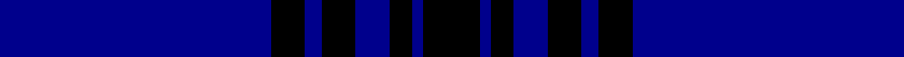
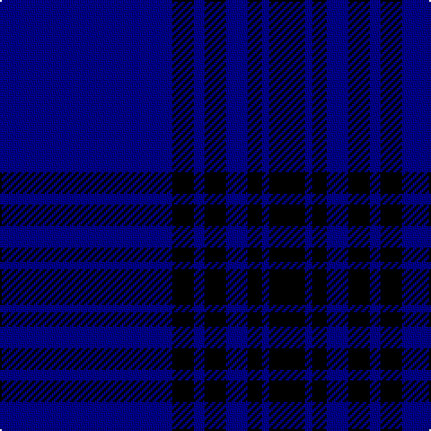

In pattern [BKBKBKBK](/stripes/bkbkbkbk/).

This was sourced from tartans-authority.  It is a [8 stripe tartan](/stripes/stripes8/).

Original link http://www.tartansauthority.com/tartan-ferret/display/4990/

## Thread count
DB/96 K12 DB6 K12 DB12 K8 DB4 K/20

## Palette
Each colour and the base-6 reference it is a variant of.

| Colour | Shade | Base |
|---|---|---|
| DB | <code style="background-color:#00008C;">#00008C</code> `oklch(28.9% 0.200 264.1)` <small>#00008C</small> | B <code style="background-color:#2A418A;">#2A418A</code> |
| K | <code style="background-color:#000000;">#000000</code> `oklch(0.0% 0.000 0.0)` <small>#000000</small> | K <code style="background-color:#000000;">#000000</code> |

# Sample pattern

## Nearest tartans

The nearest existing variants by ΔTartan distance.

1. [Lochleven (Dance)](/setts/s8/db48dg6db3dg6db6dg4db2dg10~x2/) — ΔT 1.54
1. [United French Freemasons (Corporate](/setts/s6/db144r9t44db4t4db4/) — ΔT 2.14
1. [Auchairne](/setts/s6/b10db6b3db62w4db5~x2/) — ΔT 2.14
1. [MacKay V](/setts/s6/db2k6db2k6db16r1~x2/) — ΔT 2.21
1. [Atlin (Fashion)](/setts/s6/k14db14k14db40k3db2~x2/) — ΔT 2.22
1. [Waugh](/setts/s5/db100y10k5y10r8/) — ΔT 2.31
1. [Calum's Cabin](/setts/s10/db32o4dt12db2dt4db2dt2y16db67o6/) — ΔT 2.31
1. [Marist School, The](/setts/s8/db29db2db1db1db1db1t8lo1~x4/) — ΔT 2.32
1. [Auchairne (Corporate)](/setts/s6/b11db7b3db70lb4db6~x2/) — ΔT 2.39
1. [French Freemasons' Pride (Fashion)](/setts/s6/db128r8t41n4t4n4/) — ΔT 2.40

## Neighbour map

Every grey dot is one of 14299 variants placed by the first two principal components of the ΔTartan feature space (44% of its variance). Red is this tartan; blue dots are its nearest — click one to open its page.

<svg viewBox="0 0 640 380" role="img" style="max-width:100%;height:auto;border:1px solid #e0e0e0;border-radius:4px;display:block" xmlns="http://www.w3.org/2000/svg"><image href="/nn/cloud.v1.png" width="640" height="380"/><a href="/setts/s8/db48dg6db3dg6db6dg4db2dg10~x2/"><circle cx="539.1" cy="213.1" r="4" fill="#3465a4"><title>Lochleven (Dance)</title></circle></a><a href="/setts/s6/db144r9t44db4t4db4/"><circle cx="558.0" cy="176.5" r="4" fill="#3465a4"><title>United French Freemasons (Corporate</title></circle></a><a href="/setts/s6/b10db6b3db62w4db5~x2/"><circle cx="553.1" cy="185.2" r="4" fill="#3465a4"><title>Auchairne</title></circle></a><a href="/setts/s6/db2k6db2k6db16r1~x2/"><circle cx="427.6" cy="244.5" r="4" fill="#3465a4"><title>MacKay V</title></circle></a><a href="/setts/s6/k14db14k14db40k3db2~x2/"><circle cx="501.0" cy="273.1" r="4" fill="#3465a4"><title>Atlin (Fashion)</title></circle></a><a href="/setts/s5/db100y10k5y10r8/"><circle cx="501.3" cy="184.5" r="4" fill="#3465a4"><title>Waugh</title></circle></a><a href="/setts/s10/db32o4dt12db2dt4db2dt2y16db67o6/"><circle cx="462.2" cy="137.7" r="4" fill="#3465a4"><title>Calum's Cabin</title></circle></a><a href="/setts/s8/db29db2db1db1db1db1t8lo1~x4/"><circle cx="502.5" cy="144.1" r="4" fill="#3465a4"><title>Marist School, The</title></circle></a><a href="/setts/s6/b11db7b3db70lb4db6~x2/"><circle cx="613.4" cy="198.4" r="4" fill="#3465a4"><title>Auchairne (Corporate)</title></circle></a><a href="/setts/s6/db128r8t41n4t4n4/"><circle cx="481.0" cy="158.9" r="4" fill="#3465a4"><title>French Freemasons' Pride (Fashion)</title></circle></a><circle cx="520.7" cy="203.8" r="5" fill="#c00000"/></svg>

ID: /setts/s8/db48k6db3k6db6k4db2k10~x2/
