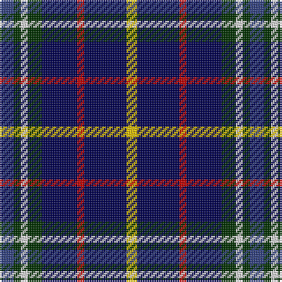

In pattern [BGWGBRBY](/stripes/bgwgbrby/).

This was sourced from weddslist.  It is a [8 stripe tartan](/stripes/stripes8/).

Original link http://www.weddslist.com/cgi-bin/tartans/pg.pl?source=sts

## Also known as

This cloth is also recorded under:

- United Services, Planning Association

## Attestations

This cloth appears in 2 source records; the oldest owns this page.

- undated — United Services, Planning Association (weddslist, [record](http://www.weddslist.com/cgi-bin/tartans/pg.pl?source=sts))
- undated — United Services Planning Assoc Corporate Tartan Tartan Number: 2097. Earliest known date: 1991 The company for which the tartan is being made serves the U. S. Military Community and as such the tartan uses the colours of the Services. Navy blue for the Navy, red for the Marines, green for Army, and light blue for the Air Force and USPA. See products available Copyright © Blair Urquhart, Comrie, 2015 (house-of-tartan, [record](http://www.house-of-tartan.scotland.net/house/TartanViewjs.asp?colr=Def&tnam=2097))

## Thread count
B/8 DG4 LN4 DG8 DB20 R4 DB24 Y/6

## Palette
Each colour and the base-6 reference it is a variant of.

| Colour | Shade | Base |
|---|---|---|
| B | <code style="background-color:#304080;">#304080</code> `oklch(39.4% 0.109 270.2)` <small>#304080</small> | B <code style="background-color:#2A418A;">#2A418A</code> |
| DB | <code style="background-color:#000050;">#000050</code> `oklch(19.5% 0.135 264.1)` <small>#000050</small> | B <code style="background-color:#2A418A;">#2A418A</code> |
| DG | <code style="background-color:#003000;">#003000</code> `oklch(26.8% 0.091 142.5)` <small>#003000</small> | G <code style="background-color:#006100;">#006100</code> |
| LN | <code style="background-color:#E0E0E0;">#E0E0E0</code> `oklch(90.7% 0.000 89.9)` <small>#E0E0E0</small> | W <code style="background-color:#F7F7F7;">#F7F7F7</code> |
| R | <code style="background-color:#C00000;">#C00000</code> `oklch(50.7% 0.208 29.2)` <small>#C00000</small> | R <code style="background-color:#CC0000;">#CC0000</code> |
| Y | <code style="background-color:#F0C000;">#F0C000</code> `oklch(82.7% 0.169 90.5)` <small>#F0C000</small> | Y <code style="background-color:#F2BF00;">#F2BF00</code> |

# Sample pattern

## Nearest tartans

The nearest existing variants by ΔTartan distance.

1. [Ayrshire Tourist Board](/setts/s9/k10p3db4p3k7b3g8k17ly2~x2/) — ΔT 0.81
1. [Mounth, The](/setts/s9/dg2y13db12w3db10w3db12g13dp2~x2/) — ΔT 1.27
1. [Glen Erin](/setts/s8/db16g8db8g8db16r3o3g3~x2/) — ΔT 1.29
1. [H.M.S. DUNCAN](/setts/s6/o3k15r2k15n15p3~x2/) — ΔT 1.34
1. [Quinn](/setts/s9/r1n8k4g1g4g1k4n8ly1~x6/) — ΔT 1.38
1. [Tupper, John Charles (Personal)](/setts/s10/r2w2dg8g2dg2db20t8g2db15w2~x2/) — ΔT 1.40
1. [Edinburgh Bus Tours](/setts/s12/lb6db20lg5db5lg5db20r14db4k18db30ly4db4/) — ΔT 1.47
1. [Grainger (Name)](/setts/s7/db36r4db6g18db15k18w4~x2/) — ΔT 1.47
1. [Loch Lomond Millennium](/setts/s11/k3g2k12dt4db19r3db19dt4k12g2ly3~x2/) — ΔT 1.49
1. [Edinburgh Bus Tours](/setts/s12/w6dt20b5dt5b5dt20r14dt4k18dt30lo4dt4/) — ΔT 1.49

## Neighbour map

Every grey dot is one of 14299 variants placed by the first two principal components of the ΔTartan feature space (44% of its variance). Red is this tartan; blue dots are its nearest — click one to open its page.

<svg viewBox="0 0 640 380" role="img" style="max-width:100%;height:auto;border:1px solid #e0e0e0;border-radius:4px;display:block" xmlns="http://www.w3.org/2000/svg"><image href="/nn/cloud.v1.png" width="640" height="380"/><a href="/setts/s9/k10p3db4p3k7b3g8k17ly2~x2/"><circle cx="235.2" cy="185.6" r="4" fill="#3465a4"><title>Ayrshire Tourist Board</title></circle></a><a href="/setts/s9/dg2y13db12w3db10w3db12g13dp2~x2/"><circle cx="132.5" cy="194.2" r="4" fill="#3465a4"><title>Mounth, The</title></circle></a><a href="/setts/s8/db16g8db8g8db16r3o3g3~x2/"><circle cx="155.1" cy="219.7" r="4" fill="#3465a4"><title>Glen Erin</title></circle></a><a href="/setts/s6/o3k15r2k15n15p3~x2/"><circle cx="252.0" cy="221.0" r="4" fill="#3465a4"><title>H.M.S. DUNCAN</title></circle></a><a href="/setts/s9/r1n8k4g1g4g1k4n8ly1~x6/"><circle cx="180.5" cy="173.7" r="4" fill="#3465a4"><title>Quinn</title></circle></a><a href="/setts/s10/r2w2dg8g2dg2db20t8g2db15w2~x2/"><circle cx="239.8" cy="152.6" r="4" fill="#3465a4"><title>Tupper, John Charles (Personal)</title></circle></a><a href="/setts/s12/lb6db20lg5db5lg5db20r14db4k18db30ly4db4/"><circle cx="258.1" cy="177.6" r="4" fill="#3465a4"><title>Edinburgh Bus Tours</title></circle></a><a href="/setts/s7/db36r4db6g18db15k18w4~x2/"><circle cx="264.0" cy="213.6" r="4" fill="#3465a4"><title>Grainger (Name)</title></circle></a><a href="/setts/s11/k3g2k12dt4db19r3db19dt4k12g2ly3~x2/"><circle cx="180.7" cy="159.9" r="4" fill="#3465a4"><title>Loch Lomond Millennium</title></circle></a><a href="/setts/s12/w6dt20b5dt5b5dt20r14dt4k18dt30lo4dt4/"><circle cx="255.0" cy="178.8" r="4" fill="#3465a4"><title>Edinburgh Bus Tours</title></circle></a><circle cx="197.2" cy="194.4" r="5" fill="#c00000"/></svg>

ID: /setts/s8/db4dg2w2dg4db10r2db12ly3~x2/
