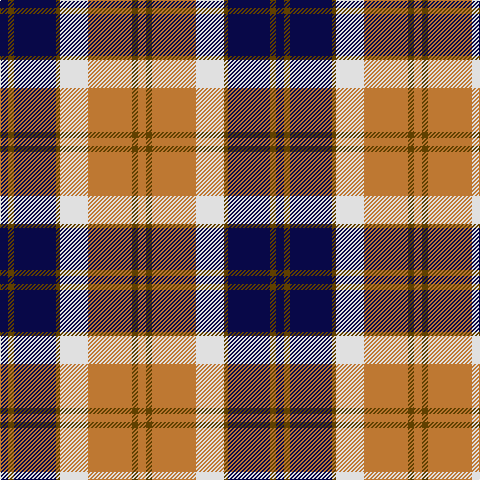

**Bands:** [BGBGWRGR](/stripes/bgbgwrgr/) · **Stripes:** [DB DY DB DY W O DY O](/stripes/stripes8/) DB DY DB DY W O DY O

This was sourced from register-of-tartans.  It is a [8 band tartan](/bands/bands8/).

Original link https://www.tartanregister.gov.uk/tartanDetails.aspx?ref=194

## Register references

External register numbers recorded for this tartan.

- Scottish Register of Tartans: [194](https://www.tartanregister.gov.uk/tartanDetails.aspx?ref=194)
- Scottish Tartans World Register: 2772

## Thread count
DB/8 T6 DB42 T4 LN28 DO44 T6 DO/8

## Palette
Each colour and its ΔE from the base-6 reference it is a variant of.

| Colour | Shade | Base | ΔE (OKLab) |
|---|---|---|---|
| DB | <code style="background-color:#080848;">#080848</code> `#080848` | B <code style="background-color:#2A418A;">#2A418A</code> | 0.20 |
| DO | <code style="background-color:#BE7832;">#BE7832</code> `#BE7832` | R <code style="background-color:#CC0000;">#CC0000</code> | 0.17 |
| LN | <code style="background-color:#E0E0E0;">#E0E0E0</code> `#E0E0E0` | W <code style="background-color:#F7F7F7;">#F7F7F7</code> | 0.07 |
| T | <code style="background-color:#604000;">#604000</code> `#604000` | G <code style="background-color:#006100;">#006100</code> | 0.14 |

# Sample pattern

## Nearest tartans

The nearest existing variants by ΔTartan distance.

1. [Unidentified (ex Tony Murray)](/setts/s8/dt8w22dt5w4k24r6k2r6~x2/) — ΔT 0.42
1. [Bannockbane, Dark Tan](/setts/s8/dr4ly2dr13ly1w8t13ly2t4~x2/) — ΔT 0.58
1. [Heriot](/setts/s8/o20db2o2db2lo3db12w18db3~x2/) — ΔT 0.70
1. [Bannockbane Grey #1](/setts/s8/k4ly2k13ly1w8o13ly2o4~x2/) — ΔT 0.78
1. [Thompson Grey Family Tartan Tartan Number: 1611. Earliest known date: pre 2003 Designed for Lord Thomson of Fleet in 1958 based on a sample in the Moy Hall collection dating from the mid 19th century. The tartan is also suitable for MacTavishs and Thompsons, who claim descent from the Clan MacIntosh. See products available Copyright © Blair Urquhart, Comrie, 2015](/setts/s6/r2o20k5w10k10r2~x2/) — ΔT 0.87
1. [National Trust](/setts/s8/dg2dr8dg8o3dr1w12dg2dr1~x2/) — ΔT 0.93
1. [Bannockbane Light Tan](/setts/s8/k4ly2k13ly1w8lo13ly2lo4~x2/) — ΔT 0.97
1. [Bannockbane Hunting (MacBean and Bishop)](/setts/s8/dg3o2dg14o1w10y14o2y3~x2/) — ΔT 0.98
1. [Unidentified](/setts/s7/w8k2y12k11w1r6y4~x2/) — ΔT 0.99
1. [Thom(p)son, Grey](/setts/s6/r2y20k5w10k10r2~x2/) — ΔT 0.99

## Neighbour map

Every grey dot is one of 14313 variants placed by the first two principal components of the ΔTartan feature space (44% of its variance). Red is this tartan; blue dots are its nearest — click one to open its page.

<svg viewBox="0 0 640 380" role="img" style="max-width:100%;height:auto;border:1px solid #e0e0e0;border-radius:4px;display:block" xmlns="http://www.w3.org/2000/svg"><image href="/nn/cloud.v1.png" width="640" height="380"/><a href="/setts/s8/dt8w22dt5w4k24r6k2r6~x2/"><circle cx="140.3" cy="164.5" r="4" fill="#3465a4"><title>Unidentified (ex Tony Murray)</title></circle></a><a href="/setts/s8/dr4ly2dr13ly1w8t13ly2t4~x2/"><circle cx="164.1" cy="170.8" r="4" fill="#3465a4"><title>Bannockbane, Dark Tan</title></circle></a><a href="/setts/s8/o20db2o2db2lo3db12w18db3~x2/"><circle cx="168.8" cy="161.5" r="4" fill="#3465a4"><title>Heriot</title></circle></a><a href="/setts/s8/k4ly2k13ly1w8o13ly2o4~x2/"><circle cx="152.3" cy="167.0" r="4" fill="#3465a4"><title>Bannockbane Grey #1</title></circle></a><a href="/setts/s6/r2o20k5w10k10r2~x2/"><circle cx="174.7" cy="192.4" r="4" fill="#3465a4"><title>Thompson Grey Family Tartan Tartan Number: 1611. Earliest known date: pre 2003 Designed for Lord Thomson of Fleet in 1958 based on a sample in the Moy Hall collection dating from the mid 19th century. The tartan is also suitable for MacTavishs and Thompsons, who claim descent from the Clan MacIntosh. See products available Copyright © Blair Urquhart, Comrie, 2015</title></circle></a><a href="/setts/s8/dg2dr8dg8o3dr1w12dg2dr1~x2/"><circle cx="144.1" cy="169.0" r="4" fill="#3465a4"><title>National Trust</title></circle></a><a href="/setts/s8/k4ly2k13ly1w8lo13ly2lo4~x2/"><circle cx="157.4" cy="168.2" r="4" fill="#3465a4"><title>Bannockbane Light Tan</title></circle></a><a href="/setts/s8/dg3o2dg14o1w10y14o2y3~x2/"><circle cx="167.9" cy="167.2" r="4" fill="#3465a4"><title>Bannockbane Hunting (MacBean and Bishop)</title></circle></a><a href="/setts/s7/w8k2y12k11w1r6y4~x2/"><circle cx="143.6" cy="193.3" r="4" fill="#3465a4"><title>Unidentified</title></circle></a><a href="/setts/s6/r2y20k5w10k10r2~x2/"><circle cx="164.9" cy="190.6" r="4" fill="#3465a4"><title>Thom(p)son, Grey</title></circle></a><circle cx="159.5" cy="166.9" r="5" fill="#c00000"/></svg>

ID: /setts/s8/db4dy3db21dy2w14o22dy3o4~x2/
