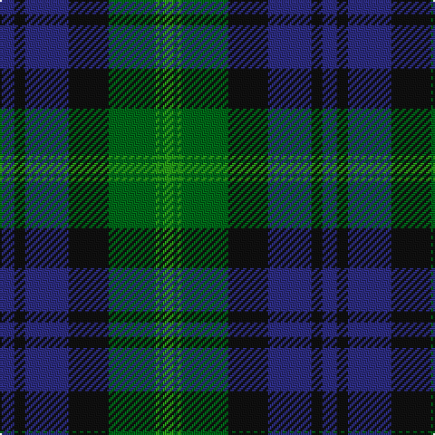

**Bands:** [BKBKGGGG](/stripes/bkbkgggg/) · **Stripes:** [DB K DB K G G G G](/stripes/stripes8/) DB K DB K G G G G

This was sourced from register-of-tartans.  It is a [8 band tartan](/bands/bands8/).

Original link https://www.tartanregister.gov.uk/tartanDetails.aspx?ref=241

## Attestations

This cloth appears in 2 source records; the oldest owns this page.

- 01/01/2003 — Bedford High School (register-of-tartans, [record](https://www.tartanregister.gov.uk/tartanDetails.aspx?ref=241))
- pre 2003 — Bedford High School (Corporate) (tartans-authority, [record](http://www.tartansauthority.com/tartan-ferret/display/6008/))

## Register references

External register numbers recorded for this tartan.

- Scottish Register of Tartans: [241](https://www.tartanregister.gov.uk/tartanDetails.aspx?ref=241)
- Scottish Tartans Authority (ITI): 6008

## Thread count
DB/8 K6 DB24 K22 G26 Ga2 G2 Ga/6

## Palette
Each colour and its ΔE from the base-6 reference it is a variant of.

| Colour | Shade | Base | ΔE (OKLab) |
|---|---|---|---|
| DB | <code style="background-color:#2C2C80;">#2C2C80</code> `#2C2C80` | B <code style="background-color:#2A418A;">#2A418A</code> | 0.06 |
| G | <code style="background-color:#006818;">#006818</code> `#006818` | G <code style="background-color:#006100;">#006100</code> | 0.02 |
| Ga | <code style="background-color:#289C18;">#289C18</code> `#289C18` | G <code style="background-color:#006100;">#006100</code> | 0.19 |
| K | <code style="background-color:#101010;">#101010</code> `#101010` | K <code style="background-color:#000000;">#000000</code> | 0.17 |

# Sample pattern

## Nearest tartans

The nearest existing variants by ΔTartan distance.

1. [Aitchison (Personal)](/setts/s9/dp2g25k11dt2k11dt18k2dt3k2~x2/) — ΔT 0.70
1. [Reid and Taylor](/setts/s7/db2k1r1db9k9g10k2~x2/) — ΔT 0.79
1. [Gunn](/setts/s6/g2db12g1k12g12r2~x2/) — ΔT 0.81
1. [Black Watch (Coarse Kilt)](/setts/s7/r4k4db24k24g24k2r3~x2/) — ΔT 0.84
1. [Ferguson](/setts/s11/g2db12r1k12g12k2g12k12r1db12g1~x4/) — ΔT 0.85
1. [Dundas #2](/setts/s7/k4db16k12g12r1g2k2~x2/) — ΔT 0.86
1. [Baird (Old) Clan Tartan Tartan Number: 273. Earliest known date: c.1906 This tartan is first recorded in Johnston's work of 1906, and the sample from the Highland Society of London probably dates from the same period. In both these early references the triple stripes are rendered in red. Today, however, they are generally woven in purple. The name originates from 'bard' meaning poet. The Bairds owned estates in Aberdeenshire which were later purchased by the Gordons. See products available Copyright © Blair Urquhart, Comrie, 2015](/setts/s8/m7g3m2g33k31db31k3db3/) — ΔT 0.89
1. [National Galleries of Scotland](/setts/s7/k7g22k22db6r2db15r2~x2/) — ΔT 0.89
1. [Gammell (1978) (Personal)](/setts/s7/db3r2db22k11g22r2g3~x2/) — ΔT 0.94
1. [Granger/Grainger (Personal)](/setts/s10/g27k21db12k4db40k4db12k21g27w4~x2/) — ΔT 0.96

## Neighbour map

Every grey dot is one of 14313 variants placed by the first two principal components of the ΔTartan feature space (44% of its variance). Red is this tartan; blue dots are its nearest — click one to open its page.

<svg viewBox="0 0 640 380" role="img" style="max-width:100%;height:auto;border:1px solid #e0e0e0;border-radius:4px;display:block" xmlns="http://www.w3.org/2000/svg"><image href="/nn/cloud.v1.png" width="640" height="380"/><a href="/setts/s9/dp2g25k11dt2k11dt18k2dt3k2~x2/"><circle cx="221.4" cy="198.9" r="4" fill="#3465a4"><title>Aitchison (Personal)</title></circle></a><a href="/setts/s7/db2k1r1db9k9g10k2~x2/"><circle cx="221.2" cy="231.7" r="4" fill="#3465a4"><title>Reid and Taylor</title></circle></a><a href="/setts/s6/g2db12g1k12g12r2~x2/"><circle cx="216.4" cy="230.6" r="4" fill="#3465a4"><title>Gunn</title></circle></a><a href="/setts/s7/r4k4db24k24g24k2r3~x2/"><circle cx="220.3" cy="218.1" r="4" fill="#3465a4"><title>Black Watch (Coarse Kilt)</title></circle></a><a href="/setts/s11/g2db12r1k12g12k2g12k12r1db12g1~x4/"><circle cx="208.0" cy="212.4" r="4" fill="#3465a4"><title>Ferguson</title></circle></a><a href="/setts/s7/k4db16k12g12r1g2k2~x2/"><circle cx="248.6" cy="216.6" r="4" fill="#3465a4"><title>Dundas #2</title></circle></a><a href="/setts/s8/m7g3m2g33k31db31k3db3/"><circle cx="226.7" cy="192.1" r="4" fill="#3465a4"><title>Baird (Old) Clan Tartan Tartan Number: 273. Earliest known date: c.1906 This tartan is first recorded in Johnston's work of 1906, and the sample from the Highland Society of London probably dates from the same period. In both these early references the triple stripes are rendered in red. Today, however, they are generally woven in purple. The name originates from 'bard' meaning poet. The Bairds owned estates in Aberdeenshire which were later purchased by the Gordons. See products available Copyright © Blair Urquhart, Comrie, 2015</title></circle></a><a href="/setts/s7/k7g22k22db6r2db15r2~x2/"><circle cx="218.3" cy="229.4" r="4" fill="#3465a4"><title>National Galleries of Scotland</title></circle></a><a href="/setts/s7/db3r2db22k11g22r2g3~x2/"><circle cx="231.5" cy="210.5" r="4" fill="#3465a4"><title>Gammell (1978) (Personal)</title></circle></a><a href="/setts/s10/g27k21db12k4db40k4db12k21g27w4~x2/"><circle cx="197.2" cy="224.6" r="4" fill="#3465a4"><title>Granger/Grainger (Personal)</title></circle></a><circle cx="197.7" cy="212.5" r="5" fill="#c00000"/></svg>

ID: /setts/s8/db4k3db12k11g13g1g1g3~x2/
