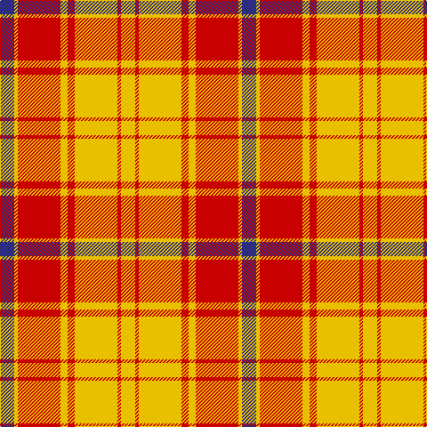

**Bands:** [YRYRYRYB](/stripes/yryryryb/) · **Stripes:** [LY R LY R LY R LY DB](/stripes/stripes8/) LY R LY R LY R LY DB

This was sourced from register-of-tartans.  It is a [8 band tartan](/bands/bands8/).

Original link https://www.tartanregister.gov.uk/tartanDetails.aspx?ref=1363

## Register references

External register numbers recorded for this tartan.

- Scottish Register of Tartans: [1363](https://www.tartanregister.gov.uk/tartanDetails.aspx?ref=1363)
- Scottish Tartans Authority (ITI): 5801

## Thread count
DB/16 Y4 R48 Y8 R8 Y48 R4 Y/16

## Palette
Each colour and its ΔE from the base-6 reference it is a variant of.

| Colour | Shade | Base | ΔE (OKLab) |
|---|---|---|---|
| DB | <code style="background-color:#2C2C80;">#2C2C80</code> `#2C2C80` | B <code style="background-color:#2A418A;">#2A418A</code> | 0.06 |
| R | <code style="background-color:#C80000;">#C80000</code> `#C80000` | R <code style="background-color:#CC0000;">#CC0000</code> | 0.01 |
| Y | <code style="background-color:#E8C000;">#E8C000</code> `#E8C000` | Y <code style="background-color:#F2BF00;">#F2BF00</code> | 0.02 |

# Sample pattern

## Nearest tartans

The nearest existing variants by ΔTartan distance.

1. [Glassary #2](/setts/s8/db4r1ly12r2ly2r12ly1db4~x4/) — ΔT 1.29
1. [Masai Shuka 16 (Artefact)](/setts/s6/ly8k3ly4k2r30ly6~x2/) — ΔT 1.36
1. [Fernandes (Personal)](/setts/s7/g5ly5g5ly35r44r3r3~x2/) — ΔT 1.36
1. [Scrymgeour Family Tartan Tartan Number: 1627. Earliest known date: 1971 Yellow ochre. A note in STS files says "Not Adopted" with no explanation. The STS research report reads, "The tartan detailed above was displayed at a gathering of Scrymgeours held at Dudhope Castle, Dundee, in 1971 and was later adopted as the official tartan. The sett was designed by Donald C Stewart, author of 'The Setts of the Scottish Tartans' in 1970." See products available Copyright © Blair Urquhart, Comrie, 2015](/setts/s7/o15k1ly2db3o2k1ly15~x4/) — ΔT 1.38
1. [MacMillan](/setts/s9/r3ly1r12ly2r3ly8r2ly8r1~x2/) — ΔT 1.38
1. [Buchele Check (Fashion?)](/setts/s6/r4ly1r3ly1ly8ly2~x4/) — ΔT 1.44
1. [Scrymgeour](/setts/s7/r46k3ly6db8r6k3ly46/) — ΔT 1.44
1. [Makhtoum](/setts/s6/w11r40g13r5g12r5~x2/) — ΔT 1.45
1. [Strathearn (Royal)](/setts/s11/g1r1ly8r6g1ly1g1r6g6r1ly1~x4/) — ΔT 1.50
1. [Ailsa, Red V2 (Dance)](/setts/s6/r8r3r28w32r3w4~x2/) — ΔT 1.53

## Neighbour map

Every grey dot is one of 14299 variants placed by the first two principal components of the ΔTartan feature space (44% of its variance). Red is this tartan; blue dots are its nearest — click one to open its page.

<svg viewBox="0 0 640 380" role="img" style="max-width:100%;height:auto;border:1px solid #e0e0e0;border-radius:4px;display:block" xmlns="http://www.w3.org/2000/svg"><image href="/nn/cloud.v1.png" width="640" height="380"/><a href="/setts/s8/db4r1ly12r2ly2r12ly1db4~x4/"><circle cx="235.8" cy="169.8" r="4" fill="#3465a4"><title>Glassary #2</title></circle></a><a href="/setts/s6/ly8k3ly4k2r30ly6~x2/"><circle cx="361.9" cy="162.7" r="4" fill="#3465a4"><title>Masai Shuka 16 (Artefact)</title></circle></a><a href="/setts/s7/g5ly5g5ly35r44r3r3~x2/"><circle cx="284.6" cy="143.2" r="4" fill="#3465a4"><title>Fernandes (Personal)</title></circle></a><a href="/setts/s7/o15k1ly2db3o2k1ly15~x4/"><circle cx="267.6" cy="145.8" r="4" fill="#3465a4"><title>Scrymgeour Family Tartan Tartan Number: 1627. Earliest known date: 1971 Yellow ochre. A note in STS files says &quot;Not Adopted&quot; with no explanation. The STS research report reads, &quot;The tartan detailed above was displayed at a gathering of Scrymgeours held at Dudhope Castle, Dundee, in 1971 and was later adopted as the official tartan. The sett was designed by Donald C Stewart, author of 'The Setts of the Scottish Tartans' in 1970.&quot; See products available Copyright © Blair Urquhart, Comrie, 2015</title></circle></a><a href="/setts/s9/r3ly1r12ly2r3ly8r2ly8r1~x2/"><circle cx="359.2" cy="196.1" r="4" fill="#3465a4"><title>MacMillan</title></circle></a><a href="/setts/s6/r4ly1r3ly1ly8ly2~x4/"><circle cx="260.5" cy="216.1" r="4" fill="#3465a4"><title>Buchele Check (Fashion?)</title></circle></a><a href="/setts/s7/r46k3ly6db8r6k3ly46/"><circle cx="262.9" cy="130.3" r="4" fill="#3465a4"><title>Scrymgeour</title></circle></a><a href="/setts/s6/w11r40g13r5g12r5~x2/"><circle cx="328.7" cy="216.4" r="4" fill="#3465a4"><title>Makhtoum</title></circle></a><a href="/setts/s11/g1r1ly8r6g1ly1g1r6g6r1ly1~x4/"><circle cx="232.9" cy="182.0" r="4" fill="#3465a4"><title>Strathearn (Royal)</title></circle></a><a href="/setts/s6/r8r3r28w32r3w4~x2/"><circle cx="293.0" cy="179.1" r="4" fill="#3465a4"><title>Ailsa, Red V2 (Dance)</title></circle></a><circle cx="298.1" cy="171.5" r="5" fill="#c00000"/></svg>

ID: /setts/s8/db4ly1r12ly2r2ly12r1ly4~x4/
