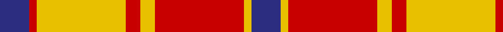
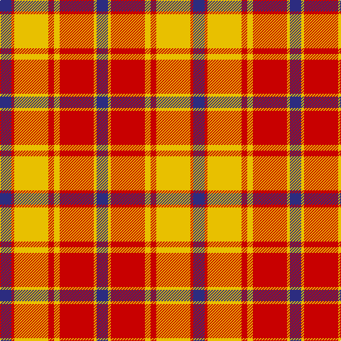

In pattern [BRYRYRYB](/stripes/bryryryb/).

This was sourced from register-of-tartans.  It is a [8 stripe tartan](/stripes/stripes8/).

Original link https://www.tartanregister.gov.uk/tartanDetails.aspx?ref=1362

## Register references

External register numbers recorded for this tartan.

- Scottish Register of Tartans: [1362](https://www.tartanregister.gov.uk/tartanDetails.aspx?ref=1362)
- Scottish Tartans Authority (ITI): 5800

## Thread count
DB/16 R4 Y48 R8 Y8 R48 Y4 DB/16

## Palette
Each colour and its ΔE from the base-6 reference it is a variant of.

| Colour | Shade | Base | ΔE (OKLab) |
|---|---|---|---|
| DB | <code style="background-color:#2C2C80;">#2C2C80</code> `#2C2C80` | B <code style="background-color:#2A418A;">#2A418A</code> | 0.06 |
| R | <code style="background-color:#C80000;">#C80000</code> `#C80000` | R <code style="background-color:#CC0000;">#CC0000</code> | 0.01 |
| Y | <code style="background-color:#E8C000;">#E8C000</code> `#E8C000` | Y <code style="background-color:#F2BF00;">#F2BF00</code> | 0.02 |

# Sample pattern

## Nearest tartans

The nearest existing variants by ΔTartan distance.

1. [Turnberry, Manx Snaefell](/setts/s8/o22dr2o2dr2o2dr15w17dr3~x2/) — ΔT 1.19
1. [Ballater Trade or 'Fancy' Tartan Tartan Number: 1708. Earliest known date: Modern Many new designs have been given district names to promote their Scottish connections. However, these names should not be confused with the District tartans which have earned their title through 'use and wont' and not a little history. See products available Copyright © Blair Urquhart, Comrie, 2015](/setts/s9/r12w2lo3w2r3k5r2lo18w2~x2/) — ΔT 1.29
1. [Glassary #3](/setts/s8/db4ly1r12ly2r2ly12r1ly4~x4/) — ΔT 1.29
1. [Turnberry Manx Snaefell Family Tartan Tartan Number: 1749. Earliest known date: 1981 A coincidence. See products available Copyright © Blair Urquhart, Comrie, 2015](/setts/s8/lo22do2lo2do2lo2do15w17do3~x2/) — ΔT 1.34
1. [Ballater](/setts/s9/r12w2o3w2r3k5r2o18w2~x2/) — ΔT 1.37
1. [Lennox Dress #2](/setts/s7/r2r1r10r2w10db1w2~x4/) — ΔT 1.39
1. [Scrymgeour Family Tartan Tartan Number: 1627. Earliest known date: 1971 Yellow ochre. A note in STS files says "Not Adopted" with no explanation. The STS research report reads, "The tartan detailed above was displayed at a gathering of Scrymgeours held at Dudhope Castle, Dundee, in 1971 and was later adopted as the official tartan. The sett was designed by Donald C Stewart, author of 'The Setts of the Scottish Tartans' in 1970." See products available Copyright © Blair Urquhart, Comrie, 2015](/setts/s7/o15k1ly2db3o2k1ly15~x4/) — ΔT 1.39
1. [Aubigny](/setts/s9/ly20k2ly3k2ly4k9r18k2r5~x2/) — ΔT 1.41
1. [Scrymgeour](/setts/s7/r15k1ly2db3r2k1ly15~x6/) — ΔT 1.45
1. [Scrymgeour](/setts/s7/r15k1ly2db3r2k1ly15~x3/) — ΔT 1.45

## Neighbour map

Every grey dot is one of 14299 variants placed by the first two principal components of the ΔTartan feature space (44% of its variance). Red is this tartan; blue dots are its nearest — click one to open its page.

<svg viewBox="0 0 640 380" role="img" style="max-width:100%;height:auto;border:1px solid #e0e0e0;border-radius:4px;display:block" xmlns="http://www.w3.org/2000/svg"><image href="/nn/cloud.v1.png" width="640" height="380"/><a href="/setts/s8/o22dr2o2dr2o2dr15w17dr3~x2/"><circle cx="225.6" cy="175.6" r="4" fill="#3465a4"><title>Turnberry, Manx Snaefell</title></circle></a><a href="/setts/s9/r12w2lo3w2r3k5r2lo18w2~x2/"><circle cx="230.0" cy="165.0" r="4" fill="#3465a4"><title>Ballater Trade or 'Fancy' Tartan Tartan Number: 1708. Earliest known date: Modern Many new designs have been given district names to promote their Scottish connections. However, these names should not be confused with the District tartans which have earned their title through 'use and wont' and not a little history. See products available Copyright © Blair Urquhart, Comrie, 2015</title></circle></a><a href="/setts/s8/db4ly1r12ly2r2ly12r1ly4~x4/"><circle cx="298.1" cy="171.5" r="4" fill="#3465a4"><title>Glassary #3</title></circle></a><a href="/setts/s8/lo22do2lo2do2lo2do15w17do3~x2/"><circle cx="222.6" cy="175.0" r="4" fill="#3465a4"><title>Turnberry Manx Snaefell Family Tartan Tartan Number: 1749. Earliest known date: 1981 A coincidence. See products available Copyright © Blair Urquhart, Comrie, 2015</title></circle></a><a href="/setts/s9/r12w2o3w2r3k5r2o18w2~x2/"><circle cx="223.1" cy="162.4" r="4" fill="#3465a4"><title>Ballater</title></circle></a><a href="/setts/s7/r2r1r10r2w10db1w2~x4/"><circle cx="237.2" cy="158.1" r="4" fill="#3465a4"><title>Lennox Dress #2</title></circle></a><a href="/setts/s7/o15k1ly2db3o2k1ly15~x4/"><circle cx="267.6" cy="145.8" r="4" fill="#3465a4"><title>Scrymgeour Family Tartan Tartan Number: 1627. Earliest known date: 1971 Yellow ochre. A note in STS files says &quot;Not Adopted&quot; with no explanation. The STS research report reads, &quot;The tartan detailed above was displayed at a gathering of Scrymgeours held at Dudhope Castle, Dundee, in 1971 and was later adopted as the official tartan. The sett was designed by Donald C Stewart, author of 'The Setts of the Scottish Tartans' in 1970.&quot; See products available Copyright © Blair Urquhart, Comrie, 2015</title></circle></a><a href="/setts/s9/ly20k2ly3k2ly4k9r18k2r5~x2/"><circle cx="223.1" cy="173.0" r="4" fill="#3465a4"><title>Aubigny</title></circle></a><a href="/setts/s7/r15k1ly2db3r2k1ly15~x6/"><circle cx="267.0" cy="149.1" r="4" fill="#3465a4"><title>Scrymgeour</title></circle></a><a href="/setts/s7/r15k1ly2db3r2k1ly15~x3/"><circle cx="267.0" cy="149.1" r="4" fill="#3465a4"><title>Scrymgeour</title></circle></a><circle cx="235.8" cy="169.8" r="5" fill="#c00000"/></svg>

ID: /setts/s8/db4r1ly12r2ly2r12ly1db4~x4/
