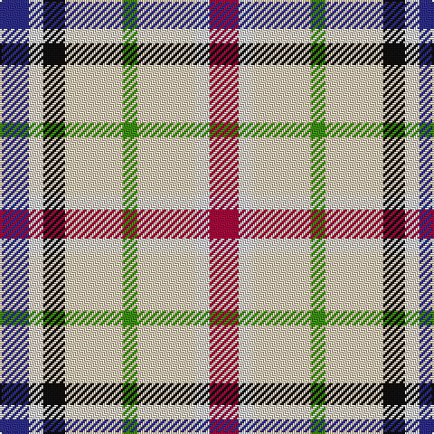

In pattern [BWKWGWWR](/stripes/bwkwgwwr/).

This was sourced from tartans-authority.  It is a [8 stripe tartan](/stripes/stripes8/).

Original link http://www.tartansauthority.com/tartan-ferret/display/4028/

## Thread count
DB/16 LN8 K12 LR32 G8 LR32 LN8 R/16

## Palette
Each colour and the base-6 reference it is a variant of.

| Colour | Shade | Base |
|---|---|---|
| DB | <code style="background-color:#2C2C88;">#2C2C88</code> `oklch(35.8% 0.149 275.8)` <small>#2C2C88</small> | B <code style="background-color:#2A418A;">#2A418A</code> |
| G | <code style="background-color:#3C9000;">#3C9000</code> `oklch(57.8% 0.177 137.6)` <small>#3C9000</small> | G <code style="background-color:#006100;">#006100</code> |
| K | <code style="background-color:#101010;">#101010</code> `oklch(17.3% 0.000 89.9)` <small>#101010</small> | K <code style="background-color:#000000;">#000000</code> |
| LN | <code style="background-color:#E0E0E0;">#E0E0E0</code> `oklch(90.7% 0.000 89.9)` <small>#E0E0E0</small> | W <code style="background-color:#F7F7F7;">#F7F7F7</code> |
| LR | <code style="background-color:#E8CCB8;">#E8CCB8</code> `oklch(86.3% 0.042 57.7)` <small>#E8CCB8</small> | W <code style="background-color:#F7F7F7;">#F7F7F7</code> |
| R | <code style="background-color:#A8003C;">#A8003C</code> `oklch(46.6% 0.186 12.5)` <small>#A8003C</small> | R <code style="background-color:#CC0000;">#CC0000</code> |

# Sample pattern

## Nearest tartans

The nearest existing variants by ΔTartan distance, with this tartan at the top so the swatches line up against it.

ΔTartan

Tartan

Sett

—

<a href="/ttd/edit/#slug=db4w2k3lb8g2lb8w2r4~x4">Desang (Corporate)</a> <a class="nn-out" href="/setts/s8/db4w2k3lb8g2lb8w2r4~x4/" title="open its dictionary page">↗</a>

0.37

<a href="/ttd/edit/#slug=dr4w2lb8dg2lb8k3w2db4~x2">Desang</a> <a class="nn-out" href="/setts/s8/dr4w2lb8dg2lb8k3w2db4~x2/" title="open its dictionary page">↗</a>

0.78

<a href="/ttd/edit/#slug=w16db4k12dg4w6r4w11ly7~x2">MacLaren (D.C Dalgliesh version)</a> <a class="nn-out" href="/setts/s8/w16db4k12dg4w6r4w11ly7~x2/" title="open its dictionary page">↗</a>

0.86

<a href="/ttd/edit/#slug=w16db4k12dg4w6lo4w11ly7~x2">MacLaren Dress (Dance)</a> <a class="nn-out" href="/setts/s8/w16db4k12dg4w6lo4w11ly7~x2/" title="open its dictionary page">↗</a>

1.03

<a href="/ttd/edit/#slug=w16db4k12g4w6lo4w11ly7~x2">MacLaren</a> <a class="nn-out" href="/setts/s8/w16db4k12g4w6lo4w11ly7~x2/" title="open its dictionary page">↗</a>

1.18

<a href="/ttd/edit/#slug=lb8db2k6dg2lb3o2lb6ly4~x4">MacLaren Albino (Dance)</a> <a class="nn-out" href="/setts/s8/lb8db2k6dg2lb3o2lb6ly4~x4/" title="open its dictionary page">↗</a>

1.42

<a href="/ttd/edit/#slug=lb67k13dy17dy13w40t20~x2">MacGregor-Ryan (Personal)</a> <a class="nn-out" href="/setts/s6/lb67k13dy17dy13w40t20~x2/" title="open its dictionary page">↗</a>

1.47

<a href="/ttd/edit/#slug=lb62dt13lo17dy13w40t20~x2">MacGregor-Ryan (Personal)</a> <a class="nn-out" href="/setts/s6/lb62dt13lo17dy13w40t20~x2/" title="open its dictionary page">↗</a>

1.59

<a href="/ttd/edit/#slug=w4k1w4dg6k4w5r1t2~x2">MacDuff Dress</a> <a class="nn-out" href="/setts/s8/w4k1w4dg6k4w5r1t2~x2/" title="open its dictionary page">↗</a>

1.62

<a href="/ttd/edit/#slug=n1w8y2lo2db6w1db6lo2y2w8r1~x4">MacKessog Wedding (Fashion)</a> <a class="nn-out" href="/setts/s11/n1w8y2lo2db6w1db6lo2y2w8r1~x4/" title="open its dictionary page">↗</a>

1.64

<a href="/ttd/edit/#slug=lb10r3lb10ly5k2r6lb2r6lb2r6db2ly2lb5lr2">Ogilvy</a> <a class="nn-out" href="/setts/s14/lb10r3lb10ly5k2r6lb2r6lb2r6db2ly2lb5lr2/" title="open its dictionary page">↗</a>

## Neighbour map

Every grey dot is one of 14299 variants placed by the first two principal components of the ΔTartan feature space (44% of its variance). Red is this tartan; blue dots are its nearest — click one to open its page.

<svg viewBox="0 0 640 380" role="img" style="max-width:100%;height:auto;border:1px solid #e0e0e0;border-radius:4px;display:block" xmlns="http://www.w3.org/2000/svg"><image href="/nn/cloud.v1.png" width="640" height="380"/><a href="/setts/s8/dr4w2lb8dg2lb8k3w2db4~x2/"><circle cx="92.5" cy="190.5" r="4" fill="#3465a4"><title>Desang</title></circle></a><a href="/setts/s8/w16db4k12dg4w6r4w11ly7~x2/"><circle cx="102.6" cy="195.2" r="4" fill="#3465a4"><title>MacLaren (D.C Dalgliesh version)</title></circle></a><a href="/setts/s8/w16db4k12dg4w6lo4w11ly7~x2/"><circle cx="102.1" cy="195.9" r="4" fill="#3465a4"><title>MacLaren Dress (Dance)</title></circle></a><a href="/setts/s8/w16db4k12g4w6lo4w11ly7~x2/"><circle cx="95.6" cy="193.6" r="4" fill="#3465a4"><title>MacLaren</title></circle></a><a href="/setts/s8/lb8db2k6dg2lb3o2lb6ly4~x4/"><circle cx="101.0" cy="200.6" r="4" fill="#3465a4"><title>MacLaren Albino (Dance)</title></circle></a><a href="/setts/s6/lb67k13dy17dy13w40t20~x2/"><circle cx="90.1" cy="190.8" r="4" fill="#3465a4"><title>MacGregor-Ryan (Personal)</title></circle></a><a href="/setts/s6/lb62dt13lo17dy13w40t20~x2/"><circle cx="69.8" cy="189.8" r="4" fill="#3465a4"><title>MacGregor-Ryan (Personal)</title></circle></a><a href="/setts/s8/w4k1w4dg6k4w5r1t2~x2/"><circle cx="120.3" cy="204.9" r="4" fill="#3465a4"><title>MacDuff Dress</title></circle></a><a href="/setts/s11/n1w8y2lo2db6w1db6lo2y2w8r1~x4/"><circle cx="126.6" cy="139.9" r="4" fill="#3465a4"><title>MacKessog Wedding (Fashion)</title></circle></a><a href="/setts/s14/lb10r3lb10ly5k2r6lb2r6lb2r6db2ly2lb5lr2/"><circle cx="121.0" cy="155.1" r="4" fill="#3465a4"><title>Ogilvy</title></circle></a><circle cx="97.4" cy="190.7" r="5" fill="#c00000"/></svg>

ID: /setts/s8/db4w2k3lb8g2lb8w2r4~x4/
