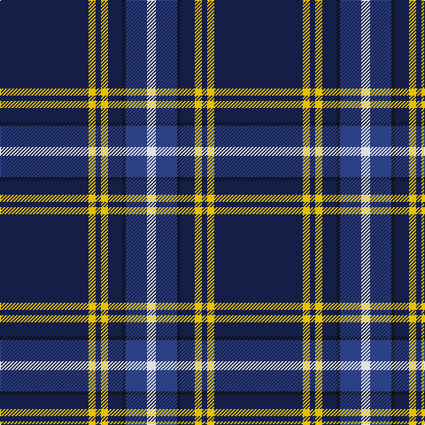

In pattern [BYBYBKBW](/stripes/bybybkbw/).

This was sourced from register-of-tartans.  It is a [8 stripe tartan](/stripes/stripes8/).

Original link https://www.tartanregister.gov.uk/tartanDetails.aspx?ref=5949

## Register references

External register numbers recorded for this tartan.

- Scottish Register of Tartans: [5949](https://www.tartanregister.gov.uk/tartanDetails.aspx?ref=5949)
- Scottish Tartans World Register: 3122

## Thread count
DB/100 Y8 DB6 Y8 DB16 K4 B24 LN/10

## Palette
Each colour and its ΔE from the base-6 reference it is a variant of.

| Colour | Shade | Base | ΔE (OKLab) |
|---|---|---|---|
| B | <code style="background-color:#2C4084;">#2C4084</code> `#2C4084` | B <code style="background-color:#2A418A;">#2A418A</code> | 0.01 |
| DB | <code style="background-color:#141E46;">#141E46</code> `#141E46` | B <code style="background-color:#2A418A;">#2A418A</code> | 0.16 |
| K | <code style="background-color:#101010;">#101010</code> `#101010` | K <code style="background-color:#000000;">#000000</code> | 0.17 |
| LN | <code style="background-color:#E0E0E0;">#E0E0E0</code> `#E0E0E0` | W <code style="background-color:#F7F7F7;">#F7F7F7</code> | 0.07 |
| Y | <code style="background-color:#E8C000;">#E8C000</code> `#E8C000` | Y <code style="background-color:#F2BF00;">#F2BF00</code> | 0.02 |

# Sample pattern

## Nearest tartans

The nearest existing variants by ΔTartan distance.

1. [Fife Flyers](/setts/s8/dt2w2dt43b5db4k8db2w2~x2/) — ΔT 1.00
1. [X Marks the Scot](/setts/s10/w6db32o3db3o1db3o2db4db1ly2~x2/) — ΔT 1.02
1. [Leblant-Macqueron (Personal)](/setts/s7/lr5k6w2dg7w2dt44w2~x2/) — ΔT 1.03
1. [Parkin](/setts/s8/w3dt9ly1lb3dp9lb1dt40dp2~x2/) — ΔT 1.05
1. [Schöbitz (2016)](/setts/s8/r1dt23lo3b16lo3dt22r1w1~x2/) — ΔT 1.09
1. [Special Air Service](/setts/s5/db26t6dg1o1w2~x2/) — ΔT 1.11
1. [Loretto School](/setts/s8/db4r14dp6r5db12dg8db70m4/) — ΔT 1.15
1. [Fife Flyers (Corporate)](/setts/s8/dt2w2dt43b5db4ly8db2w2~x2/) — ΔT 1.17
1. [Oxford University Dress (Corporate)](/setts/s10/ly4db44g5w2g2db2g2r2db3ly3~x2/) — ΔT 1.24
1. [World Youth Congress (Corporate)](/setts/s10/r2db8ly1db16w1g12db27w1db1w1~x2/) — ΔT 1.26

## Neighbour map

Every grey dot is one of 14299 variants placed by the first two principal components of the ΔTartan feature space (44% of its variance). Red is this tartan; blue dots are its nearest — click one to open its page.

<svg viewBox="0 0 640 380" role="img" style="max-width:100%;height:auto;border:1px solid #e0e0e0;border-radius:4px;display:block" xmlns="http://www.w3.org/2000/svg"><image href="/nn/cloud.v1.png" width="640" height="380"/><a href="/setts/s8/dt2w2dt43b5db4k8db2w2~x2/"><circle cx="396.0" cy="128.6" r="4" fill="#3465a4"><title>Fife Flyers</title></circle></a><a href="/setts/s10/w6db32o3db3o1db3o2db4db1ly2~x2/"><circle cx="414.6" cy="91.6" r="4" fill="#3465a4"><title>X Marks the Scot</title></circle></a><a href="/setts/s7/lr5k6w2dg7w2dt44w2~x2/"><circle cx="364.5" cy="123.4" r="4" fill="#3465a4"><title>Leblant-Macqueron (Personal)</title></circle></a><a href="/setts/s8/w3dt9ly1lb3dp9lb1dt40dp2~x2/"><circle cx="474.3" cy="109.5" r="4" fill="#3465a4"><title>Parkin</title></circle></a><a href="/setts/s8/r1dt23lo3b16lo3dt22r1w1~x2/"><circle cx="368.1" cy="143.6" r="4" fill="#3465a4"><title>Schöbitz (2016)</title></circle></a><a href="/setts/s5/db26t6dg1o1w2~x2/"><circle cx="453.6" cy="149.0" r="4" fill="#3465a4"><title>Special Air Service</title></circle></a><a href="/setts/s8/db4r14dp6r5db12dg8db70m4/"><circle cx="411.4" cy="137.7" r="4" fill="#3465a4"><title>Loretto School</title></circle></a><a href="/setts/s8/dt2w2dt43b5db4ly8db2w2~x2/"><circle cx="378.4" cy="114.0" r="4" fill="#3465a4"><title>Fife Flyers (Corporate)</title></circle></a><a href="/setts/s10/ly4db44g5w2g2db2g2r2db3ly3~x2/"><circle cx="429.1" cy="98.4" r="4" fill="#3465a4"><title>Oxford University Dress (Corporate)</title></circle></a><a href="/setts/s10/r2db8ly1db16w1g12db27w1db1w1~x2/"><circle cx="466.6" cy="133.6" r="4" fill="#3465a4"><title>World Youth Congress (Corporate)</title></circle></a><circle cx="412.6" cy="123.7" r="5" fill="#c00000"/></svg>

ID: /setts/s8/db50ly4db3ly4db8k2db12w5~x2/
