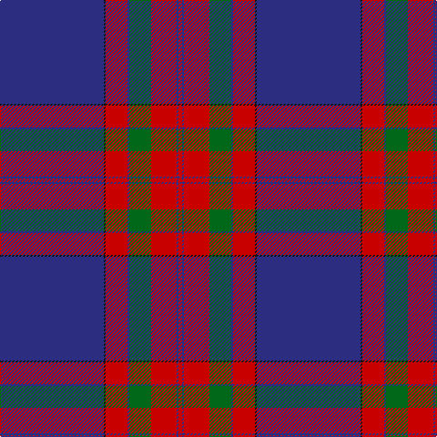

In pattern [BKRBGRBR](/stripes/bkrbgrbr/).

This was sourced from tartans-authority.  It is a [8 stripe tartan](/stripes/stripes8/).

Original link http://www.tartansauthority.com/tartan-ferret/display/7554/

## Attestations

This cloth appears in 2 source records; the oldest owns this page.

- 1981 — McBrayer Blue (Personal) (tartans-authority, [record](http://www.tartansauthority.com/tartan-ferret/display/7554/))
- undated — McBrayer Blue (Personal) (register-of-tartans, [record](https://www.tartanregister.gov.uk/tartanDetails.aspx?ref=5582))

## Register references

External register numbers recorded for this tartan.

- Scottish Register of Tartans: [5582](https://www.tartanregister.gov.uk/tartanDetails.aspx?ref=5582)
- Scottish Tartans Authority (ITI): 7554

## Thread count
DB/114 K2 R24 DB2 G24 R28 DB2 R/4

## Palette
Each colour and the base-6 reference it is a variant of.

| Colour | Shade | Base |
|---|---|---|
| DB | <code style="background-color:#2C2C80;">#2C2C80</code> `oklch(35.0% 0.138 276.6)` <small>#2C2C80</small> | B <code style="background-color:#2A418A;">#2A418A</code> |
| G | <code style="background-color:#006818;">#006818</code> `oklch(45.0% 0.142 145.0)` <small>#006818</small> | G <code style="background-color:#006100;">#006100</code> |
| K | <code style="background-color:#101010;">#101010</code> `oklch(17.3% 0.000 89.9)` <small>#101010</small> | K <code style="background-color:#000000;">#000000</code> |
| R | <code style="background-color:#C80000;">#C80000</code> `oklch(52.3% 0.215 29.2)` <small>#C80000</small> | R <code style="background-color:#CC0000;">#CC0000</code> |

# Sample pattern

## Nearest tartans

The nearest existing variants by ΔTartan distance.

1. [Falkirk Football Club (Corporate)](/setts/s9/db5r16db4k3db4k3db43r15w1~x2/) — ΔT 0.98
1. [Ahmlaigh (Corporate)](/setts/s7/dp50k8g4k1g4k1g14/) — ΔT 1.01
1. [Salvation Army, dress](/setts/s7/db80r21k2ly4k2r16db10~x2/) — ΔT 1.09
1. [Salvation Army Dress (Corporate)](/setts/s8/db74k2r15k2ly4k2r16db10~x2/) — ΔT 1.19
1. [Russian Scottish (District)](/setts/s9/w2db2w1db40r3ly1r10g10r1~x2/) — ΔT 1.26
1. [University of Edinburgh](/setts/s7/k8r26k22n110w4k5w4/) — ΔT 1.33
1. [Chinese Scottish (Corporate)](/setts/s10/db58w2db1w1db6g3r3g6r24ly3~x2/) — ΔT 1.34
1. [Skye District Tartan Tartan Number: 385. Earliest known date: 1984 See also 'Isle of Skye'. See products available Copyright © Blair Urquhart, Comrie, 2015](/setts/s11/db45k10o2k2ly2k2o10db5k1db5ly1~x2/) — ΔT 1.51
1. [Finnie (Personal)](/setts/s8/k4w1dp5w1k20db37w4db4~x2/) — ΔT 1.52
1. [Knights Templar - Grand Priory (Corp](/setts/s8/db1r2w1db30r30k1r2w1~x2/) — ΔT 1.58

## Neighbour map

Every grey dot is one of 14299 variants placed by the first two principal components of the ΔTartan feature space (44% of its variance). Red is this tartan; blue dots are its nearest — click one to open its page.

<svg viewBox="0 0 640 380" role="img" style="max-width:100%;height:auto;border:1px solid #e0e0e0;border-radius:4px;display:block" xmlns="http://www.w3.org/2000/svg"><image href="/nn/cloud.v1.png" width="640" height="380"/><a href="/setts/s9/db5r16db4k3db4k3db43r15w1~x2/"><circle cx="419.8" cy="121.1" r="4" fill="#3465a4"><title>Falkirk Football Club (Corporate)</title></circle></a><a href="/setts/s7/dp50k8g4k1g4k1g14/"><circle cx="470.8" cy="138.6" r="4" fill="#3465a4"><title>Ahmlaigh (Corporate)</title></circle></a><a href="/setts/s7/db80r21k2ly4k2r16db10~x2/"><circle cx="475.8" cy="132.3" r="4" fill="#3465a4"><title>Salvation Army, dress</title></circle></a><a href="/setts/s8/db74k2r15k2ly4k2r16db10~x2/"><circle cx="472.3" cy="122.3" r="4" fill="#3465a4"><title>Salvation Army Dress (Corporate)</title></circle></a><a href="/setts/s9/w2db2w1db40r3ly1r10g10r1~x2/"><circle cx="386.7" cy="89.1" r="4" fill="#3465a4"><title>Russian Scottish (District)</title></circle></a><a href="/setts/s7/k8r26k22n110w4k5w4/"><circle cx="432.6" cy="155.0" r="4" fill="#3465a4"><title>University of Edinburgh</title></circle></a><a href="/setts/s10/db58w2db1w1db6g3r3g6r24ly3~x2/"><circle cx="400.2" cy="69.0" r="4" fill="#3465a4"><title>Chinese Scottish (Corporate)</title></circle></a><a href="/setts/s11/db45k10o2k2ly2k2o10db5k1db5ly1~x2/"><circle cx="454.2" cy="107.3" r="4" fill="#3465a4"><title>Skye District Tartan Tartan Number: 385. Earliest known date: 1984 See also 'Isle of Skye'. See products available Copyright © Blair Urquhart, Comrie, 2015</title></circle></a><a href="/setts/s8/k4w1dp5w1k20db37w4db4~x2/"><circle cx="365.4" cy="135.6" r="4" fill="#3465a4"><title>Finnie (Personal)</title></circle></a><a href="/setts/s8/db1r2w1db30r30k1r2w1~x2/"><circle cx="383.2" cy="118.5" r="4" fill="#3465a4"><title>Knights Templar - Grand Priory (Corp</title></circle></a><circle cx="433.3" cy="115.1" r="5" fill="#c00000"/></svg>

ID: /setts/s8/db57k1r12db1g12r14db1r2~x2/
