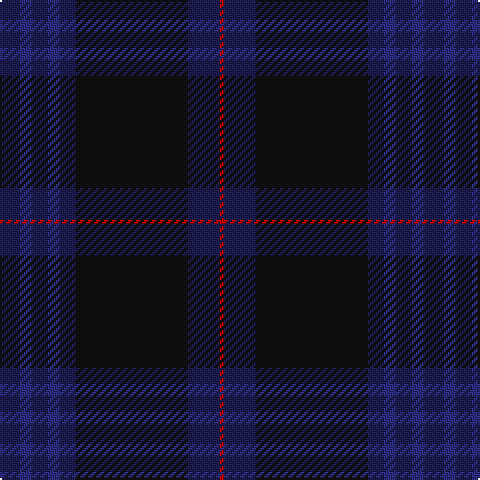

This page is one **sett** — a single exact thread-count. It belongs to the [tartan](/tartans/db5db3db4db3db4k28db8r1/)
(the same proportion at any scale), whose colour order is pattern [BBBBBKBR](/stripes/bbbbbkbr/).

Sourced from register-of-tartans.  It is a [8 stripe tartan](/stripes/stripes8/).

Original link https://www.tartanregister.gov.uk/tartanDetails.aspx?ref=908

## Register references

External register numbers recorded for this tartan.

- Scottish Register of Tartans: [908](https://www.tartanregister.gov.uk/tartanDetails.aspx?ref=908)
- Scottish Tartans Authority (ITI): 7229

## Thread count
DB/10 DBa6 DB8 DBa6 DB8 K56 DB16 R/2

## Palette

Palette: <strong>Tartan Register</strong>
<table><thead><tr><th>Colour</th><th>Threads</th><th>Shade</th><th>Base</th><th>OKLCh</th></tr></thead><tbody><tr><td>DB/</td><td style="text-align:right;font-variant-numeric:tabular-nums">10</td><td><code style="background-color:#1C1C50;">#1C1C50</code> <small style="color:#888">#1C1C50</small></td><td>B <code style="background-color:#2A418A;">#2A418A</code></td><td><small style="color:#888">oklch(26.2% 0.093 277.9)</small></td></tr><tr><td>DBa</td><td style="text-align:right;font-variant-numeric:tabular-nums">6</td><td><code style="background-color:#2C2C80;">#2C2C80</code> <small style="color:#888">#2C2C80</small></td><td>B <code style="background-color:#2A418A;">#2A418A</code></td><td><small style="color:#888">oklch(35.0% 0.138 276.6)</small></td></tr><tr><td>DB</td><td style="text-align:right;font-variant-numeric:tabular-nums">8</td><td><code style="background-color:#1C1C50;">#1C1C50</code> <small style="color:#888">#1C1C50</small></td><td>B <code style="background-color:#2A418A;">#2A418A</code></td><td><small style="color:#888">oklch(26.2% 0.093 277.9)</small></td></tr><tr><td>DBa</td><td style="text-align:right;font-variant-numeric:tabular-nums">6</td><td><code style="background-color:#2C2C80;">#2C2C80</code> <small style="color:#888">#2C2C80</small></td><td>B <code style="background-color:#2A418A;">#2A418A</code></td><td><small style="color:#888">oklch(35.0% 0.138 276.6)</small></td></tr><tr><td>DB</td><td style="text-align:right;font-variant-numeric:tabular-nums">8</td><td><code style="background-color:#1C1C50;">#1C1C50</code> <small style="color:#888">#1C1C50</small></td><td>B <code style="background-color:#2A418A;">#2A418A</code></td><td><small style="color:#888">oklch(26.2% 0.093 277.9)</small></td></tr><tr><td>K</td><td style="text-align:right;font-variant-numeric:tabular-nums">56</td><td><code style="background-color:#101010;">#101010</code> <small style="color:#888">#101010</small></td><td>K <code style="background-color:#000000;">#000000</code></td><td><small style="color:#888">oklch(17.3% 0.000 89.9)</small></td></tr><tr><td>DB</td><td style="text-align:right;font-variant-numeric:tabular-nums">16</td><td><code style="background-color:#1C1C50;">#1C1C50</code> <small style="color:#888">#1C1C50</small></td><td>B <code style="background-color:#2A418A;">#2A418A</code></td><td><small style="color:#888">oklch(26.2% 0.093 277.9)</small></td></tr><tr><td>R/</td><td style="text-align:right;font-variant-numeric:tabular-nums">2</td><td><code style="background-color:#C80000;">#C80000</code> <small style="color:#888">#C80000</small></td><td>R <code style="background-color:#CC0000;">#CC0000</code></td><td><small style="color:#888">oklch(52.3% 0.215 29.2)</small></td></tr></tbody></table>

# Sample pattern

## Nearest tartans

The nearest existing variants by ΔTartan distance, with this tartan at the top so the swatches line up against it.

ΔTartan

Tartan

Sett

—

<a href="/ttd/edit/#slug=db5db3db4db3db4k28db8r1~x2">Little Hunting</a> <a class="nn-out" href="/setts/s8/db5db3db4db3db4k28db8r1~x2/" title="open its dictionary page">↗</a>

1.31

<a href="/ttd/edit/#slug=k4y1dp5y1k20db37y4db4~x2">Finnie (Personal)</a> <a class="nn-out" href="/setts/s8/k4y1dp5y1k20db37y4db4~x2/" title="open its dictionary page">↗</a>

1.54

<a href="/ttd/edit/#slug=dt2k3dt33k11k3dt3dp15dt4o1dt2~x2">Scottish Thistle</a> <a class="nn-out" href="/setts/s10/dt2k3dt33k11k3dt3dp15dt4o1dt2~x2/" title="open its dictionary page">↗</a>

1.56

<a href="/ttd/edit/#slug=dt3k53dt4k4dt4k4dt24db10dt1r1">Comme Ça Il Principe</a> <a class="nn-out" href="/setts/s10/dt3k53dt4k4dt4k4dt24db10dt1r1/" title="open its dictionary page">↗</a>

1.60

<a href="/ttd/edit/#slug=dg23db3k8db4dg4db56dy8">Tern House</a> <a class="nn-out" href="/setts/s7/dg23db3k8db4dg4db56dy8/" title="open its dictionary page">↗</a>

1.66

<a href="/ttd/edit/#slug=g4db34dt20db4dt8db6r2db5dt2db3g4">Hughes Welsh Name Tartan Tartan Number: 5756. Earliest known date: 2002 The tartan for this Welsh surname and its variations, Hugh, Hullin, Hullyn, Huws, Pugh, Tugh, Hoell, is actually woven in Wales at the Cambrian Woollen Mill, weaving on the same site since 1830. This tartan differs from many traditional patterns in that the warp and weft differ, giving the finished worsted wool cloth more of a predominant stripe, vertically noticeable in the finished Kilt, or Cilt in Wales. See products available Copyright © Blair Urquhart, Comrie, 2015</a> <a class="nn-out" href="/setts/s11/g4db34dt20db4dt8db6r2db5dt2db3g4/" title="open its dictionary page">↗</a>

1.67

<a href="/ttd/edit/#slug=r3dt32db2dt3db4dt2db16w1db1~x2">Dauphinee, Andrew Hunter (Personal)</a> <a class="nn-out" href="/setts/s9/r3dt32db2dt3db4dt2db16w1db1~x2/" title="open its dictionary page">↗</a>

1.69

<a href="/ttd/edit/#slug=k4r1db3db28db36k3r2o1~x2">ODL (Corporate)</a> <a class="nn-out" href="/setts/s8/k4r1db3db28db36k3r2o1~x2/" title="open its dictionary page">↗</a>

1.70

<a href="/ttd/edit/#slug=k3t1k32db6k4db16k3r2~x2">Little of Morton Rigg Red (Personal)</a> <a class="nn-out" href="/setts/s8/k3t1k32db6k4db16k3r2~x2/" title="open its dictionary page">↗</a>

1.85

<a href="/ttd/edit/#slug=db64r3k3r3dp61dg5dp6~x2">Rutherford, John (Personal)</a> <a class="nn-out" href="/setts/s7/db64r3k3r3dp61dg5dp6~x2/" title="open its dictionary page">↗</a>

1.89

<a href="/ttd/edit/#slug=dt19k4dt4db1dt1db1dt1dg5dp3k1dp4~x6">Spirit of Scotland</a> <a class="nn-out" href="/setts/s11/dt19k4dt4db1dt1db1dt1dg5dp3k1dp4~x6/" title="open its dictionary page">↗</a>

## Neighbour map

Every grey dot is one of 14299 variants placed by the first two principal components of the ΔTartan feature space (44% of its variance). Red is this tartan; blue dots are its nearest — click one to open its page.

<svg viewBox="0 0 640 380" role="img" style="max-width:100%;height:auto;border:1px solid #e0e0e0;border-radius:4px;display:block" xmlns="http://www.w3.org/2000/svg"><image href="/nn/cloud.v1.png" width="640" height="380"/><a href="/setts/s8/k4y1dp5y1k20db37y4db4~x2/"><circle cx="466.4" cy="197.5" r="4" fill="#3465a4"><title>Finnie (Personal)</title></circle></a><a href="/setts/s10/dt2k3dt33k11k3dt3dp15dt4o1dt2~x2/"><circle cx="458.2" cy="186.2" r="4" fill="#3465a4"><title>Scottish Thistle</title></circle></a><a href="/setts/s10/dt3k53dt4k4dt4k4dt24db10dt1r1/"><circle cx="526.4" cy="181.6" r="4" fill="#3465a4"><title>Comme Ça Il Principe</title></circle></a><a href="/setts/s7/dg23db3k8db4dg4db56dy8/"><circle cx="527.1" cy="265.1" r="4" fill="#3465a4"><title>Tern House</title></circle></a><a href="/setts/s11/g4db34dt20db4dt8db6r2db5dt2db3g4/"><circle cx="477.4" cy="239.4" r="4" fill="#3465a4"><title>Hughes Welsh Name Tartan Tartan Number: 5756. Earliest known date: 2002 The tartan for this Welsh surname and its variations, Hugh, Hullin, Hullyn, Huws, Pugh, Tugh, Hoell, is actually woven in Wales at the Cambrian Woollen Mill, weaving on the same site since 1830. This tartan differs from many traditional patterns in that the warp and weft differ, giving the finished worsted wool cloth more of a predominant stripe, vertically noticeable in the finished Kilt, or Cilt in Wales. See products available Copyright © Blair Urquhart, Comrie, 2015</title></circle></a><a href="/setts/s9/r3dt32db2dt3db4dt2db16w1db1~x2/"><circle cx="529.3" cy="204.8" r="4" fill="#3465a4"><title>Dauphinee, Andrew Hunter (Personal)</title></circle></a><a href="/setts/s8/k4r1db3db28db36k3r2o1~x2/"><circle cx="452.8" cy="184.2" r="4" fill="#3465a4"><title>ODL (Corporate)</title></circle></a><a href="/setts/s8/k3t1k32db6k4db16k3r2~x2/"><circle cx="539.4" cy="215.6" r="4" fill="#3465a4"><title>Little of Morton Rigg Red (Personal)</title></circle></a><a href="/setts/s7/db64r3k3r3dp61dg5dp6~x2/"><circle cx="430.9" cy="204.3" r="4" fill="#3465a4"><title>Rutherford, John (Personal)</title></circle></a><a href="/setts/s11/dt19k4dt4db1dt1db1dt1dg5dp3k1dp4~x6/"><circle cx="418.7" cy="191.9" r="4" fill="#3465a4"><title>Spirit of Scotland</title></circle></a><circle cx="474.5" cy="230.1" r="5" fill="#c00000"/></svg>

ID: /setts/s8/db5db3db4db3db4k28db8r1~x2/
