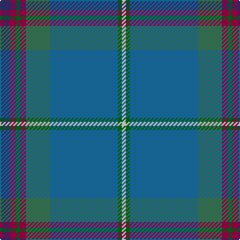

**Bands:** [BRGRGBGW](/stripes/brgrgbgw/) · **Stripes:** [DB M G M G B G W](/stripes/stripes8/) DB M G M G B G W

This was sourced from register-of-tartans.  It is a [8 band tartan](/bands/bands8/).

Original link https://www.tartanregister.gov.uk/tartanDetails.aspx?ref=3004

## Also known as

This cloth is also recorded under:

- Moran

## Attestations

This cloth appears in 3 source records; the oldest owns this page.

- 01/01/2003 — Moran (Wedding) (Personal) (register-of-tartans, [record](https://www.tartanregister.gov.uk/tartanDetails.aspx?ref=3004))
- 2003 — Moran (Wedding) (Personal) (tartans-authority, [record](http://www.tartansauthority.com/tartan-ferret/display/5986/))
- undated — Moran (Drummond) Personal Tartan Tartan Number: 5986. Earliest known date: 2003 A version of the Moran Blue (#3901) for use for the wedding of Julie Drummond and Ian Moran See products available Copyright © Blair Urquhart, Comrie, 2015 (house-of-tartan, [record](http://www.house-of-tartan.scotland.net/house/TartanViewjs.asp?colr=Def&tnam=5986))

## Register references

External register numbers recorded for this tartan.

- Scottish Register of Tartans: [3004](https://www.tartanregister.gov.uk/tartanDetails.aspx?ref=3004)
- Scottish Tartans Authority (ITI): 5986

## Thread count
DB/10 R6 Ga4 R6 G24 B68 Ga4 LN/4

## Palette
Each colour and its ΔE from the base-6 reference it is a variant of.

| Colour | Shade | Base | ΔE (OKLab) |
|---|---|---|---|
| B | <code style="background-color:#1870A4;">#1870A4</code> `#1870A4` | B <code style="background-color:#2A418A;">#2A418A</code> | 0.13 |
| DB | <code style="background-color:#303070;">#303070</code> `#303070` | B <code style="background-color:#2A418A;">#2A418A</code> | 0.06 |
| G | <code style="background-color:#387858;">#387858</code> `#387858` | G <code style="background-color:#006100;">#006100</code> | 0.12 |
| Ga | <code style="background-color:#006818;">#006818</code> `#006818` | G <code style="background-color:#006100;">#006100</code> | 0.02 |
| LN | <code style="background-color:#E0E0E0;">#E0E0E0</code> `#E0E0E0` | W <code style="background-color:#F7F7F7;">#F7F7F7</code> | 0.07 |
| R | <code style="background-color:#A00048;">#A00048</code> `#A00048` | R <code style="background-color:#CC0000;">#CC0000</code> | 0.12 |

# Sample pattern

## Nearest tartans

The nearest existing variants by ΔTartan distance.

1. [Sarasota - Dunfermline (Commemorat)](/setts/s10/r2g6ly2g3b4g14b36k2b3w2~x2/) — ΔT 1.13
1. [Kansai St Andrews Society (Corp)](/setts/s10/n33w2r3w2db14r3g15n20r2n3~x2/) — ΔT 1.26
1. [Roach (2015)](/setts/s13/t18w1t1w1t4r4dt1g12lo1g1lo1g1lo1~x4/) — ΔT 1.55
1. [Glasgow High (School)](/setts/s8/dy6ly3n42w4dg18ly2n12r3~x2/) — ΔT 1.56
1. [State Seal of Arkansas (Fashion)](/setts/s10/dt49lo3dy13dt12r4dt5k7y26dt4r2~x2/) — ΔT 1.62
1. [Laurentian University](/setts/s8/dy2db4ly3dg28db28w2db4n2~x2/) — ΔT 1.63
1. [Clyde (WCWM Fashion)](/setts/s9/lo2n28k2w2k2g26n3g5lo2~x2/) — ΔT 1.64
1. [Burt #1 (Name)](/setts/s9/r2lo13b8lo3b33lg3b8lg13m2~x2/) — ΔT 1.69
1. [Royal Deeside (District)](/setts/s6/r4y2db4y35t27r3~x2/) — ΔT 1.71
1. [Un-named (D C Dalgliesh) #2](/setts/s10/b5lg2b2lg9k3b9g3b3g25lr2~x2/) — ΔT 1.71

## Neighbour map

Every grey dot is one of 14299 variants placed by the first two principal components of the ΔTartan feature space (44% of its variance). Red is this tartan; blue dots are its nearest — click one to open its page.

<svg viewBox="0 0 640 380" role="img" style="max-width:100%;height:auto;border:1px solid #e0e0e0;border-radius:4px;display:block" xmlns="http://www.w3.org/2000/svg"><image href="/nn/cloud.v1.png" width="640" height="380"/><a href="/setts/s10/r2g6ly2g3b4g14b36k2b3w2~x2/"><circle cx="383.7" cy="146.3" r="4" fill="#3465a4"><title>Sarasota - Dunfermline (Commemorat)</title></circle></a><a href="/setts/s10/n33w2r3w2db14r3g15n20r2n3~x2/"><circle cx="332.1" cy="155.7" r="4" fill="#3465a4"><title>Kansai St Andrews Society (Corp)</title></circle></a><a href="/setts/s13/t18w1t1w1t4r4dt1g12lo1g1lo1g1lo1~x4/"><circle cx="322.7" cy="124.7" r="4" fill="#3465a4"><title>Roach (2015)</title></circle></a><a href="/setts/s8/dy6ly3n42w4dg18ly2n12r3~x2/"><circle cx="367.1" cy="150.6" r="4" fill="#3465a4"><title>Glasgow High (School)</title></circle></a><a href="/setts/s10/dt49lo3dy13dt12r4dt5k7y26dt4r2~x2/"><circle cx="359.0" cy="149.8" r="4" fill="#3465a4"><title>State Seal of Arkansas (Fashion)</title></circle></a><a href="/setts/s8/dy2db4ly3dg28db28w2db4n2~x2/"><circle cx="300.7" cy="160.9" r="4" fill="#3465a4"><title>Laurentian University</title></circle></a><a href="/setts/s9/lo2n28k2w2k2g26n3g5lo2~x2/"><circle cx="326.6" cy="179.3" r="4" fill="#3465a4"><title>Clyde (WCWM Fashion)</title></circle></a><a href="/setts/s9/r2lo13b8lo3b33lg3b8lg13m2~x2/"><circle cx="371.4" cy="183.7" r="4" fill="#3465a4"><title>Burt #1 (Name)</title></circle></a><a href="/setts/s6/r4y2db4y35t27r3~x2/"><circle cx="341.8" cy="186.8" r="4" fill="#3465a4"><title>Royal Deeside (District)</title></circle></a><a href="/setts/s10/b5lg2b2lg9k3b9g3b3g25lr2~x2/"><circle cx="286.6" cy="189.6" r="4" fill="#3465a4"><title>Un-named (D C Dalgliesh) #2</title></circle></a><circle cx="336.5" cy="155.6" r="5" fill="#c00000"/></svg>

ID: /setts/s8/db5m3g2m3g12b34g2w2~x2/
