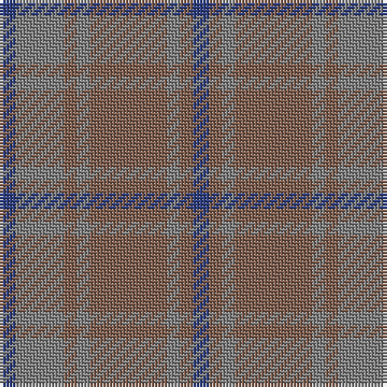

This page is one **sett** — a single exact thread-count. It belongs to the [tartan](/tartans/db5y15o4y4o24y4o4db5/)
(the same proportion at any scale), whose colour order is pattern [BGRGRGRB](/stripes/bgrgrgrb/).

Sourced from weddslist.  It is a [8 stripe tartan](/stripes/stripes8/).

Original link http://www.weddslist.com/cgi-bin/tartans/pg.pl?source=sts

## Thread count
B/5 N15 LT4 N4 LT24 N4 LT4 B/5

## Palette

Palette: <strong>Tartan Register</strong> <small style="color:#888">(1 of 3 colours)</small>
<table><thead><tr><th>Colour</th><th>Threads</th><th>Shade</th><th>Base</th><th>OKLCh</th></tr></thead><tbody><tr><td>B/</td><td style="text-align:right;font-variant-numeric:tabular-nums">5</td><td><code style="background-color:#304080;">#304080</code> <small style="color:#888">#304080</small></td><td>B <code style="background-color:#2A418A;">#2A418A</code></td><td><small style="color:#888">oklch(39.4% 0.109 270.2)</small></td></tr><tr><td>N</td><td style="text-align:right;font-variant-numeric:tabular-nums">15</td><td><code style="background-color:#808080;">#808080</code> <small style="color:#888">#808080</small></td><td>G <code style="background-color:#006100;">#006100</code></td><td><small style="color:#888">oklch(60.0% 0.000 89.9)</small></td></tr><tr><td>LT</td><td style="text-align:right;font-variant-numeric:tabular-nums">4</td><td><code style="background-color:#806050;">#806050</code> <small style="color:#888">#806050</small></td><td>R <code style="background-color:#CC0000;">#CC0000</code></td><td><small style="color:#888">oklch(51.7% 0.049 47.8)</small></td></tr><tr><td>N</td><td style="text-align:right;font-variant-numeric:tabular-nums">4</td><td><code style="background-color:#808080;">#808080</code> <small style="color:#888">#808080</small></td><td>G <code style="background-color:#006100;">#006100</code></td><td><small style="color:#888">oklch(60.0% 0.000 89.9)</small></td></tr><tr><td>LT</td><td style="text-align:right;font-variant-numeric:tabular-nums">24</td><td><code style="background-color:#806050;">#806050</code> <small style="color:#888">#806050</small></td><td>R <code style="background-color:#CC0000;">#CC0000</code></td><td><small style="color:#888">oklch(51.7% 0.049 47.8)</small></td></tr><tr><td>N</td><td style="text-align:right;font-variant-numeric:tabular-nums">4</td><td><code style="background-color:#808080;">#808080</code> <small style="color:#888">#808080</small></td><td>G <code style="background-color:#006100;">#006100</code></td><td><small style="color:#888">oklch(60.0% 0.000 89.9)</small></td></tr><tr><td>LT</td><td style="text-align:right;font-variant-numeric:tabular-nums">4</td><td><code style="background-color:#806050;">#806050</code> <small style="color:#888">#806050</small></td><td>R <code style="background-color:#CC0000;">#CC0000</code></td><td><small style="color:#888">oklch(51.7% 0.049 47.8)</small></td></tr><tr><td>B/</td><td style="text-align:right;font-variant-numeric:tabular-nums">5</td><td><code style="background-color:#304080;">#304080</code> <small style="color:#888">#304080</small></td><td>B <code style="background-color:#2A418A;">#2A418A</code></td><td><small style="color:#888">oklch(39.4% 0.109 270.2)</small></td></tr></tbody></table>

# Sample pattern

## Nearest tartans

The nearest existing variants by ΔTartan distance, with this tartan at the top so the swatches line up against it.

ΔTartan

Tartan

Sett

—

<a href="/ttd/edit/#slug=db5y15o4y4o24y4o4db5">Daks, (Muted Skye)</a> <a class="nn-out" href="/setts/s8/db5y15o4y4o24y4o4db5/" title="open its dictionary page">↗</a>

1.49

<a href="/ttd/edit/#slug=o24n3o3n3o3n20lr22n4~x2">Turnberry (MacArthur)</a> <a class="nn-out" href="/setts/s8/o24n3o3n3o3n20lr22n4~x2/" title="open its dictionary page">↗</a>

1.49

<a href="/setts/s6/n6o6n1o1~x4/">Glen Burns (WCWM-2)</a>

1.93

<a href="/ttd/edit/#slug=t22g3t3g3t3g9o28g3o6~x2">Manx Centenary</a> <a class="nn-out" href="/setts/s9/t22g3t3g3t3g9o28g3o6~x2/" title="open its dictionary page">↗</a>

1.98

<a href="/ttd/edit/#slug=o5n3o22r3n6n17r2n4r2n4~x2">Clyde</a> <a class="nn-out" href="/setts/s10/o5n3o22r3n6n17r2n4r2n4~x2/" title="open its dictionary page">↗</a>

2.01

<a href="/ttd/edit/#slug=g6t8o2t2ly2t16g18t4g4t3~x2">Blue Ridge</a> <a class="nn-out" href="/setts/s10/g6t8o2t2ly2t16g18t4g4t3~x2/" title="open its dictionary page">↗</a>

2.01

<a href="/ttd/edit/#slug=g6t8o2t2ly2t16g18t4g4t3~x4">Blue Ridge (District)</a> <a class="nn-out" href="/setts/s10/g6t8o2t2ly2t16g18t4g4t3~x4/" title="open its dictionary page">↗</a>

2.01

<a href="/ttd/edit/#slug=do1dy6do6dy1n6dy1~x8">Brown Heather (Fashion)</a> <a class="nn-out" href="/setts/s6/do1dy6do6dy1n6dy1~x8/" title="open its dictionary page">↗</a>

2.04

<a href="/ttd/edit/#slug=n11o1n4o8r1~x8">Cairns, David (Personal)</a> <a class="nn-out" href="/setts/s5/n11o1n4o8r1~x8/" title="open its dictionary page">↗</a>

2.05

<a href="/ttd/edit/#slug=dr9do4dr4do4dr24dy19do19dy4~x2">Chindecella Ruadh (Kemete Heil)</a> <a class="nn-out" href="/setts/s8/dr9do4dr4do4dr24dy19do19dy4~x2/" title="open its dictionary page">↗</a>

2.13

<a href="/ttd/edit/#slug=do1n2g6n1do3t1n12do1n1g1~x4">Wicklow, County (District)</a> <a class="nn-out" href="/setts/s10/do1n2g6n1do3t1n12do1n1g1~x4/" title="open its dictionary page">↗</a>

## Neighbour map

Every grey dot is one of 14299 variants placed by the first two principal components of the ΔTartan feature space (44% of its variance). Red is this tartan; blue dots are its nearest — click one to open its page.

<svg viewBox="0 0 640 380" role="img" style="max-width:100%;height:auto;border:1px solid #e0e0e0;border-radius:4px;display:block" xmlns="http://www.w3.org/2000/svg"><image href="/nn/cloud.v1.png" width="640" height="380"/><a href="/setts/s8/o24n3o3n3o3n20lr22n4~x2/"><circle cx="346.4" cy="282.7" r="4" fill="#3465a4"><title>Turnberry (MacArthur)</title></circle></a><a href="/setts/s6/n6o6n1o1~x4/"><circle cx="351.0" cy="326.5" r="4" fill="#3465a4"><title>Glen Burns (WCWM-2)</title></circle></a><a href="/setts/s9/t22g3t3g3t3g9o28g3o6~x2/"><circle cx="370.7" cy="267.2" r="4" fill="#3465a4"><title>Manx Centenary</title></circle></a><a href="/setts/s10/o5n3o22r3n6n17r2n4r2n4~x2/"><circle cx="338.2" cy="236.7" r="4" fill="#3465a4"><title>Clyde</title></circle></a><a href="/setts/s10/g6t8o2t2ly2t16g18t4g4t3~x2/"><circle cx="416.8" cy="273.3" r="4" fill="#3465a4"><title>Blue Ridge</title></circle></a><a href="/setts/s10/g6t8o2t2ly2t16g18t4g4t3~x4/"><circle cx="416.8" cy="273.3" r="4" fill="#3465a4"><title>Blue Ridge (District)</title></circle></a><a href="/setts/s6/do1dy6do6dy1n6dy1~x8/"><circle cx="365.3" cy="340.5" r="4" fill="#3465a4"><title>Brown Heather (Fashion)</title></circle></a><a href="/setts/s5/n11o1n4o8r1~x8/"><circle cx="504.7" cy="311.4" r="4" fill="#3465a4"><title>Cairns, David (Personal)</title></circle></a><a href="/setts/s8/dr9do4dr4do4dr24dy19do19dy4~x2/"><circle cx="388.6" cy="334.7" r="4" fill="#3465a4"><title>Chindecella Ruadh (Kemete Heil)</title></circle></a><a href="/setts/s10/do1n2g6n1do3t1n12do1n1g1~x4/"><circle cx="455.6" cy="245.1" r="4" fill="#3465a4"><title>Wicklow, County (District)</title></circle></a><circle cx="414.8" cy="309.3" r="5" fill="#c00000"/></svg>

ID: /setts/s8/db5y15o4y4o24y4o4db5/
