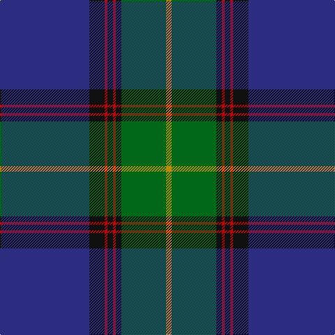

In pattern [BKRKRKGY](/stripes/bkrkrkgy/).

This was sourced from tartans-authority.  It is a [8 stripe tartan](/stripes/stripes8/).

Original link http://www.tartansauthority.com/tartan-ferret/display/2189/

## Thread count
DB/128 K22 R4 K8 R4 K8 G64 DY/8

## Palette
Each colour and the base-6 reference it is a variant of.

| Colour | Shade | Base |
|---|---|---|
| DB | <code style="background-color:#2C2C80;">#2C2C80</code> `oklch(35.0% 0.138 276.6)` <small>#2C2C80</small> | B <code style="background-color:#2A418A;">#2A418A</code> |
| DY | <code style="background-color:#BC8C00;">#BC8C00</code> `oklch(66.8% 0.137 84.1)` <small>#BC8C00</small> | Y <code style="background-color:#F2BF00;">#F2BF00</code> |
| G | <code style="background-color:#006818;">#006818</code> `oklch(45.0% 0.142 145.0)` <small>#006818</small> | G <code style="background-color:#006100;">#006100</code> |
| K | <code style="background-color:#101010;">#101010</code> `oklch(17.3% 0.000 89.9)` <small>#101010</small> | K <code style="background-color:#000000;">#000000</code> |
| R | <code style="background-color:#C80000;">#C80000</code> `oklch(52.3% 0.215 29.2)` <small>#C80000</small> | R <code style="background-color:#CC0000;">#CC0000</code> |

# Sample pattern

## Nearest tartans

The nearest existing variants by ΔTartan distance, with this tartan at the top so the swatches line up against it.

ΔTartan

Tartan

Sett

—

<a href="/ttd/edit/#slug=db64k11r2k4r2k4g32lo4~x2">Sinclair-Brown (Personal)</a> <a class="nn-out" href="/setts/s8/db64k11r2k4r2k4g32lo4~x2/" title="open its dictionary page">↗</a>

0.76

<a href="/ttd/edit/#slug=r2k3db42k3ly2k3g22k3r2~x2">Strachan (Name)</a> <a class="nn-out" href="/setts/s9/r2k3db42k3ly2k3g22k3r2~x2/" title="open its dictionary page">↗</a>

0.80

<a href="/ttd/edit/#slug=db36k10dg3r3dg6k1ly2~x2">MacLaurin of Brioch</a> <a class="nn-out" href="/setts/s7/db36k10dg3r3dg6k1ly2~x2/" title="open its dictionary page">↗</a>

0.86

<a href="/ttd/edit/#slug=k8ly1k1db28k12dg2k1t2~x2">Hope-Weir/Weir</a> <a class="nn-out" href="/setts/s8/k8ly1k1db28k12dg2k1t2~x2/" title="open its dictionary page">↗</a>

0.89

<a href="/ttd/edit/#slug=dp4db5dp3db50k15g3k5g32w2g3">Spirit of Morningside (Fashion)</a> <a class="nn-out" href="/setts/s10/dp4db5dp3db50k15g3k5g32w2g3/" title="open its dictionary page">↗</a>

1.06

<a href="/ttd/edit/#slug=w3dt1k14dt2k1g6k1dt30lo3~x2">Bro-Kerne</a> <a class="nn-out" href="/setts/s9/w3dt1k14dt2k1g6k1dt30lo3~x2/" title="open its dictionary page">↗</a>

1.07

<a href="/ttd/edit/#slug=r3g10k12db3k2db2k2db30r4w1~x2">McClafferty</a> <a class="nn-out" href="/setts/s10/r3g10k12db3k2db2k2db30r4w1~x2/" title="open its dictionary page">↗</a>

1.08

<a href="/ttd/edit/#slug=k7lo3db62o16g5o5g5o5g16db16k4">Polkemmet (Corporate)</a> <a class="nn-out" href="/setts/s11/k7lo3db62o16g5o5g5o5g16db16k4/" title="open its dictionary page">↗</a>

1.11

<a href="/ttd/edit/#slug=db33k1db5k8g8r2g15ly1w2~x2">Mulcahy (Name)</a> <a class="nn-out" href="/setts/s9/db33k1db5k8g8r2g15ly1w2~x2/" title="open its dictionary page">↗</a>

1.12

<a href="/ttd/edit/#slug=g10db9dp4r2dp4g6k10w4g24db60k4">Huaum, Patrick Antoine (Personal))</a> <a class="nn-out" href="/setts/s11/g10db9dp4r2dp4g6k10w4g24db60k4/" title="open its dictionary page">↗</a>

1.13

<a href="/ttd/edit/#slug=db60k15g10r2g10r2g10r2g10k1ly4~x2">Muir/Moore</a> <a class="nn-out" href="/setts/s11/db60k15g10r2g10r2g10r2g10k1ly4~x2/" title="open its dictionary page">↗</a>

## Neighbour map

Every grey dot is one of 14299 variants placed by the first two principal components of the ΔTartan feature space (44% of its variance). Red is this tartan; blue dots are its nearest — click one to open its page.

<svg viewBox="0 0 640 380" role="img" style="max-width:100%;height:auto;border:1px solid #e0e0e0;border-radius:4px;display:block" xmlns="http://www.w3.org/2000/svg"><image href="/nn/cloud.v1.png" width="640" height="380"/><a href="/setts/s9/r2k3db42k3ly2k3g22k3r2~x2/"><circle cx="322.3" cy="132.5" r="4" fill="#3465a4"><title>Strachan (Name)</title></circle></a><a href="/setts/s7/db36k10dg3r3dg6k1ly2~x2/"><circle cx="393.9" cy="136.1" r="4" fill="#3465a4"><title>MacLaurin of Brioch</title></circle></a><a href="/setts/s8/k8ly1k1db28k12dg2k1t2~x2/"><circle cx="370.7" cy="149.7" r="4" fill="#3465a4"><title>Hope-Weir/Weir</title></circle></a><a href="/setts/s10/dp4db5dp3db50k15g3k5g32w2g3/"><circle cx="293.4" cy="135.4" r="4" fill="#3465a4"><title>Spirit of Morningside (Fashion)</title></circle></a><a href="/setts/s9/w3dt1k14dt2k1g6k1dt30lo3~x2/"><circle cx="332.9" cy="116.5" r="4" fill="#3465a4"><title>Bro-Kerne</title></circle></a><a href="/setts/s10/r3g10k12db3k2db2k2db30r4w1~x2/"><circle cx="341.0" cy="140.1" r="4" fill="#3465a4"><title>McClafferty</title></circle></a><a href="/setts/s11/k7lo3db62o16g5o5g5o5g16db16k4/"><circle cx="323.1" cy="135.9" r="4" fill="#3465a4"><title>Polkemmet (Corporate)</title></circle></a><a href="/setts/s9/db33k1db5k8g8r2g15ly1w2~x2/"><circle cx="301.2" cy="113.4" r="4" fill="#3465a4"><title>Mulcahy (Name)</title></circle></a><a href="/setts/s11/g10db9dp4r2dp4g6k10w4g24db60k4/"><circle cx="304.1" cy="105.1" r="4" fill="#3465a4"><title>Huaum, Patrick Antoine (Personal))</title></circle></a><a href="/setts/s11/db60k15g10r2g10r2g10r2g10k1ly4~x2/"><circle cx="327.4" cy="93.6" r="4" fill="#3465a4"><title>Muir/Moore</title></circle></a><circle cx="347.9" cy="132.3" r="5" fill="#c00000"/></svg>

ID: /setts/s8/db64k11r2k4r2k4g32lo4~x2/
