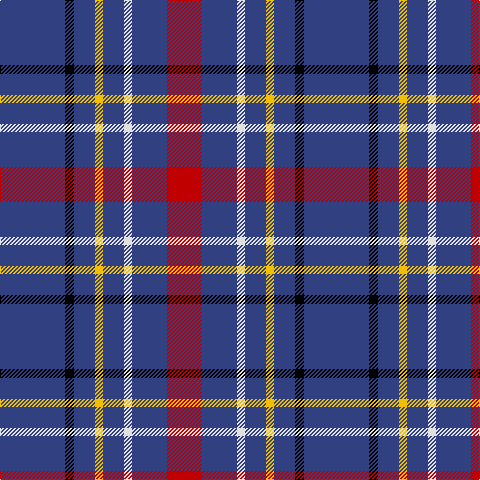

This page is one **sett** — a single exact thread-count. It belongs to the [tartan](/tartans/db65k9db21ly8db21w8db35r35/)
(the same proportion at any scale), whose colour order is pattern [BKBYBWBR](/stripes/bkbybwbr/).

Sourced from weddslist.  It is a [8 stripe tartan](/stripes/stripes8/).

Original link http://www.weddslist.com/cgi-bin/tartans/pg.pl?source=sts

## Also known as

This cloth is also recorded under:

- Maud, Mary

2 attestations — the source records this cloth was collapsed from (oldest owns this page)

<ul>
<li>undated — Maud, Mary (weddslist, <a href="http://www.weddslist.com/cgi-bin/tartans/pg.pl?source=sts">record</a>)</li>
<li>undated — Maud Mary Irish Family Tartan Tartan Number: 268. Earliest known date: pre 1892 Dublin See products available Copyright © Blair Urquhart, Comrie, 2015 (house-of-tartan, <a href="http://www.house-of-tartan.scotland.net/house/TartanViewjs.asp?colr=Def&tnam=268">record</a>)</li>
</ul>

## Thread count
B/65 K9 B21 Y8 B21 LN8 B35 R/35

## Palette

Palette: <strong>Tartan Register</strong> <small style="color:#888">(2 of 5 colours)</small>
<table><thead><tr><th>Colour</th><th>Threads</th><th>Shade</th><th>Base</th><th>OKLCh</th></tr></thead><tbody><tr><td>B/</td><td style="text-align:right;font-variant-numeric:tabular-nums">65</td><td><code style="background-color:#304080;">#304080</code> <small style="color:#888">#304080</small></td><td>B <code style="background-color:#2A418A;">#2A418A</code></td><td><small style="color:#888">oklch(39.4% 0.109 270.2)</small></td></tr><tr><td>K</td><td style="text-align:right;font-variant-numeric:tabular-nums">9</td><td><code style="background-color:#000000;">#000000</code> <small style="color:#888">#000000</small></td><td>K <code style="background-color:#000000;">#000000</code></td><td><small style="color:#888">oklch(0.0% 0.000 0.0)</small></td></tr><tr><td>B</td><td style="text-align:right;font-variant-numeric:tabular-nums">21</td><td><code style="background-color:#304080;">#304080</code> <small style="color:#888">#304080</small></td><td>B <code style="background-color:#2A418A;">#2A418A</code></td><td><small style="color:#888">oklch(39.4% 0.109 270.2)</small></td></tr><tr><td>Y</td><td style="text-align:right;font-variant-numeric:tabular-nums">8</td><td><code style="background-color:#F0C000;">#F0C000</code> <small style="color:#888">#F0C000</small></td><td>Y <code style="background-color:#F2BF00;">#F2BF00</code></td><td><small style="color:#888">oklch(82.7% 0.169 90.5)</small></td></tr><tr><td>B</td><td style="text-align:right;font-variant-numeric:tabular-nums">21</td><td><code style="background-color:#304080;">#304080</code> <small style="color:#888">#304080</small></td><td>B <code style="background-color:#2A418A;">#2A418A</code></td><td><small style="color:#888">oklch(39.4% 0.109 270.2)</small></td></tr><tr><td>LN</td><td style="text-align:right;font-variant-numeric:tabular-nums">8</td><td><code style="background-color:#E0E0E0;">#E0E0E0</code> <small style="color:#888">#E0E0E0</small></td><td>W <code style="background-color:#F7F7F7;">#F7F7F7</code></td><td><small style="color:#888">oklch(90.7% 0.000 89.9)</small></td></tr><tr><td>B</td><td style="text-align:right;font-variant-numeric:tabular-nums">35</td><td><code style="background-color:#304080;">#304080</code> <small style="color:#888">#304080</small></td><td>B <code style="background-color:#2A418A;">#2A418A</code></td><td><small style="color:#888">oklch(39.4% 0.109 270.2)</small></td></tr><tr><td>R/</td><td style="text-align:right;font-variant-numeric:tabular-nums">35</td><td><code style="background-color:#C00000;">#C00000</code> <small style="color:#888">#C00000</small></td><td>R <code style="background-color:#CC0000;">#CC0000</code></td><td><small style="color:#888">oklch(50.7% 0.208 29.2)</small></td></tr></tbody></table>

# Sample pattern

## Nearest tartans

The nearest existing variants by ΔTartan distance, with this tartan at the top so the swatches line up against it.

ΔTartan

Tartan

Sett

—

<a href="/ttd/edit/#slug=db65k9db21ly8db21w8db35r35">Maud, Mary</a> <a class="nn-out" href="/setts/s8/db65k9db21ly8db21w8db35r35/" title="open its dictionary page">↗</a>

1.16

<a href="/ttd/edit/#slug=w1db8r3db2r1db2r3db8lo1~x4">Louisville Fire &amp; Rescue P&amp;D</a> <a class="nn-out" href="/setts/s9/w1db8r3db2r1db2r3db8lo1~x4/" title="open its dictionary page">↗</a>

1.32

<a href="/ttd/edit/#slug=db24w4db24lo4r5k4~x2">de Grussa (Personal)</a> <a class="nn-out" href="/setts/s6/db24w4db24lo4r5k4~x2/" title="open its dictionary page">↗</a>

1.40

<a href="/ttd/edit/#slug=db40w7db60k10r25ly4">Stradling (Name)</a> <a class="nn-out" href="/setts/s6/db40w7db60k10r25ly4/" title="open its dictionary page">↗</a>

1.53

<a href="/ttd/edit/#slug=w1db6dy5k1db6ly1~x4">Ancient Atlantic</a> <a class="nn-out" href="/setts/s6/w1db6dy5k1db6ly1~x4/" title="open its dictionary page">↗</a>

1.53

<a href="/ttd/edit/#slug=r5db15g3db15ly3db3~x2">Abertay University (Estimated threadcount)</a> <a class="nn-out" href="/setts/s6/r5db15g3db15ly3db3~x2/" title="open its dictionary page">↗</a>

1.55

<a href="/ttd/edit/#slug=db24w4db24ly4r5k4~x2">De Grussa</a> <a class="nn-out" href="/setts/s6/db24w4db24ly4r5k4~x2/" title="open its dictionary page">↗</a>

1.55

<a href="/ttd/edit/#slug=r3db21r3db3k13db13t3db3w2~x2">Fitzgerald, Blue</a> <a class="nn-out" href="/setts/s9/r3db21r3db3k13db13t3db3w2~x2/" title="open its dictionary page">↗</a>

1.56

<a href="/ttd/edit/#slug=r1db12k5o3db5w1~x4">Massachusetts</a> <a class="nn-out" href="/setts/s6/r1db12k5o3db5w1~x4/" title="open its dictionary page">↗</a>

1.57

<a href="/ttd/edit/#slug=dt30t5dt5lp5dt10w4r4dt10g5dt10~x2">Bukowski-Jackson (Personal)</a> <a class="nn-out" href="/setts/s10/dt30t5dt5lp5dt10w4r4dt10g5dt10~x2/" title="open its dictionary page">↗</a>

1.58

<a href="/ttd/edit/#slug=db20b2w5r2db10b5db20b2w5r5~x2">Mortell (Personal)</a> <a class="nn-out" href="/setts/s10/db20b2w5r2db10b5db20b2w5r5~x2/" title="open its dictionary page">↗</a>

## Neighbour map

Every grey dot is one of 14359 variants placed by the first two principal components of the ΔTartan feature space (44% of its variance). Red is this tartan; blue dots are its nearest — click one to open its page.

<svg viewBox="0 0 640 380" role="img" style="max-width:100%;height:auto;border:1px solid #e0e0e0;border-radius:4px;display:block" xmlns="http://www.w3.org/2000/svg"><image href="/nn/cloud.v1.png" width="640" height="380"/><a href="/setts/s9/w1db8r3db2r1db2r3db8lo1~x4/"><circle cx="381.4" cy="208.3" r="4" fill="#3465a4"><title>Louisville Fire &amp; Rescue P&amp;D</title></circle></a><a href="/setts/s6/db24w4db24lo4r5k4~x2/"><circle cx="376.6" cy="221.6" r="4" fill="#3465a4"><title>de Grussa (Personal)</title></circle></a><a href="/setts/s6/db40w7db60k10r25ly4/"><circle cx="385.1" cy="194.5" r="4" fill="#3465a4"><title>Stradling (Name)</title></circle></a><a href="/setts/s6/w1db6dy5k1db6ly1~x4/"><circle cx="271.4" cy="230.5" r="4" fill="#3465a4"><title>Ancient Atlantic</title></circle></a><a href="/setts/s6/r5db15g3db15ly3db3~x2/"><circle cx="400.8" cy="256.3" r="4" fill="#3465a4"><title>Abertay University (Estimated threadcount)</title></circle></a><a href="/setts/s6/db24w4db24ly4r5k4~x2/"><circle cx="359.3" cy="214.5" r="4" fill="#3465a4"><title>De Grussa</title></circle></a><a href="/setts/s9/r3db21r3db3k13db13t3db3w2~x2/"><circle cx="305.8" cy="175.2" r="4" fill="#3465a4"><title>Fitzgerald, Blue</title></circle></a><a href="/setts/s6/r1db12k5o3db5w1~x4/"><circle cx="316.5" cy="194.5" r="4" fill="#3465a4"><title>Massachusetts</title></circle></a><a href="/setts/s10/dt30t5dt5lp5dt10w4r4dt10g5dt10~x2/"><circle cx="350.8" cy="177.9" r="4" fill="#3465a4"><title>Bukowski-Jackson (Personal)</title></circle></a><a href="/setts/s10/db20b2w5r2db10b5db20b2w5r5~x2/"><circle cx="337.0" cy="187.5" r="4" fill="#3465a4"><title>Mortell (Personal)</title></circle></a><circle cx="349.3" cy="204.7" r="5" fill="#c00000"/></svg>

ID: /setts/s8/db65k9db21ly8db21w8db35r35/
