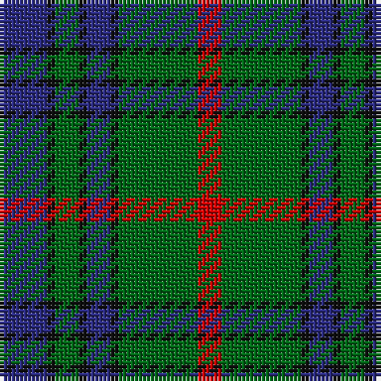

In pattern [BKGKBKGR](/stripes/bkgkbkgr/).

This was sourced from tartans-authority.  It is a [8 stripe tartan](/stripes/stripes8/).

Original link http://www.tartansauthority.com/tartan-ferret/display/328/

## Also known as

This cloth is also recorded under:

- Aiton
- Aiton/Ayton

## Attestations

This cloth appears in 3 source records; the oldest owns this page.

- 1979 — AIton - 1979 (Clan) (tartans-authority, [record](http://www.tartansauthority.com/tartan-ferret/display/328/))
- 01/01/1997 — Aiton/Ayton (register-of-tartans, [record](https://www.tartanregister.gov.uk/tartanDetails.aspx?ref=31))
- undated — Aiton (weddslist, [record](http://www.weddslist.com/cgi-bin/tartans/pg.pl?source=sts))

## Register references

External register numbers recorded for this tartan.

- Scottish Register of Tartans: [31](https://www.tartanregister.gov.uk/tartanDetails.aspx?ref=31)
- Scottish Tartans Authority (ITI): 328
- Scottish Tartans World Register: 328

## Thread count
DB/12 K2 G6 K2 DB6 K2 G20 R/6

## Palette
Each colour and the base-6 reference it is a variant of.

| Colour | Shade | Base |
|---|---|---|
| DB | <code style="background-color:#2C2C80;">#2C2C80</code> `oklch(35.0% 0.138 276.6)` <small>#2C2C80</small> | B <code style="background-color:#2A418A;">#2A418A</code> |
| G | <code style="background-color:#006818;">#006818</code> `oklch(45.0% 0.142 145.0)` <small>#006818</small> | G <code style="background-color:#006100;">#006100</code> |
| K | <code style="background-color:#101010;">#101010</code> `oklch(17.3% 0.000 89.9)` <small>#101010</small> | K <code style="background-color:#000000;">#000000</code> |
| R | <code style="background-color:#C80000;">#C80000</code> `oklch(52.3% 0.215 29.2)` <small>#C80000</small> | R <code style="background-color:#CC0000;">#CC0000</code> |

# Sample pattern

## Nearest tartans

The nearest existing variants by ΔTartan distance, with this tartan at the top so the swatches line up against it.

ΔTartan

Tartan

Sett

—

<a href="/ttd/edit/#slug=db6k1g3k1db3k1g10r3~x2">AIton - 1979 (Clan)</a> <a class="nn-out" href="/setts/s8/db6k1g3k1db3k1g10r3~x2/" title="open its dictionary page">↗</a>

0.74

<a href="/ttd/edit/#slug=b5k1g3k1b3k1g10r3~x2">Ayrton 1979 No. 2 (Personal)</a> <a class="nn-out" href="/setts/s8/b5k1g3k1b3k1g10r3~x2/" title="open its dictionary page">↗</a>

0.82

<a href="/ttd/edit/#slug=g14w1g7k7db2k2db2k2db7~x4">Abercrombie</a> <a class="nn-out" href="/setts/s9/g14w1g7k7db2k2db2k2db7~x4/" title="open its dictionary page">↗</a>

0.87

<a href="/ttd/edit/#slug=db13dg8r5db3dg2r1ly1~x4">Fibonacci7</a> <a class="nn-out" href="/setts/s7/db13dg8r5db3dg2r1ly1~x4/" title="open its dictionary page">↗</a>

0.93

<a href="/ttd/edit/#slug=r5dt12g3db4g20dt3g3r5~x4">Daks (0600150)</a> <a class="nn-out" href="/setts/s8/r5dt12g3db4g20dt3g3r5~x4/" title="open its dictionary page">↗</a>

0.95

<a href="/ttd/edit/#slug=g8r3g3r5g26db7t3db28r3db6~x2">Stewart of Appin Htg (error)</a> <a class="nn-out" href="/setts/s10/g8r3g3r5g26db7t3db28r3db6~x2/" title="open its dictionary page">↗</a>

0.97

<a href="/ttd/edit/#slug=g28r12g4db20lo2db3lo2db3g7~x2">Cork Irish County Tartan Tartan Number: 2253. Earliest known date: 1996 One of a series of Irish District tartans designed by Polly Wittering of the House of Edgar, with colours reminiscent of the Country with soft warm colours dominating. See products available Copyright © Blair Urquhart, Comrie, 2015</a> <a class="nn-out" href="/setts/s9/g28r12g4db20lo2db3lo2db3g7~x2/" title="open its dictionary page">↗</a>

0.98

<a href="/ttd/edit/#slug=db12w2db7g15k2g4k2g15db2k7~x2">Smeaton #2 (Name)</a> <a class="nn-out" href="/setts/s10/db12w2db7g15k2g4k2g15db2k7~x2/" title="open its dictionary page">↗</a>

0.99

<a href="/ttd/edit/#slug=t4dy28g6t12k12t3~x2">MacTavish Hunting</a> <a class="nn-out" href="/setts/s6/t4dy28g6t12k12t3~x2/" title="open its dictionary page">↗</a>

0.99

<a href="/ttd/edit/#slug=t4dy28dg6t12k12t3~x2">Thompson/Thomson/MacTavish Hunting</a> <a class="nn-out" href="/setts/s6/t4dy28dg6t12k12t3~x2/" title="open its dictionary page">↗</a>

0.99

<a href="/ttd/edit/#slug=t3dy26g4t13k13t2~x2">MacTavish Hunting Clan Tartan Tartan Number: 232. Earliest known date: pre 2003 See Lord Thomson See products available Copyright © Blair Urquhart, Comrie, 2015</a> <a class="nn-out" href="/setts/s6/t3dy26g4t13k13t2~x2/" title="open its dictionary page">↗</a>

## Neighbour map

Every grey dot is one of 14299 variants placed by the first two principal components of the ΔTartan feature space (44% of its variance). Red is this tartan; blue dots are its nearest — click one to open its page.

<svg viewBox="0 0 640 380" role="img" style="max-width:100%;height:auto;border:1px solid #e0e0e0;border-radius:4px;display:block" xmlns="http://www.w3.org/2000/svg"><image href="/nn/cloud.v1.png" width="640" height="380"/><a href="/setts/s8/b5k1g3k1b3k1g10r3~x2/"><circle cx="258.6" cy="214.9" r="4" fill="#3465a4"><title>Ayrton 1979 No. 2 (Personal)</title></circle></a><a href="/setts/s9/g14w1g7k7db2k2db2k2db7~x4/"><circle cx="266.8" cy="203.1" r="4" fill="#3465a4"><title>Abercrombie</title></circle></a><a href="/setts/s7/db13dg8r5db3dg2r1ly1~x4/"><circle cx="283.8" cy="207.2" r="4" fill="#3465a4"><title>Fibonacci7</title></circle></a><a href="/setts/s8/r5dt12g3db4g20dt3g3r5~x4/"><circle cx="248.5" cy="231.4" r="4" fill="#3465a4"><title>Daks (0600150)</title></circle></a><a href="/setts/s10/g8r3g3r5g26db7t3db28r3db6~x2/"><circle cx="271.5" cy="198.4" r="4" fill="#3465a4"><title>Stewart of Appin Htg (error)</title></circle></a><a href="/setts/s9/g28r12g4db20lo2db3lo2db3g7~x2/"><circle cx="303.8" cy="192.7" r="4" fill="#3465a4"><title>Cork Irish County Tartan Tartan Number: 2253. Earliest known date: 1996 One of a series of Irish District tartans designed by Polly Wittering of the House of Edgar, with colours reminiscent of the Country with soft warm colours dominating. See products available Copyright © Blair Urquhart, Comrie, 2015</title></circle></a><a href="/setts/s10/db12w2db7g15k2g4k2g15db2k7~x2/"><circle cx="248.9" cy="226.2" r="4" fill="#3465a4"><title>Smeaton #2 (Name)</title></circle></a><a href="/setts/s6/t4dy28g6t12k12t3~x2/"><circle cx="237.9" cy="230.6" r="4" fill="#3465a4"><title>MacTavish Hunting</title></circle></a><a href="/setts/s6/t4dy28dg6t12k12t3~x2/"><circle cx="249.9" cy="241.5" r="4" fill="#3465a4"><title>Thompson/Thomson/MacTavish Hunting</title></circle></a><a href="/setts/s6/t3dy26g4t13k13t2~x2/"><circle cx="251.9" cy="214.7" r="4" fill="#3465a4"><title>MacTavish Hunting Clan Tartan Tartan Number: 232. Earliest known date: pre 2003 See Lord Thomson See products available Copyright © Blair Urquhart, Comrie, 2015</title></circle></a><circle cx="256.1" cy="215.9" r="5" fill="#c00000"/></svg>

ID: /setts/s8/db6k1g3k1db3k1g10r3~x2/
