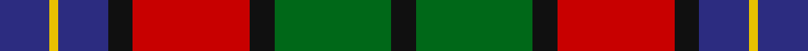
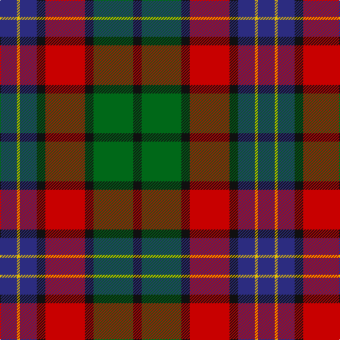

**Bands:** [KGKRKBYB](/stripes/kgkrkbyb/) · **Stripes:** [K G K R K DB LY DB](/stripes/stripes8/) K G K R K DB LY DB

This was sourced from register-of-tartans.  It is a [8 band tartan](/bands/bands8/).

Original link https://www.tartanregister.gov.uk/tartanDetails.aspx?ref=1969

## Register references

External register numbers recorded for this tartan.

- Scottish Register of Tartans: [1969](https://www.tartanregister.gov.uk/tartanDetails.aspx?ref=1969)
- Scottish Tartans Authority (ITI): 1979
- Scottish Tartans World Register: 1979

## Thread count
DB/24 Y4 DB24 K12 R56 K12 G56 K/12

## Palette
Each colour and its ΔE from the base-6 reference it is a variant of.

| Colour | Shade | Base | ΔE (OKLab) |
|---|---|---|---|
| DB | <code style="background-color:#2C2C80;">#2C2C80</code> `#2C2C80` | B <code style="background-color:#2A418A;">#2A418A</code> | 0.06 |
| G | <code style="background-color:#006818;">#006818</code> `#006818` | G <code style="background-color:#006100;">#006100</code> | 0.02 |
| K | <code style="background-color:#101010;">#101010</code> `#101010` | K <code style="background-color:#000000;">#000000</code> | 0.17 |
| R | <code style="background-color:#C80000;">#C80000</code> `#C80000` | R <code style="background-color:#CC0000;">#CC0000</code> | 0.01 |
| Y | <code style="background-color:#E8C000;">#E8C000</code> `#E8C000` | Y <code style="background-color:#F2BF00;">#F2BF00</code> | 0.02 |

# Sample pattern

## Nearest tartans

The nearest existing variants by ΔTartan distance.

1. [Kilgour (Asymmetrical)](/setts/s8/db6k3r14k3g14k3db6ly1~x4/) — ΔT 0.00
1. [Kilgour (Symmetrical)](/setts/s8/db6k3g14k3r14k3db6ly1~x4/) — ΔT 0.00
1. [St. Clement of Rome (Corporate)](/setts/s8/db18k5r26k5g25k5db18ly2~x2/) — ΔT 0.66
1. [MacLagan of Glenquiech](/setts/s11/r6db6r3db3r3db28k21g28r21k2ly4/) — ΔT 0.86
1. [Manson (Name)](/setts/s9/dg1r11dg3k4dg4r1k2db11w1~x2/) — ΔT 0.87
1. [Etienne-Carter, Sir George](/setts/s10/r4g6ly3g12k14db5r20db5k4db2~x2/) — ΔT 0.88
1. [Patterson, John (Personal)](/setts/s6/dg3db12w1dg12r12dg2~x2/) — ΔT 0.88
1. [MacBrine (Name)](/setts/s11/k4r6g8r16k6db10k2db10k2g8ly1~x2/) — ΔT 0.92
1. [Patterson, John (Personal)](/setts/s6/g3db12w1dg12r12dg2~x2/) — ΔT 0.93
1. [Unidentified #9](/setts/s10/r4dg7ly3dg12k16t5r20t5k4t2~x2/) — ΔT 0.96

## Neighbour map

Every grey dot is one of 14299 variants placed by the first two principal components of the ΔTartan feature space (44% of its variance). Red is this tartan; blue dots are its nearest — click one to open its page.

<svg viewBox="0 0 640 380" role="img" style="max-width:100%;height:auto;border:1px solid #e0e0e0;border-radius:4px;display:block" xmlns="http://www.w3.org/2000/svg"><image href="/nn/cloud.v1.png" width="640" height="380"/><a href="/setts/s8/db6k3r14k3g14k3db6ly1~x4/"><circle cx="137.0" cy="174.1" r="4" fill="#3465a4"><title>Kilgour (Asymmetrical)</title></circle></a><a href="/setts/s8/db6k3g14k3r14k3db6ly1~x4/"><circle cx="137.0" cy="174.1" r="4" fill="#3465a4"><title>Kilgour (Symmetrical)</title></circle></a><a href="/setts/s8/db18k5r26k5g25k5db18ly2~x2/"><circle cx="158.9" cy="185.2" r="4" fill="#3465a4"><title>St. Clement of Rome (Corporate)</title></circle></a><a href="/setts/s11/r6db6r3db3r3db28k21g28r21k2ly4/"><circle cx="143.5" cy="147.8" r="4" fill="#3465a4"><title>MacLagan of Glenquiech</title></circle></a><a href="/setts/s9/dg1r11dg3k4dg4r1k2db11w1~x2/"><circle cx="154.0" cy="164.7" r="4" fill="#3465a4"><title>Manson (Name)</title></circle></a><a href="/setts/s10/r4g6ly3g12k14db5r20db5k4db2~x2/"><circle cx="124.8" cy="172.3" r="4" fill="#3465a4"><title>Etienne-Carter, Sir George</title></circle></a><a href="/setts/s6/dg3db12w1dg12r12dg2~x2/"><circle cx="163.3" cy="195.6" r="4" fill="#3465a4"><title>Patterson, John (Personal)</title></circle></a><a href="/setts/s11/k4r6g8r16k6db10k2db10k2g8ly1~x2/"><circle cx="123.9" cy="162.4" r="4" fill="#3465a4"><title>MacBrine (Name)</title></circle></a><a href="/setts/s6/g3db12w1dg12r12dg2~x2/"><circle cx="169.2" cy="199.7" r="4" fill="#3465a4"><title>Patterson, John (Personal)</title></circle></a><a href="/setts/s10/r4dg7ly3dg12k16t5r20t5k4t2~x2/"><circle cx="114.5" cy="168.0" r="4" fill="#3465a4"><title>Unidentified #9</title></circle></a><circle cx="137.0" cy="174.1" r="5" fill="#c00000"/></svg>

ID: /setts/s8/db6ly1db6k3r14k3g14k3~x4/
