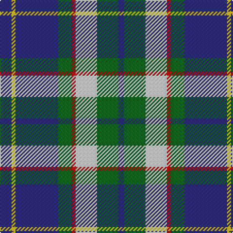

In pattern [BGWRGBYB](/stripes/bgwrgbyb/).

This was sourced from house-of-tartan.  It is a [8 stripe tartan](/stripes/stripes8/).

Original link http://www.house-of-tartan.scotland.net/house/TartanViewjs.asp?colr=Def&tnam=2089

## Thread count
DB/12 Y4 DB44 G14 R4 LN22 G22 DB/6

## Palette
Each colour and its ΔE from the base-6 reference it is a variant of.

| Colour | Shade | Base | ΔE (OKLab) |
|---|---|---|---|
| DB | <code style="background-color:#2C2C80;">#2C2C80</code> `#2C2C80` | B <code style="background-color:#2A418A;">#2A418A</code> | 0.06 |
| G | <code style="background-color:#006818;">#006818</code> `#006818` | G <code style="background-color:#006100;">#006100</code> | 0.02 |
| LN | <code style="background-color:#E0E0E0;">#E0E0E0</code> `#E0E0E0` | W <code style="background-color:#F7F7F7;">#F7F7F7</code> | 0.07 |
| R | <code style="background-color:#C80000;">#C80000</code> `#C80000` | R <code style="background-color:#CC0000;">#CC0000</code> | 0.01 |
| Y | <code style="background-color:#E8C000;">#E8C000</code> `#E8C000` | Y <code style="background-color:#F2BF00;">#F2BF00</code> | 0.02 |

# Sample pattern

## Nearest tartans

The nearest existing variants by ΔTartan distance.

1. [Loyalhanna](/setts/s8/db15lb2g2ly15r3db21r3g15~x2/) — ΔT 0.56
1. [Thomson Dress (Blue)](/setts/s6/r1b10k2w4k4ly1~x6/) — ΔT 0.79
1. [Bahamas](/setts/s8/db3g11w11r2g7db22ly2db2~x2/) — ΔT 0.92
1. [MacIntyre, Inglis](/setts/s6/w4g28db18r4db18ly3~x2/) — ΔT 0.98
1. [Scotsburn Croft](/setts/s9/lt16k3lt16k26dp4k26n20w3n8/) — ΔT 0.99
1. [Seaford House](/setts/s9/w3db28g26r3g26db26lb12db3lb3/) — ΔT 1.00
1. [Ayrshire](/setts/s8/db2r1db10w1y4g8g1g2~x4/) — ΔT 1.04
1. [MacTavish Dress](/setts/s6/r4t28k6lb12k12lo3~x2/) — ΔT 1.04
1. [Loch Ness (Fashion)](/setts/s7/r2t2r2t21lg11k17lb2~x2/) — ΔT 1.07
1. [Afternoon Tea / Earl Grey](/setts/s6/r15t98db72ly25db8w15/) — ΔT 1.08

## Neighbour map

Every grey dot is one of 14299 variants placed by the first two principal components of the ΔTartan feature space (44% of its variance). Red is this tartan; blue dots are its nearest — click one to open its page.

<svg viewBox="0 0 640 380" role="img" style="max-width:100%;height:auto;border:1px solid #e0e0e0;border-radius:4px;display:block" xmlns="http://www.w3.org/2000/svg"><image href="/nn/cloud.v1.png" width="640" height="380"/><a href="/setts/s8/db15lb2g2ly15r3db21r3g15~x2/"><circle cx="176.0" cy="176.8" r="4" fill="#3465a4"><title>Loyalhanna</title></circle></a><a href="/setts/s6/r1b10k2w4k4ly1~x6/"><circle cx="179.9" cy="178.2" r="4" fill="#3465a4"><title>Thomson Dress (Blue)</title></circle></a><a href="/setts/s8/db3g11w11r2g7db22ly2db2~x2/"><circle cx="192.2" cy="166.3" r="4" fill="#3465a4"><title>Bahamas</title></circle></a><a href="/setts/s6/w4g28db18r4db18ly3~x2/"><circle cx="224.0" cy="206.3" r="4" fill="#3465a4"><title>MacIntyre, Inglis</title></circle></a><a href="/setts/s9/lt16k3lt16k26dp4k26n20w3n8/"><circle cx="150.8" cy="184.9" r="4" fill="#3465a4"><title>Scotsburn Croft</title></circle></a><a href="/setts/s9/w3db28g26r3g26db26lb12db3lb3/"><circle cx="196.7" cy="189.2" r="4" fill="#3465a4"><title>Seaford House</title></circle></a><a href="/setts/s8/db2r1db10w1y4g8g1g2~x4/"><circle cx="177.6" cy="169.8" r="4" fill="#3465a4"><title>Ayrshire</title></circle></a><a href="/setts/s6/r4t28k6lb12k12lo3~x2/"><circle cx="168.3" cy="187.2" r="4" fill="#3465a4"><title>MacTavish Dress</title></circle></a><a href="/setts/s7/r2t2r2t21lg11k17lb2~x2/"><circle cx="169.5" cy="170.4" r="4" fill="#3465a4"><title>Loch Ness (Fashion)</title></circle></a><a href="/setts/s6/r15t98db72ly25db8w15/"><circle cx="186.0" cy="168.3" r="4" fill="#3465a4"><title>Afternoon Tea / Earl Grey</title></circle></a><circle cx="200.9" cy="174.4" r="5" fill="#c00000"/></svg>

ID: /setts/s8/db6ly2db22g7r2w11g11db3~x2/
