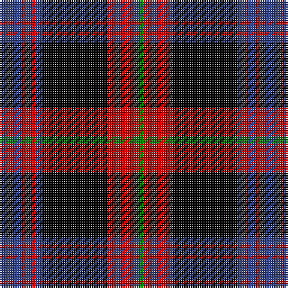

This page is one **sett** — a single exact thread-count. It belongs to the [tartan](/tartans/db6r1db2r1db2k18r8g2/)
(the same proportion at any scale), whose colour order is pattern [BRBRBKRG](/stripes/brbrbkrg/).

Sourced from weddslist.  It is a [8 stripe tartan](/stripes/stripes8/).

Original link http://www.weddslist.com/cgi-bin/tartans/pg.pl?source=sts

## Thread count
B/12 R2 B4 R2 B4 K36 R16 G/4

## Palette

Palette: <strong>Ingles Buchan</strong> <small style="color:#888">(1 of 4 colours)</small>
<table><thead><tr><th>Colour</th><th>Threads</th><th>Shade</th><th>Base</th><th>OKLCh</th></tr></thead><tbody><tr><td>B/</td><td style="text-align:right;font-variant-numeric:tabular-nums">12</td><td><code style="background-color:#304080;">#304080</code> <small style="color:#888">#304080</small></td><td>B <code style="background-color:#2A418A;">#2A418A</code></td><td><small style="color:#888">oklch(39.4% 0.109 270.2)</small></td></tr><tr><td>R</td><td style="text-align:right;font-variant-numeric:tabular-nums">2</td><td><code style="background-color:#C00000;">#C00000</code> <small style="color:#888">#C00000</small></td><td>R <code style="background-color:#CC0000;">#CC0000</code></td><td><small style="color:#888">oklch(50.7% 0.208 29.2)</small></td></tr><tr><td>B</td><td style="text-align:right;font-variant-numeric:tabular-nums">4</td><td><code style="background-color:#304080;">#304080</code> <small style="color:#888">#304080</small></td><td>B <code style="background-color:#2A418A;">#2A418A</code></td><td><small style="color:#888">oklch(39.4% 0.109 270.2)</small></td></tr><tr><td>R</td><td style="text-align:right;font-variant-numeric:tabular-nums">2</td><td><code style="background-color:#C00000;">#C00000</code> <small style="color:#888">#C00000</small></td><td>R <code style="background-color:#CC0000;">#CC0000</code></td><td><small style="color:#888">oklch(50.7% 0.208 29.2)</small></td></tr><tr><td>B</td><td style="text-align:right;font-variant-numeric:tabular-nums">4</td><td><code style="background-color:#304080;">#304080</code> <small style="color:#888">#304080</small></td><td>B <code style="background-color:#2A418A;">#2A418A</code></td><td><small style="color:#888">oklch(39.4% 0.109 270.2)</small></td></tr><tr><td>K</td><td style="text-align:right;font-variant-numeric:tabular-nums">36</td><td><code style="background-color:#000000;">#000000</code> <small style="color:#888">#000000</small></td><td>K <code style="background-color:#000000;">#000000</code></td><td><small style="color:#888">oklch(0.0% 0.000 0.0)</small></td></tr><tr><td>R</td><td style="text-align:right;font-variant-numeric:tabular-nums">16</td><td><code style="background-color:#C00000;">#C00000</code> <small style="color:#888">#C00000</small></td><td>R <code style="background-color:#CC0000;">#CC0000</code></td><td><small style="color:#888">oklch(50.7% 0.208 29.2)</small></td></tr><tr><td>G/</td><td style="text-align:right;font-variant-numeric:tabular-nums">4</td><td><code style="background-color:#008000;">#008000</code> <small style="color:#888">#008000</small></td><td>G <code style="background-color:#006100;">#006100</code></td><td><small style="color:#888">oklch(52.0% 0.177 142.5)</small></td></tr></tbody></table>

# Sample pattern

## Nearest tartans

The nearest existing variants by ΔTartan distance, with this tartan at the top so the swatches line up against it.

ΔTartan

Tartan

Sett

—

<a href="/ttd/edit/#slug=db6r1db2r1db2k18r8g2~x2">Brown</a> <a class="nn-out" href="/setts/s8/db6r1db2r1db2k18r8g2~x2/" title="open its dictionary page">↗</a>

0.27

<a href="/ttd/edit/#slug=db6r1db2r1db2k18r8dg2~x4">Brown</a> <a class="nn-out" href="/setts/s8/db6r1db2r1db2k18r8dg2~x4/" title="open its dictionary page">↗</a>

0.71

<a href="/ttd/edit/#slug=k36r3db3r3k8db23r18g3r3~x2">Grady, Highlands</a> <a class="nn-out" href="/setts/s9/k36r3db3r3k8db23r18g3r3~x2/" title="open its dictionary page">↗</a>

0.95

<a href="/ttd/edit/#slug=r2dy14k26ri3k2ri12k1ri2~x4">Booth (Fashion)</a> <a class="nn-out" href="/setts/s8/r2dy14k26ri3k2ri12k1ri2~x4/" title="open its dictionary page">↗</a>

1.13

<a href="/ttd/edit/#slug=dg3dp2dg2dp2dg2dp20k20dg22k1o3~x4">Urbino (Fashion)</a> <a class="nn-out" href="/setts/s10/dg3dp2dg2dp2dg2dp20k20dg22k1o3~x4/" title="open its dictionary page">↗</a>

1.14

<a href="/ttd/edit/#slug=k8r1k3w5k5w3k5dr23r3~x2">Southdown Tartan Tartan Number: 1194. Earliest known date: pre 2003 Designed for the Glasgow conference in 2002 See products available Copyright © Blair Urquhart, Comrie, 2015</a> <a class="nn-out" href="/setts/s9/k8r1k3w5k5w3k5dr23r3~x2/" title="open its dictionary page">↗</a>

1.21

<a href="/setts/s10/k30ki5k19ki5k2n20ly2n20ki5ly4~x2/">Sonsub Corporate Tartan Tartan Number: 6984. Earliest known date: 2006 Corporate colours for Sonsub Ltd, Bridge of Don, Aberdeen. Sonsub is a well known provider of remote subsea systems technology, and provides services to the North Atlantic, Mediterranean, Africa, Caspian and Middle East. See products available Copyright © Blair Urquhart, Comrie, 2015</a>

1.26

<a href="/ttd/edit/#slug=m20dg2m2dg2m2dg8k24dg2k3~x2">Carlow</a> <a class="nn-out" href="/setts/s9/m20dg2m2dg2m2dg8k24dg2k3~x2/" title="open its dictionary page">↗</a>

1.26

<a href="/ttd/edit/#slug=db6r1db2r1db2k18r8g2~x4">Brown Family Tartan Tartan Number: 432. Earliest known date: 1850 The Scott Adie collection, a book of manufacturers samples, was recently sold at auction. The book is dated 1850 and the samples are thought to represent the tartans available for purchase between 1840-50. See products available Copyright © Blair Urquhart, Comrie, 2015</a> <a class="nn-out" href="/setts/s8/db6r1db2r1db2k18r8g2~x4/" title="open its dictionary page">↗</a>

1.26

<a href="/ttd/edit/#slug=w3dr10k38o11dr6k2w3~x2">Phantom (Corporate)</a> <a class="nn-out" href="/setts/s7/w3dr10k38o11dr6k2w3~x2/" title="open its dictionary page">↗</a>

1.33

<a href="/ttd/edit/#slug=n19r2n3r2n3k43r22g3~x2">Carson Red (Personal)</a> <a class="nn-out" href="/setts/s8/n19r2n3r2n3k43r22g3~x2/" title="open its dictionary page">↗</a>

## Neighbour map

Every grey dot is one of 14359 variants placed by the first two principal components of the ΔTartan feature space (44% of its variance). Red is this tartan; blue dots are its nearest — click one to open its page.

<svg viewBox="0 0 640 380" role="img" style="max-width:100%;height:auto;border:1px solid #e0e0e0;border-radius:4px;display:block" xmlns="http://www.w3.org/2000/svg"><image href="/nn/cloud.v1.png" width="640" height="380"/><a href="/setts/s8/db6r1db2r1db2k18r8dg2~x4/"><circle cx="257.9" cy="155.1" r="4" fill="#3465a4"><title>Brown</title></circle></a><a href="/setts/s9/k36r3db3r3k8db23r18g3r3~x2/"><circle cx="232.2" cy="167.5" r="4" fill="#3465a4"><title>Grady, Highlands</title></circle></a><a href="/setts/s8/r2dy14k26ri3k2ri12k1ri2~x4/"><circle cx="289.3" cy="145.4" r="4" fill="#3465a4"><title>Booth (Fashion)</title></circle></a><a href="/setts/s10/dg3dp2dg2dp2dg2dp20k20dg22k1o3~x4/"><circle cx="239.4" cy="144.3" r="4" fill="#3465a4"><title>Urbino (Fashion)</title></circle></a><a href="/setts/s9/k8r1k3w5k5w3k5dr23r3~x2/"><circle cx="247.3" cy="142.6" r="4" fill="#3465a4"><title>Southdown Tartan Tartan Number: 1194. Earliest known date: pre 2003 Designed for the Glasgow conference in 2002 See products available Copyright © Blair Urquhart, Comrie, 2015</title></circle></a><a href="/setts/s10/k30ki5k19ki5k2n20ly2n20ki5ly4~x2/"><circle cx="237.7" cy="176.8" r="4" fill="#3465a4"><title>Sonsub Corporate Tartan Tartan Number: 6984. Earliest known date: 2006 Corporate colours for Sonsub Ltd, Bridge of Don, Aberdeen. Sonsub is a well known provider of remote subsea systems technology, and provides services to the North Atlantic, Mediterranean, Africa, Caspian and Middle East. See products available Copyright © Blair Urquhart, Comrie, 2015</title></circle></a><a href="/setts/s9/m20dg2m2dg2m2dg8k24dg2k3~x2/"><circle cx="267.4" cy="184.6" r="4" fill="#3465a4"><title>Carlow</title></circle></a><a href="/setts/s8/db6r1db2r1db2k18r8g2~x4/"><circle cx="284.4" cy="165.2" r="4" fill="#3465a4"><title>Brown Family Tartan Tartan Number: 432. Earliest known date: 1850 The Scott Adie collection, a book of manufacturers samples, was recently sold at auction. The book is dated 1850 and the samples are thought to represent the tartans available for purchase between 1840-50. See products available Copyright © Blair Urquhart, Comrie, 2015</title></circle></a><a href="/setts/s7/w3dr10k38o11dr6k2w3~x2/"><circle cx="314.2" cy="157.6" r="4" fill="#3465a4"><title>Phantom (Corporate)</title></circle></a><a href="/setts/s8/n19r2n3r2n3k43r22g3~x2/"><circle cx="284.3" cy="148.4" r="4" fill="#3465a4"><title>Carson Red (Personal)</title></circle></a><circle cx="254.5" cy="153.8" r="5" fill="#c00000"/></svg>

ID: /setts/s8/db6r1db2r1db2k18r8g2~x2/
