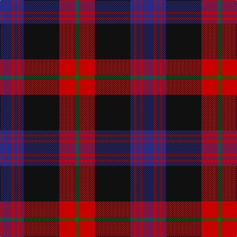

This page is one **sett** — a single exact thread-count. It belongs to the [tartan](/tartans/db6r1db2r1db2k18r8g2/)
(the same proportion at any scale), whose colour order is pattern [BRBRBKRG](/stripes/brbrbkrg/).

Sourced from house-of-tartan.  It is a [8 stripe tartan](/stripes/stripes8/).

Original link http://www.house-of-tartan.scotland.net/house/TartanViewjs.asp?colr=Def&tnam=432

## Thread count
DB/24 R4 DB8 R4 DB8 K72 R32 G/8

## Palette

Palette: <strong>Tartan Register</strong>
<table><thead><tr><th>Colour</th><th>Threads</th><th>Shade</th><th>Base</th><th>OKLCh</th></tr></thead><tbody><tr><td>DB/</td><td style="text-align:right;font-variant-numeric:tabular-nums">24</td><td><code style="background-color:#2C2C80;">#2C2C80</code> <small style="color:#888">#2C2C80</small></td><td>B <code style="background-color:#2A418A;">#2A418A</code></td><td><small style="color:#888">oklch(35.0% 0.138 276.6)</small></td></tr><tr><td>R</td><td style="text-align:right;font-variant-numeric:tabular-nums">4</td><td><code style="background-color:#C80000;">#C80000</code> <small style="color:#888">#C80000</small></td><td>R <code style="background-color:#CC0000;">#CC0000</code></td><td><small style="color:#888">oklch(52.3% 0.215 29.2)</small></td></tr><tr><td>DB</td><td style="text-align:right;font-variant-numeric:tabular-nums">8</td><td><code style="background-color:#2C2C80;">#2C2C80</code> <small style="color:#888">#2C2C80</small></td><td>B <code style="background-color:#2A418A;">#2A418A</code></td><td><small style="color:#888">oklch(35.0% 0.138 276.6)</small></td></tr><tr><td>R</td><td style="text-align:right;font-variant-numeric:tabular-nums">4</td><td><code style="background-color:#C80000;">#C80000</code> <small style="color:#888">#C80000</small></td><td>R <code style="background-color:#CC0000;">#CC0000</code></td><td><small style="color:#888">oklch(52.3% 0.215 29.2)</small></td></tr><tr><td>DB</td><td style="text-align:right;font-variant-numeric:tabular-nums">8</td><td><code style="background-color:#2C2C80;">#2C2C80</code> <small style="color:#888">#2C2C80</small></td><td>B <code style="background-color:#2A418A;">#2A418A</code></td><td><small style="color:#888">oklch(35.0% 0.138 276.6)</small></td></tr><tr><td>K</td><td style="text-align:right;font-variant-numeric:tabular-nums">72</td><td><code style="background-color:#101010;">#101010</code> <small style="color:#888">#101010</small></td><td>K <code style="background-color:#000000;">#000000</code></td><td><small style="color:#888">oklch(17.3% 0.000 89.9)</small></td></tr><tr><td>R</td><td style="text-align:right;font-variant-numeric:tabular-nums">32</td><td><code style="background-color:#C80000;">#C80000</code> <small style="color:#888">#C80000</small></td><td>R <code style="background-color:#CC0000;">#CC0000</code></td><td><small style="color:#888">oklch(52.3% 0.215 29.2)</small></td></tr><tr><td>G/</td><td style="text-align:right;font-variant-numeric:tabular-nums">8</td><td><code style="background-color:#006818;">#006818</code> <small style="color:#888">#006818</small></td><td>G <code style="background-color:#006100;">#006100</code></td><td><small style="color:#888">oklch(45.0% 0.142 145.0)</small></td></tr></tbody></table>

# Sample pattern

## Nearest tartans

The nearest existing variants by ΔTartan distance, with this tartan at the top so the swatches line up against it.

ΔTartan

Tartan

Sett

—

<a href="/ttd/edit/#slug=db6r1db2r1db2k18r8g2~x4">Brown Family Tartan Tartan Number: 432. Earliest known date: 1850 The Scott Adie collection, a book of manufacturers samples, was recently sold at auction. The book is dated 1850 and the samples are thought to represent the tartans available for purchase between 1840-50. See products available Copyright © Blair Urquhart, Comrie, 2015</a> <a class="nn-out" href="/setts/s8/db6r1db2r1db2k18r8g2~x4/" title="open its dictionary page">↗</a>

0.71

<a href="/ttd/edit/#slug=k36r3db3r3k8db24r18g3r3~x2">Grady (Personal)</a> <a class="nn-out" href="/setts/s9/k36r3db3r3k8db24r18g3r3~x2/" title="open its dictionary page">↗</a>

0.74

<a href="/ttd/edit/#slug=n19r2n3r2n3k43r22g3~x2">Carson Red (Personal)</a> <a class="nn-out" href="/setts/s8/n19r2n3r2n3k43r22g3~x2/" title="open its dictionary page">↗</a>

0.92

<a href="/ttd/edit/#slug=k36r3db3r3k8db24r18ly3r3~x2">Girl Guiding Scotland (Corporate)</a> <a class="nn-out" href="/setts/s9/k36r3db3r3k8db24r18ly3r3~x2/" title="open its dictionary page">↗</a>

0.92

<a href="/ttd/edit/#slug=r25k2n4k2r8k31db32k8">Black and Red</a> <a class="nn-out" href="/setts/s8/r25k2n4k2r8k31db32k8/" title="open its dictionary page">↗</a>

1.02

<a href="/ttd/edit/#slug=w2k35db30k3r30k2r4k2r30k3w2">Gwyn Welsh Name Tartan Tartan Number: 5734. Earliest known date: 2002 The tartan for this Welsh surname and its spelling variation, Wynn, is actually woven in Wales at the Cambrian Woollen Mill, weaving on the same site since 1830. This tartan differs from many traditional patterns in that the warp and weft differ, giving the finished worsted wool cloth more of a predominant stripe, vertically noticeable in the finished Kilt, or Cilt in Wales. See products available Copyright © Blair Urquhart, Comrie, 2015</a> <a class="nn-out" href="/setts/s11/w2k35db30k3r30k2r4k2r30k3w2/" title="open its dictionary page">↗</a>

1.21

<a href="/ttd/edit/#slug=r3dg12r12r5dg2db30r2dg2~x2">Rannoch Moor (Fashion)</a> <a class="nn-out" href="/setts/s8/r3dg12r12r5dg2db30r2dg2~x2/" title="open its dictionary page">↗</a>

1.21

<a href="/ttd/edit/#slug=dp2r1dg26r18dp26y1r1dp2~x2">Robb Dress (Personal)</a> <a class="nn-out" href="/setts/s8/dp2r1dg26r18dp26y1r1dp2~x2/" title="open its dictionary page">↗</a>

1.23

<a href="/ttd/edit/#slug=db2r2db28k11r27w2r2~x2">Americana - 1978 #2 (Fashion)</a> <a class="nn-out" href="/setts/s7/db2r2db28k11r27w2r2~x2/" title="open its dictionary page">↗</a>

1.23

<a href="/ttd/edit/#slug=r3k12g4db12r1k2r1~x4">Sandberg</a> <a class="nn-out" href="/setts/s7/r3k12g4db12r1k2r1~x4/" title="open its dictionary page">↗</a>

1.25

<a href="/ttd/edit/#slug=k35p2k3dp13g8w4g8dp8~x2">SheBoom</a> <a class="nn-out" href="/setts/s8/k35p2k3dp13g8w4g8dp8~x2/" title="open its dictionary page">↗</a>

## Neighbour map

Every grey dot is one of 14359 variants placed by the first two principal components of the ΔTartan feature space (44% of its variance). Red is this tartan; blue dots are its nearest — click one to open its page.

<svg viewBox="0 0 640 380" role="img" style="max-width:100%;height:auto;border:1px solid #e0e0e0;border-radius:4px;display:block" xmlns="http://www.w3.org/2000/svg"><image href="/nn/cloud.v1.png" width="640" height="380"/><a href="/setts/s9/k36r3db3r3k8db24r18g3r3~x2/"><circle cx="259.3" cy="178.6" r="4" fill="#3465a4"><title>Grady (Personal)</title></circle></a><a href="/setts/s8/n19r2n3r2n3k43r22g3~x2/"><circle cx="284.3" cy="148.4" r="4" fill="#3465a4"><title>Carson Red (Personal)</title></circle></a><a href="/setts/s9/k36r3db3r3k8db24r18ly3r3~x2/"><circle cx="250.5" cy="172.7" r="4" fill="#3465a4"><title>Girl Guiding Scotland (Corporate)</title></circle></a><a href="/setts/s8/r25k2n4k2r8k31db32k8/"><circle cx="240.0" cy="182.0" r="4" fill="#3465a4"><title>Black and Red</title></circle></a><a href="/setts/s11/w2k35db30k3r30k2r4k2r30k3w2/"><circle cx="297.4" cy="159.7" r="4" fill="#3465a4"><title>Gwyn Welsh Name Tartan Tartan Number: 5734. Earliest known date: 2002 The tartan for this Welsh surname and its spelling variation, Wynn, is actually woven in Wales at the Cambrian Woollen Mill, weaving on the same site since 1830. This tartan differs from many traditional patterns in that the warp and weft differ, giving the finished worsted wool cloth more of a predominant stripe, vertically noticeable in the finished Kilt, or Cilt in Wales. See products available Copyright © Blair Urquhart, Comrie, 2015</title></circle></a><a href="/setts/s8/r3dg12r12r5dg2db30r2dg2~x2/"><circle cx="289.0" cy="186.3" r="4" fill="#3465a4"><title>Rannoch Moor (Fashion)</title></circle></a><a href="/setts/s8/dp2r1dg26r18dp26y1r1dp2~x2/"><circle cx="305.2" cy="155.5" r="4" fill="#3465a4"><title>Robb Dress (Personal)</title></circle></a><a href="/setts/s7/db2r2db28k11r27w2r2~x2/"><circle cx="269.8" cy="168.9" r="4" fill="#3465a4"><title>Americana - 1978 #2 (Fashion)</title></circle></a><a href="/setts/s7/r3k12g4db12r1k2r1~x4/"><circle cx="243.6" cy="207.3" r="4" fill="#3465a4"><title>Sandberg</title></circle></a><a href="/setts/s8/k35p2k3dp13g8w4g8dp8~x2/"><circle cx="243.3" cy="149.9" r="4" fill="#3465a4"><title>SheBoom</title></circle></a><circle cx="284.4" cy="165.2" r="5" fill="#c00000"/></svg>

ID: /setts/s8/db6r1db2r1db2k18r8g2~x4/
