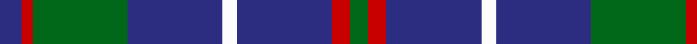
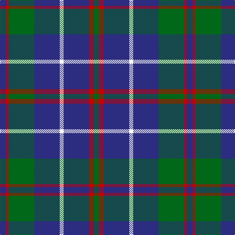

In pattern [BRGBWBRG](/stripes/brgbwbrg/).

This was sourced from register-of-tartans.  It is a [8 stripe tartan](/stripes/stripes8/).

Original link https://www.tartanregister.gov.uk/tartanDetails.aspx?ref=4953

## Register references

External register numbers recorded for this tartan.

- Scottish Register of Tartans: [4953](https://www.tartanregister.gov.uk/tartanDetails.aspx?ref=4953)
- Scottish Tartans Authority (ITI): 3380

## Thread count
DB/12 R6 G52 DB52 W8 DB52 R10 G/10

## Palette
Each colour and its ΔE from the base-6 reference it is a variant of.

| Colour | Shade | Base | ΔE (OKLab) |
|---|---|---|---|
| DB | <code style="background-color:#2C2C80;">#2C2C80</code> `#2C2C80` | B <code style="background-color:#2A418A;">#2A418A</code> | 0.06 |
| G | <code style="background-color:#006818;">#006818</code> `#006818` | G <code style="background-color:#006100;">#006100</code> | 0.02 |
| R | <code style="background-color:#C80000;">#C80000</code> `#C80000` | R <code style="background-color:#CC0000;">#CC0000</code> | 0.01 |
| W | <code style="background-color:#FCFCFC;">#FCFCFC</code> `#FCFCFC` | W <code style="background-color:#F7F7F7;">#F7F7F7</code> | 0.01 |

# Sample pattern

## Nearest tartans

The nearest existing variants by ΔTartan distance.

1. [Bruce (Personal)](/setts/s11/w1db8g2db2g6db1g6db2g2db8ly1~x4/) — ΔT 1.02
1. [MacHardy](/setts/s8/db1r1g6db6ly1db6r1g1~x2/) — ΔT 1.06
1. [MacHardy](/setts/s8/db3r3g18db16w2db26r3g3~x2/) — ΔT 1.10
1. [MacHardy](/setts/s8/dg1r1db6ly1db6dg6r1db1~x2/) — ΔT 1.11
1. [Notre Dame Marching Guard](/setts/s10/g9b9k24b35dr5b35k24b9g9dr5~x2/) — ΔT 1.12
1. [Stone of Destiny](/setts/s9/db4ly2db17k2r4k2db3k11db3~x2/) — ΔT 1.13
1. [Glen Esk](/setts/s8/dg10r1dg1r2dg8db10dg1ly1~x4/) — ΔT 1.14
1. [Dege, of Saville Row](/setts/s6/o11db1o3db1db9r1~x4/) — ΔT 1.15
1. [Kelvinside Academy (School)](/setts/s8/w4y15db8k4db28k2db4w2/) — ΔT 1.17
1. [Kinross (Fashion)](/setts/s8/dg20db2g6db2dg4db27lo2db8~x2/) — ΔT 1.18

## Neighbour map

Every grey dot is one of 14299 variants placed by the first two principal components of the ΔTartan feature space (44% of its variance). Red is this tartan; blue dots are its nearest — click one to open its page.

<svg viewBox="0 0 640 380" role="img" style="max-width:100%;height:auto;border:1px solid #e0e0e0;border-radius:4px;display:block" xmlns="http://www.w3.org/2000/svg"><image href="/nn/cloud.v1.png" width="640" height="380"/><a href="/setts/s11/w1db8g2db2g6db1g6db2g2db8ly1~x4/"><circle cx="286.1" cy="214.5" r="4" fill="#3465a4"><title>Bruce (Personal)</title></circle></a><a href="/setts/s8/db1r1g6db6ly1db6r1g1~x2/"><circle cx="291.6" cy="228.7" r="4" fill="#3465a4"><title>MacHardy</title></circle></a><a href="/setts/s8/db3r3g18db16w2db26r3g3~x2/"><circle cx="360.5" cy="198.1" r="4" fill="#3465a4"><title>MacHardy</title></circle></a><a href="/setts/s8/dg1r1db6ly1db6dg6r1db1~x2/"><circle cx="310.0" cy="238.9" r="4" fill="#3465a4"><title>MacHardy</title></circle></a><a href="/setts/s10/g9b9k24b35dr5b35k24b9g9dr5~x2/"><circle cx="238.6" cy="222.4" r="4" fill="#3465a4"><title>Notre Dame Marching Guard</title></circle></a><a href="/setts/s9/db4ly2db17k2r4k2db3k11db3~x2/"><circle cx="308.1" cy="207.0" r="4" fill="#3465a4"><title>Stone of Destiny</title></circle></a><a href="/setts/s8/dg10r1dg1r2dg8db10dg1ly1~x4/"><circle cx="324.8" cy="207.8" r="4" fill="#3465a4"><title>Glen Esk</title></circle></a><a href="/setts/s6/o11db1o3db1db9r1~x4/"><circle cx="329.2" cy="208.3" r="4" fill="#3465a4"><title>Dege, of Saville Row</title></circle></a><a href="/setts/s8/w4y15db8k4db28k2db4w2/"><circle cx="352.1" cy="186.6" r="4" fill="#3465a4"><title>Kelvinside Academy (School)</title></circle></a><a href="/setts/s8/dg20db2g6db2dg4db27lo2db8~x2/"><circle cx="334.1" cy="197.7" r="4" fill="#3465a4"><title>Kinross (Fashion)</title></circle></a><circle cx="303.6" cy="215.0" r="5" fill="#c00000"/></svg>

ID: /setts/s8/db6r3g26db26w4db26r5g5~x2/
