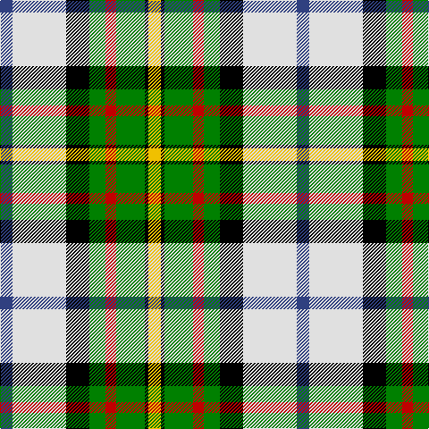

This page is one **sett** — a single exact thread-count. It belongs to the [tartan](/tartans/y7k2g16r6g9k13ln30b7/)
(the same proportion at any scale), whose colour order is pattern [BWKGRGKY](/stripes/bwkgrgky/).

Sourced from weddslist.  It is a [8 stripe tartan](/stripes/stripes8/).

Original link http://www.weddslist.com/cgi-bin/tartans/pg.pl?source=sts

## Also known as

This cloth is also recorded under:

- MacLaren dress

2 attestations — the source records this cloth was collapsed from (oldest owns this page)

<ul>
<li>undated — MacLaren dress (weddslist, <a href="http://www.weddslist.com/cgi-bin/tartans/pg.pl?source=sts">record</a>)</li>
<li>undated — MacLaren Dress Clan Tartan Tartan Number: 649. Earliest known date: 1981 This sett was approved by the Chief and accepted by the A.G.M. of the Clan MacLaren Society as Dress MacLaren in 1981. The sett has been designed by changing the blue ground of the usual MacLaren sett to white and then centering a blue stripe on the white ground. This illustration is based on a kilt belonging to the designer, Mr I.G.Campbell MacLaren. See products available Copyright © Blair Urquhart, Comrie, 2015 (house-of-tartan, <a href="http://www.house-of-tartan.scotland.net/house/TartanViewjs.asp?colr=Def&tnam=649">record</a>)</li>
</ul>

## Thread count
Y/14 K4 G32 R12 G18 K26 LN60 B/14

## Palette
Each colour and the base-6 reference it is a variant of.

| Colour | Shade | Base |
|---|---|---|
| B | <code style="background-color:#304080;">#304080</code> `oklch(39.4% 0.109 270.2)` <small>#304080</small> | B <code style="background-color:#2A418A;">#2A418A</code> |
| G | <code style="background-color:#008000;">#008000</code> `oklch(52.0% 0.177 142.5)` <small>#008000</small> | G <code style="background-color:#006100;">#006100</code> |
| K | <code style="background-color:#000000;">#000000</code> `oklch(0.0% 0.000 0.0)` <small>#000000</small> | K <code style="background-color:#000000;">#000000</code> |
| LN | <code style="background-color:#E0E0E0;">#E0E0E0</code> `oklch(90.7% 0.000 89.9)` <small>#E0E0E0</small> | W <code style="background-color:#F7F7F7;">#F7F7F7</code> |
| R | <code style="background-color:#C00000;">#C00000</code> `oklch(50.7% 0.208 29.2)` <small>#C00000</small> | R <code style="background-color:#CC0000;">#CC0000</code> |
| Y | <code style="background-color:#F0C000;">#F0C000</code> `oklch(82.7% 0.169 90.5)` <small>#F0C000</small> | Y <code style="background-color:#F2BF00;">#F2BF00</code> |

# Sample pattern

## Nearest tartans

The nearest existing variants by ΔTartan distance, with this tartan at the top so the swatches line up against it.

ΔTartan

Tartan

Sett

—

<a href="/ttd/edit/#slug=db7w30k13g9r6g16k2ly7~x2">MacLaren dress</a> <a class="nn-out" href="/setts/s8/db7w30k13g9r6g16k2ly7~x2/" title="open its dictionary page">↗</a>

0.77

<a href="/ttd/edit/#slug=ly6k2g15r6g8k12w25t2w3t2~x2">Gillies, dress Green</a> <a class="nn-out" href="/setts/s10/ly6k2g15r6g8k12w25t2w3t2~x2/" title="open its dictionary page">↗</a>

0.81

<a href="/ttd/edit/#slug=db2w12k8g8r2g8k1lo2~x2">MacLaren Dress</a> <a class="nn-out" href="/setts/s8/db2w12k8g8r2g8k1lo2~x2/" title="open its dictionary page">↗</a>

0.89

<a href="/ttd/edit/#slug=ly8r3b2db1w6g12db2~x2">Carmen Lau (Hong Kong) (Personal)</a> <a class="nn-out" href="/setts/s7/ly8r3b2db1w6g12db2~x2/" title="open its dictionary page">↗</a>

1.02

<a href="/ttd/edit/#slug=ly8k3t2do1w6g12do2~x2">Carmen Lau (Hong Kong) (Personal)</a> <a class="nn-out" href="/setts/s7/ly8k3t2do1w6g12do2~x2/" title="open its dictionary page">↗</a>

1.04

<a href="/ttd/edit/#slug=lo12k3g24r12g24k32w44g4w8g4">Gillies Dress Green</a> <a class="nn-out" href="/setts/s10/lo12k3g24r12g24k32w44g4w8g4/" title="open its dictionary page">↗</a>

1.04

<a href="/ttd/edit/#slug=k20ly4r4ly20g20w5g2lg2~x2">Hackett William (Coatbridge) Hunting (Personal)</a> <a class="nn-out" href="/setts/s8/k20ly4r4ly20g20w5g2lg2~x2/" title="open its dictionary page">↗</a>

1.05

<a href="/ttd/edit/#slug=ly6k2g12r4g8k10w24b2w3b2~x2">Gillies Dress, Green (Dance)</a> <a class="nn-out" href="/setts/s10/ly6k2g12r4g8k10w24b2w3b2~x2/" title="open its dictionary page">↗</a>

1.27

<a href="/ttd/edit/#slug=w7r1w14k6lo2k6g14r2g10lo1~x2">Spanish shirt</a> <a class="nn-out" href="/setts/s10/w7r1w14k6lo2k6g14r2g10lo1~x2/" title="open its dictionary page">↗</a>

1.28

<a href="/ttd/edit/#slug=db8w33k15g17t3g17t3~x2">MacRobart, dress</a> <a class="nn-out" href="/setts/s7/db8w33k15g17t3g17t3~x2/" title="open its dictionary page">↗</a>

1.28

<a href="/ttd/edit/#slug=db8w33k15dg17t3dg17t3~x2">MacRobart Dress (Personal)</a> <a class="nn-out" href="/setts/s7/db8w33k15dg17t3dg17t3~x2/" title="open its dictionary page">↗</a>

## Neighbour map

Every grey dot is one of 14299 variants placed by the first two principal components of the ΔTartan feature space (44% of its variance). Red is this tartan; blue dots are its nearest — click one to open its page.

<svg viewBox="0 0 640 380" role="img" style="max-width:100%;height:auto;border:1px solid #e0e0e0;border-radius:4px;display:block" xmlns="http://www.w3.org/2000/svg"><image href="/nn/cloud.v1.png" width="640" height="380"/><a href="/setts/s10/ly6k2g15r6g8k12w25t2w3t2~x2/"><circle cx="84.5" cy="116.5" r="4" fill="#3465a4"><title>Gillies, dress Green</title></circle></a><a href="/setts/s8/db2w12k8g8r2g8k1lo2~x2/"><circle cx="98.0" cy="144.7" r="4" fill="#3465a4"><title>MacLaren Dress</title></circle></a><a href="/setts/s7/ly8r3b2db1w6g12db2~x2/"><circle cx="89.6" cy="144.4" r="4" fill="#3465a4"><title>Carmen Lau (Hong Kong) (Personal)</title></circle></a><a href="/setts/s7/ly8k3t2do1w6g12do2~x2/"><circle cx="83.4" cy="140.7" r="4" fill="#3465a4"><title>Carmen Lau (Hong Kong) (Personal)</title></circle></a><a href="/setts/s10/lo12k3g24r12g24k32w44g4w8g4/"><circle cx="107.2" cy="134.7" r="4" fill="#3465a4"><title>Gillies Dress Green</title></circle></a><a href="/setts/s8/k20ly4r4ly20g20w5g2lg2~x2/"><circle cx="88.5" cy="143.4" r="4" fill="#3465a4"><title>Hackett William (Coatbridge) Hunting (Personal)</title></circle></a><a href="/setts/s10/ly6k2g12r4g8k10w24b2w3b2~x2/"><circle cx="92.6" cy="115.0" r="4" fill="#3465a4"><title>Gillies Dress, Green (Dance)</title></circle></a><a href="/setts/s10/w7r1w14k6lo2k6g14r2g10lo1~x2/"><circle cx="127.5" cy="143.3" r="4" fill="#3465a4"><title>Spanish shirt</title></circle></a><a href="/setts/s7/db8w33k15g17t3g17t3~x2/"><circle cx="105.4" cy="172.8" r="4" fill="#3465a4"><title>MacRobart, dress</title></circle></a><a href="/setts/s7/db8w33k15dg17t3dg17t3~x2/"><circle cx="114.9" cy="174.8" r="4" fill="#3465a4"><title>MacRobart Dress (Personal)</title></circle></a><circle cx="75.9" cy="132.5" r="5" fill="#c00000"/></svg>

ID: /setts/s8/db7w30k13g9r6g16k2ly7~x2/
