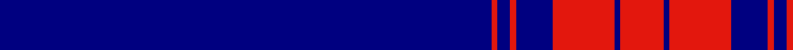

**Bands:** [BRBRBRBR](/stripes/brbrbrbr/) · **Stripes:** [DB R DB R DB R DB R](/stripes/stripes8/) DB R DB R DB R DB R

This was sourced from register-of-tartans.  It is a [8 band tartan](/bands/bands8/).

Original link https://www.tartanregister.gov.uk/tartanDetails.aspx?ref=10795

## Attestations

This cloth appears in 2 source records; the oldest owns this page.

- 24/01/2008 — Mack of Stoneywood Dress (Personal) (register-of-tartans, [record](https://www.tartanregister.gov.uk/tartanDetails.aspx?ref=10795))
- Feb 2008 — Mack of Stoneywood Dress (Personal) (tartans-authority, [record](http://www.tartansauthority.com/tartan-ferret/display/10795/))

## Register references

External register numbers recorded for this tartan.

- Scottish Register of Tartans: [10795](https://www.tartanregister.gov.uk/tartanDetails.aspx?ref=10795)

## Variants

Other setts woven to the same stripe pattern.

- [Unidentified Plaid #12](/setts/s8/db3r64db3r3db62r3db3r3/)

## Thread count
DB/160 R2 DB4 R2 DB12 R20 DB2 R/14

## Palette
Each colour and its ΔE from the base-6 reference it is a variant of.

| Colour | Shade | Base | ΔE (OKLab) |
|---|---|---|---|
| DB | <code style="background-color:#000080;">#000080</code> `#000080` | B <code style="background-color:#2A418A;">#2A418A</code> | 0.14 |
| R | <code style="background-color:#E3170D;">#E3170D</code> `#E3170D` | R <code style="background-color:#CC0000;">#CC0000</code> | 0.05 |

# Sample pattern

## Nearest tartans

The nearest existing variants by ΔTartan distance.

1. [University of Delaware (Corporate)](/setts/s9/db43ly5db1ly4db1ly2db7w1db2~x2/) — ΔT 1.89
1. [Weir Minerals (Corporate)](/setts/s4/db80w1lo8w3~x2/) — ΔT 1.91
1. [Auchairne](/setts/s6/b10db6b3db62w4db5~x2/) — ΔT 2.02
1. [Duke of York (Royal)](/setts/s8/db61r6w2r8lo2db3lo2db15~x2/) — ΔT 2.04
1. [Angotta (Name)](/setts/s13/lo6db1lo1db1lo1db5lo2db5lo4db2r1db40r1~x2/) — ΔT 2.15
1. [Spirit of Ulster](/setts/s7/w2db4r2db90w2db4r1~x2/) — ΔT 2.25
1. [Angotta](/setts/s13/ly6db1ly1db1ly1db5ly2db5ly4db2r1db40r1~x2/) — ΔT 2.27
1. [Cougan Irish Personal Tartan Tartan Number: 6782. Earliest known date: 2005 September Designed by Douglas Gregor of Tartanweb as a personal tartan for Margot Coogan of County Laois, Ireland. The colours reflect those in the Cougan coat of arms - deep red representing the red cross in the shield and the white lines representing the three silver oak leaves. See products available Copyright © Blair Urquhart, Comrie, 2015](/setts/s10/db66r16w2r1w1r1w2r16db66ly2~x2/) — ΔT 2.28
1. [Auchairne (Corporate)](/setts/s6/b11db7b3db70lb4db6~x2/) — ΔT 2.29
1. [United States (Corporate)](/setts/s9/b7db5w6db5r7db2b2db70w2/) — ΔT 2.34

## Neighbour map

Every grey dot is one of 14313 variants placed by the first two principal components of the ΔTartan feature space (44% of its variance). Red is this tartan; blue dots are its nearest — click one to open its page.

<svg viewBox="0 0 640 380" role="img" style="max-width:100%;height:auto;border:1px solid #e0e0e0;border-radius:4px;display:block" xmlns="http://www.w3.org/2000/svg"><image href="/nn/cloud.v1.png" width="640" height="380"/><a href="/setts/s9/db43ly5db1ly4db1ly2db7w1db2~x2/"><circle cx="581.6" cy="111.1" r="4" fill="#3465a4"><title>University of Delaware (Corporate)</title></circle></a><a href="/setts/s4/db80w1lo8w3~x2/"><circle cx="626.0" cy="169.9" r="4" fill="#3465a4"><title>Weir Minerals (Corporate)</title></circle></a><a href="/setts/s6/b10db6b3db62w4db5~x2/"><circle cx="553.2" cy="185.6" r="4" fill="#3465a4"><title>Auchairne</title></circle></a><a href="/setts/s8/db61r6w2r8lo2db3lo2db15~x2/"><circle cx="551.3" cy="141.9" r="4" fill="#3465a4"><title>Duke of York (Royal)</title></circle></a><a href="/setts/s13/lo6db1lo1db1lo1db5lo2db5lo4db2r1db40r1~x2/"><circle cx="569.7" cy="104.7" r="4" fill="#3465a4"><title>Angotta (Name)</title></circle></a><a href="/setts/s7/w2db4r2db90w2db4r1~x2/"><circle cx="626.0" cy="143.2" r="4" fill="#3465a4"><title>Spirit of Ulster</title></circle></a><a href="/setts/s13/ly6db1ly1db1ly1db5ly2db5ly4db2r1db40r1~x2/"><circle cx="548.2" cy="89.3" r="4" fill="#3465a4"><title>Angotta</title></circle></a><a href="/setts/s10/db66r16w2r1w1r1w2r16db66ly2~x2/"><circle cx="546.7" cy="114.9" r="4" fill="#3465a4"><title>Cougan Irish Personal Tartan Tartan Number: 6782. Earliest known date: 2005 September Designed by Douglas Gregor of Tartanweb as a personal tartan for Margot Coogan of County Laois, Ireland. The colours reflect those in the Cougan coat of arms - deep red representing the red cross in the shield and the white lines representing the three silver oak leaves. See products available Copyright © Blair Urquhart, Comrie, 2015</title></circle></a><a href="/setts/s6/b11db7b3db70lb4db6~x2/"><circle cx="613.6" cy="198.8" r="4" fill="#3465a4"><title>Auchairne (Corporate)</title></circle></a><a href="/setts/s9/b7db5w6db5r7db2b2db70w2/"><circle cx="525.8" cy="108.1" r="4" fill="#3465a4"><title>United States (Corporate)</title></circle></a><circle cx="626.0" cy="139.4" r="5" fill="#c00000"/></svg>

ID: /setts/s8/db80r1db2r1db6r10db1r7~x2/
