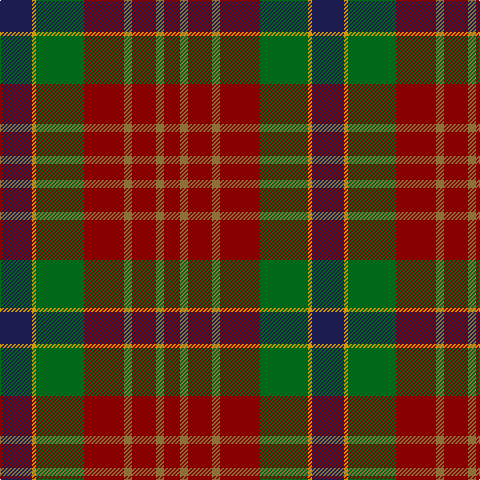

**Bands:** [RGRGRGYB](/stripes/rgrgrgyb/) · **Stripes:** [R Y R Y R G LO DB](/stripes/stripes8/) R Y R Y R G LO DB

This was sourced from tartans-authority.  It is a [8 band tartan](/bands/bands8/).

Original link http://www.tartansauthority.com/tartan-ferret/display/5251/

## Also known as

This cloth is also recorded under:

- Indiana "Cardinal"

## Thread count
DB/32 DY4 G48 DR40 LT8 DR24 LT8 DR/16

## Palette
Each colour and its ΔE from the base-6 reference it is a variant of.

| Colour | Shade | Base | ΔE (OKLab) |
|---|---|---|---|
| DB | <code style="background-color:#1C1C50;">#1C1C50</code> `#1C1C50` | B <code style="background-color:#2A418A;">#2A418A</code> | 0.14 |
| DR | <code style="background-color:#880000;">#880000</code> `#880000` | R <code style="background-color:#CC0000;">#CC0000</code> | 0.15 |
| DY | <code style="background-color:#D09800;">#D09800</code> `#D09800` | Y <code style="background-color:#F2BF00;">#F2BF00</code> | 0.12 |
| G | <code style="background-color:#006818;">#006818</code> `#006818` | G <code style="background-color:#006100;">#006100</code> | 0.02 |
| LT | <code style="background-color:#8C7038;">#8C7038</code> `#8C7038` | G <code style="background-color:#006100;">#006100</code> | 0.18 |

# Sample pattern

## Nearest tartans

The nearest existing variants by ΔTartan distance.

1. [Vass (Personal)](/setts/s8/db6w1y6dy12r2~x4/) — ΔT 0.99
1. [Craik of Assington (Personal)](/setts/s8/db4r11db1g8r2g4k1lo2~x4/) — ΔT 1.09
1. [Ballantrae (Macnaughtons)](/setts/s7/dy6r3dy34k16ly3dt22r4~x2/) — ΔT 1.12
1. [Strathspey (Fashion)](/setts/s6/g3r22t5g10k10g2~x2/) — ΔT 1.19
1. [Indiana 'Cardinal'](/setts/s14/db8lo1g12r10y2r6y2r4~x4/) — ΔT 1.22
1. [Loch Rannoch Trade Tartan Tartan Number: 1735. Earliest known date: 1975 Nothing See products available Copyright © Blair Urquhart, Comrie, 2015](/setts/s8/do24g2do5lo14g2lo5dy17do2~x2/) — ΔT 1.24
1. [Wcwm 9275-1410](/setts/s7/g3dy32g4lb3g18dp18lo3~x2/) — ΔT 1.25
1. [Montrose (Macnaughton variation)](/setts/s9/db1k1r12g12k6db5r12k1db1~x4/) — ΔT 1.30
1. [Unidentified #66](/setts/s6/ly1dy10k8r8dy1ly1~x4/) — ΔT 1.31
1. [Monaghan Irish County Tartan Tartan Number: 2267. Earliest known date: 1996 One of a series of Irish District tartans designed by Polly Wittering of the House of Edgar, with colours reminiscent of the Country with soft warm colours dominating. See products available Copyright © Blair Urquhart, Comrie, 2015](/setts/s9/lo3dy2o14dg17dy14lo8o14dy2lo3~x2/) — ΔT 1.32

## Neighbour map

Every grey dot is one of 14299 variants placed by the first two principal components of the ΔTartan feature space (44% of its variance). Red is this tartan; blue dots are its nearest — click one to open its page.

<svg viewBox="0 0 640 380" role="img" style="max-width:100%;height:auto;border:1px solid #e0e0e0;border-radius:4px;display:block" xmlns="http://www.w3.org/2000/svg"><image href="/nn/cloud.v1.png" width="640" height="380"/><a href="/setts/s8/db6w1y6dy12r2~x4/"><circle cx="293.2" cy="211.4" r="4" fill="#3465a4"><title>Vass (Personal)</title></circle></a><a href="/setts/s8/db4r11db1g8r2g4k1lo2~x4/"><circle cx="209.3" cy="186.8" r="4" fill="#3465a4"><title>Craik of Assington (Personal)</title></circle></a><a href="/setts/s7/dy6r3dy34k16ly3dt22r4~x2/"><circle cx="264.4" cy="204.3" r="4" fill="#3465a4"><title>Ballantrae (Macnaughtons)</title></circle></a><a href="/setts/s6/g3r22t5g10k10g2~x2/"><circle cx="251.9" cy="225.9" r="4" fill="#3465a4"><title>Strathspey (Fashion)</title></circle></a><a href="/setts/s14/db8lo1g12r10y2r6y2r4~x4/"><circle cx="246.8" cy="180.4" r="4" fill="#3465a4"><title>Indiana 'Cardinal'</title></circle></a><a href="/setts/s8/do24g2do5lo14g2lo5dy17do2~x2/"><circle cx="277.6" cy="206.2" r="4" fill="#3465a4"><title>Loch Rannoch Trade Tartan Tartan Number: 1735. Earliest known date: 1975 Nothing See products available Copyright © Blair Urquhart, Comrie, 2015</title></circle></a><a href="/setts/s7/g3dy32g4lb3g18dp18lo3~x2/"><circle cx="235.7" cy="199.3" r="4" fill="#3465a4"><title>Wcwm 9275-1410</title></circle></a><a href="/setts/s9/db1k1r12g12k6db5r12k1db1~x4/"><circle cx="272.7" cy="198.4" r="4" fill="#3465a4"><title>Montrose (Macnaughton variation)</title></circle></a><a href="/setts/s6/ly1dy10k8r8dy1ly1~x4/"><circle cx="219.6" cy="214.4" r="4" fill="#3465a4"><title>Unidentified #66</title></circle></a><a href="/setts/s9/lo3dy2o14dg17dy14lo8o14dy2lo3~x2/"><circle cx="187.0" cy="221.3" r="4" fill="#3465a4"><title>Monaghan Irish County Tartan Tartan Number: 2267. Earliest known date: 1996 One of a series of Irish District tartans designed by Polly Wittering of the House of Edgar, with colours reminiscent of the Country with soft warm colours dominating. See products available Copyright © Blair Urquhart, Comrie, 2015</title></circle></a><circle cx="236.8" cy="205.4" r="5" fill="#c00000"/></svg>

ID: /setts/s8/db8lo1g12r10y2r6y2r4~x4/
