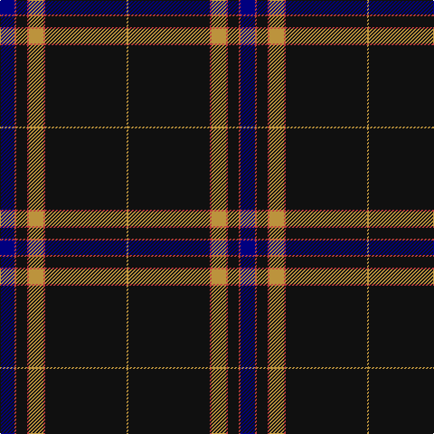

In pattern [BRKRYRKY](/stripes/brkryrky/).

This was sourced from register-of-tartans.  It is a [8 stripe tartan](/stripes/stripes8/).

Original link https://www.tartanregister.gov.uk/tartanDetails.aspx?ref=10635

## Attestations

This cloth appears in 2 source records; the oldest owns this page.

- 03/04/2012 — degli Uberti, Baron of Cartsburn (Personal) (register-of-tartans, [record](https://www.tartanregister.gov.uk/tartanDetails.aspx?ref=10635))
- April 3rd 2012 — degli Uberti, Baron of Cartsburn (P) (tartans-authority, [record](http://www.tartansauthority.com/tartan-ferret/display/10635/))

## Register references

External register numbers recorded for this tartan.

- Scottish Register of Tartans: [10635](https://www.tartanregister.gov.uk/tartanDetails.aspx?ref=10635)

## Thread count
DB/16 R2 K12 R2 DO16 R2 K90 DO/2

## Palette
Each colour and the base-6 reference it is a variant of.

| Colour | Shade | Base |
|---|---|---|
| DB | <code style="background-color:#000080;">#000080</code> `oklch(27.1% 0.188 264.1)` <small>#000080</small> | B <code style="background-color:#2A418A;">#2A418A</code> |
| DO | <code style="background-color:#BC933D;">#BC933D</code> `oklch(68.6% 0.114 83.1)` <small>#BC933D</small> | Y <code style="background-color:#F2BF00;">#F2BF00</code> |
| K | <code style="background-color:#101010;">#101010</code> `oklch(17.3% 0.000 89.9)` <small>#101010</small> | K <code style="background-color:#000000;">#000000</code> |
| R | <code style="background-color:#BE3D3D;">#BE3D3D</code> `oklch(54.7% 0.165 24.4)` <small>#BE3D3D</small> | R <code style="background-color:#CC0000;">#CC0000</code> |

# Sample pattern

## Nearest tartans

The nearest existing variants by ΔTartan distance, with this tartan at the top so the swatches line up against it.

ΔTartan

Tartan

Sett

—

<a href="/ttd/edit/#slug=db8r1k6r1lo8r1k45lo1~x2">degli Uberti, Baron of Cartsburn (Personal)</a> <a class="nn-out" href="/setts/s8/db8r1k6r1lo8r1k45lo1~x2/" title="open its dictionary page">↗</a>

0.88

<a href="/ttd/edit/#slug=b10lb2k2b1k6lb1k45lo2~x2">Marine Harvest Scotland (Corporate)</a> <a class="nn-out" href="/setts/s8/b10lb2k2b1k6lb1k45lo2~x2/" title="open its dictionary page">↗</a>

0.98

<a href="/ttd/edit/#slug=k5lo1dg7r1k45r5lo3k4lo3~x2">Brooks Brothers Signature (Corporate</a> <a class="nn-out" href="/setts/s9/k5lo1dg7r1k45r5lo3k4lo3~x2/" title="open its dictionary page">↗</a>

0.99

<a href="/ttd/edit/#slug=w5k2db14k4r8k4db4k80r6k4r4">American Heritage</a> <a class="nn-out" href="/setts/s11/w5k2db14k4r8k4db4k80r6k4r4/" title="open its dictionary page">↗</a>

1.11

<a href="/ttd/edit/#slug=k31w1k2w2dt3k2t4w2~x4">Capco</a> <a class="nn-out" href="/setts/s8/k31w1k2w2dt3k2t4w2~x4/" title="open its dictionary page">↗</a>

1.14

<a href="/ttd/edit/#slug=db10t2k2db1k6t1k45lo2~x2">Marine Harvest (Scotland)</a> <a class="nn-out" href="/setts/s8/db10t2k2db1k6t1k45lo2~x2/" title="open its dictionary page">↗</a>

1.18

<a href="/ttd/edit/#slug=dp3n2o2k60n2k3n12k1o3~x2">Grassi (Personal)</a> <a class="nn-out" href="/setts/s9/dp3n2o2k60n2k3n12k1o3~x2/" title="open its dictionary page">↗</a>

1.21

<a href="/ttd/edit/#slug=k74o4k7o4k9o40k2o4k2">Llewellyn (Welsh Name)</a> <a class="nn-out" href="/setts/s9/k74o4k7o4k9o40k2o4k2/" title="open its dictionary page">↗</a>

1.22

<a href="/ttd/edit/#slug=dp3k40lr3dp6k10dp10k3lr1o3~x2">Midnight Glen (Fashion)</a> <a class="nn-out" href="/setts/s9/dp3k40lr3dp6k10dp10k3lr1o3~x2/" title="open its dictionary page">↗</a>

1.23

<a href="/ttd/edit/#slug=t6k6t6db3w1k39ly3k3~x2">Washington County Sheriff’s Office (Oregon)</a> <a class="nn-out" href="/setts/s8/t6k6t6db3w1k39ly3k3~x2/" title="open its dictionary page">↗</a>

1.24

<a href="/ttd/edit/#slug=db5ly1g7r1db45r5ly3db4ly3~x2">Brooks Brothers Signature</a> <a class="nn-out" href="/setts/s9/db5ly1g7r1db45r5ly3db4ly3~x2/" title="open its dictionary page">↗</a>

## Neighbour map

Every grey dot is one of 14299 variants placed by the first two principal components of the ΔTartan feature space (44% of its variance). Red is this tartan; blue dots are its nearest — click one to open its page.

<svg viewBox="0 0 640 380" role="img" style="max-width:100%;height:auto;border:1px solid #e0e0e0;border-radius:4px;display:block" xmlns="http://www.w3.org/2000/svg"><image href="/nn/cloud.v1.png" width="640" height="380"/><a href="/setts/s8/b10lb2k2b1k6lb1k45lo2~x2/"><circle cx="539.6" cy="118.1" r="4" fill="#3465a4"><title>Marine Harvest Scotland (Corporate)</title></circle></a><a href="/setts/s9/k5lo1dg7r1k45r5lo3k4lo3~x2/"><circle cx="509.7" cy="120.0" r="4" fill="#3465a4"><title>Brooks Brothers Signature (Corporate</title></circle></a><a href="/setts/s11/w5k2db14k4r8k4db4k80r6k4r4/"><circle cx="495.6" cy="107.7" r="4" fill="#3465a4"><title>American Heritage</title></circle></a><a href="/setts/s8/k31w1k2w2dt3k2t4w2~x4/"><circle cx="484.1" cy="117.0" r="4" fill="#3465a4"><title>Capco</title></circle></a><a href="/setts/s8/db10t2k2db1k6t1k45lo2~x2/"><circle cx="551.3" cy="125.6" r="4" fill="#3465a4"><title>Marine Harvest (Scotland)</title></circle></a><a href="/setts/s9/dp3n2o2k60n2k3n12k1o3~x2/"><circle cx="552.5" cy="115.5" r="4" fill="#3465a4"><title>Grassi (Personal)</title></circle></a><a href="/setts/s9/k74o4k7o4k9o40k2o4k2/"><circle cx="422.9" cy="116.1" r="4" fill="#3465a4"><title>Llewellyn (Welsh Name)</title></circle></a><a href="/setts/s9/dp3k40lr3dp6k10dp10k3lr1o3~x2/"><circle cx="476.7" cy="139.2" r="4" fill="#3465a4"><title>Midnight Glen (Fashion)</title></circle></a><a href="/setts/s8/t6k6t6db3w1k39ly3k3~x2/"><circle cx="447.3" cy="105.5" r="4" fill="#3465a4"><title>Washington County Sheriff’s Office (Oregon)</title></circle></a><a href="/setts/s9/db5ly1g7r1db45r5ly3db4ly3~x2/"><circle cx="481.9" cy="103.5" r="4" fill="#3465a4"><title>Brooks Brothers Signature</title></circle></a><circle cx="499.8" cy="118.3" r="5" fill="#c00000"/></svg>

ID: /setts/s8/db8r1k6r1lo8r1k45lo1~x2/
