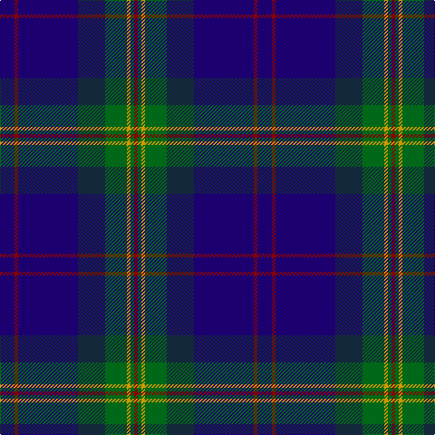

In pattern [BRBBGYGR](/stripes/brbbgygr/).

This was sourced from register-of-tartans.  It is a [8 stripe tartan](/stripes/stripes8/).

Original link https://www.tartanregister.gov.uk/tartanDetails.aspx?ref=3007

## Attestations

This cloth appears in 2 source records; the oldest owns this page.

- 01/10/1998 — Moray Council (register-of-tartans, [record](https://www.tartanregister.gov.uk/tartanDetails.aspx?ref=3007))
- 1998 — Moray Council (Corporate) (tartans-authority, [record](http://www.tartansauthority.com/tartan-ferret/display/2494/))

## Register references

External register numbers recorded for this tartan.

- Scottish Register of Tartans: [3007](https://www.tartanregister.gov.uk/tartanDetails.aspx?ref=3007)
- Scottish Tartans Authority (ITI): 2494
- Scottish Tartans World Register: 2494

## Thread count
DB/16 DR4 DB66 DN30 G24 DY4 G4 DR/4

## Palette
Each colour and its ΔE from the base-6 reference it is a variant of.

| Colour | Shade | Base | ΔE (OKLab) |
|---|---|---|---|
| DB | <code style="background-color:#1C0070;">#1C0070</code> `#1C0070` | B <code style="background-color:#2A418A;">#2A418A</code> | 0.14 |
| DN | <code style="background-color:#14283C;">#14283C</code> `#14283C` | B <code style="background-color:#2A418A;">#2A418A</code> | 0.15 |
| DR | <code style="background-color:#880000;">#880000</code> `#880000` | R <code style="background-color:#CC0000;">#CC0000</code> | 0.15 |
| DY | <code style="background-color:#D09800;">#D09800</code> `#D09800` | Y <code style="background-color:#F2BF00;">#F2BF00</code> | 0.12 |
| G | <code style="background-color:#006818;">#006818</code> `#006818` | G <code style="background-color:#006100;">#006100</code> | 0.02 |

# Sample pattern

## Nearest tartans

The nearest existing variants by ΔTartan distance.

1. [Burt Family](/setts/s9/dp2g13db8g3db33dy3db8dy13r2~x2/) — ΔT 0.83
1. [Wcwm 9275-1395](/setts/s7/db6dp3db56k24g6r6g6/) — ΔT 0.89
1. [Edinburgh Crystal Corporate Tartan Tartan Number: 2307. Earliest known date: pre 1997 Designed by Sandra Campbell an employee of Edinburgh Crystal. See products available Copyright © Blair Urquhart, Comrie, 2015](/setts/s8/dt30lb2k6db3r3~x4/) — ΔT 1.10
1. [Stewmann (2009) (Personal)](/setts/s9/dg24b4dg3db11dp8db37k3db2lr4~x2/) — ΔT 1.11
1. [Hope-Weir/Weir](/setts/s8/k8ly1k1db28k12dg2k1t2~x2/) — ΔT 1.18
1. [Spirit of Alva](/setts/s10/t6db10dp4db12dg19dp4dg8k20db50t4/) — ΔT 1.19
1. [Auckland (Fashion)](/setts/s8/dg3k3db2k16db2k2db24lb2~x2/) — ΔT 1.21
1. [Royal Highland Yacht Club (Corporate](/setts/s11/db26db3db1m2db1db3db3db12g14db2w2~x2/) — ΔT 1.21
1. [Peter of Lee (Chief) (Personal)](/setts/s8/r4dg4k2dg29db21k3db3ly3~x2/) — ΔT 1.22
1. [Dollar Academy (1999)](/setts/s8/lb2dt19k4dt4k4g9db2k1~x4/) — ΔT 1.23

## Neighbour map

Every grey dot is one of 14299 variants placed by the first two principal components of the ΔTartan feature space (44% of its variance). Red is this tartan; blue dots are its nearest — click one to open its page.

<svg viewBox="0 0 640 380" role="img" style="max-width:100%;height:auto;border:1px solid #e0e0e0;border-radius:4px;display:block" xmlns="http://www.w3.org/2000/svg"><image href="/nn/cloud.v1.png" width="640" height="380"/><a href="/setts/s9/dp2g13db8g3db33dy3db8dy13r2~x2/"><circle cx="335.1" cy="179.1" r="4" fill="#3465a4"><title>Burt Family</title></circle></a><a href="/setts/s7/db6dp3db56k24g6r6g6/"><circle cx="358.5" cy="170.9" r="4" fill="#3465a4"><title>Wcwm 9275-1395</title></circle></a><a href="/setts/s8/dt30lb2k6db3r3~x4/"><circle cx="330.9" cy="164.7" r="4" fill="#3465a4"><title>Edinburgh Crystal Corporate Tartan Tartan Number: 2307. Earliest known date: pre 1997 Designed by Sandra Campbell an employee of Edinburgh Crystal. See products available Copyright © Blair Urquhart, Comrie, 2015</title></circle></a><a href="/setts/s9/dg24b4dg3db11dp8db37k3db2lr4~x2/"><circle cx="287.9" cy="150.2" r="4" fill="#3465a4"><title>Stewmann (2009) (Personal)</title></circle></a><a href="/setts/s8/k8ly1k1db28k12dg2k1t2~x2/"><circle cx="370.7" cy="149.7" r="4" fill="#3465a4"><title>Hope-Weir/Weir</title></circle></a><a href="/setts/s10/t6db10dp4db12dg19dp4dg8k20db50t4/"><circle cx="306.9" cy="190.6" r="4" fill="#3465a4"><title>Spirit of Alva</title></circle></a><a href="/setts/s8/dg3k3db2k16db2k2db24lb2~x2/"><circle cx="362.1" cy="205.0" r="4" fill="#3465a4"><title>Auckland (Fashion)</title></circle></a><a href="/setts/s11/db26db3db1m2db1db3db3db12g14db2w2~x2/"><circle cx="315.7" cy="142.0" r="4" fill="#3465a4"><title>Royal Highland Yacht Club (Corporate</title></circle></a><a href="/setts/s8/r4dg4k2dg29db21k3db3ly3~x2/"><circle cx="297.6" cy="176.4" r="4" fill="#3465a4"><title>Peter of Lee (Chief) (Personal)</title></circle></a><a href="/setts/s8/lb2dt19k4dt4k4g9db2k1~x4/"><circle cx="306.3" cy="182.4" r="4" fill="#3465a4"><title>Dollar Academy (1999)</title></circle></a><circle cx="326.9" cy="180.8" r="5" fill="#c00000"/></svg>

ID: /setts/s8/db8r2db33dt15g12lo2g2r2~x2/
